title:: @From reactive to cognitive: brain-inspired spatial intelligence for embodied agents

- **演示视频**
	- https://drive.google.com/drive/folders/1p1GjpQMQQ-ylmazhjPgqT49AUOcUT3Z-
- 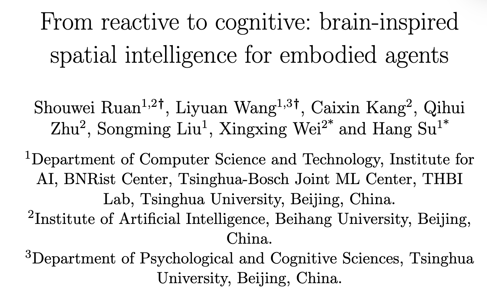{:width 600}
	- https://heathcliff-saku.github.io/
	- 1  [Tsinghua Laboratory of Brain and Intelligence (THBI)](https://brain.tsinghua.edu.cn/en/index.htm)
	- 2  [Beihang; ROSE Vision Lab (RObust & SEcure Vision Lab)](https://rose-vision.github.io/)
	- 3  [Tsinghua; Department of Psychological and Cognitive Sciences](https://www.pcs.tsinghua.edu.cn/)
-
- [[Abstract]]
	- en
	  collapsed:: true
		- Spatial cognition enables adaptive goal-directed behavior by constructing internal models of space. Robust biological systems consolidate spatial knowledge into three interconnected forms: \textit{landmarks} for salient cues, \textit{route knowledge} for movement trajectories, and \textit{survey knowledge} for map-like representations. While recent advances in multi-modal large language models (MLLMs) have enabled visual-language reasoning in embodied agents, these efforts lack structured spatial memory and instead operate reactively, limiting their generalization and adaptability in complex real-world environments. Here we present Brain-inspired Spatial Cognition for Navigation (BSC-Nav), a unified framework for constructing and leveraging structured spatial memory in embodied agents. BSC-Nav builds allocentric cognitive maps from egocentric trajectories and contextual cues, and dynamically retrieves spatial knowledge aligned with semantic goals. Integrated with powerful MLLMs, BSC-Nav achieves state-of-the-art efficacy and efficiency across diverse navigation tasks, demonstrates strong zero-shot generalization, and supports versatile embodied behaviors in the real physical world, offering a scalable and biologically grounded path toward general-purpose spatial intelligence.
	- 背景
		- **空间认知（spatial cognition）**通过构建空间的内部模型，使得个体能够实现自适应的目标导向行为。
		- 稳健的生物系统将空间知识巩固为三种相互关联的形式：
			- **地标（landmarks）**用于显著线索的表征，
			- **路径知识（route knowledge）**用于运动轨迹的记忆，而
			- **测绘知识（survey knowledge）**则用于地图式的表征。
	- 现有不足
		- 尽管多模态大语言模型（MLLMs）的最新进展使具身智能体（embodied agents）能够进行视觉-语言推理，但这些尝试==缺乏结构化的空间记忆==，而是以**反应式**方式运作，从而限制了它们在复杂真实环境中的泛化性与适应性。
	- 本文工作
		- 在本文中，我们提出了**Brain-inspired Spatial Cognition for Navigation (BSC-Nav)**，一个在具身智能体中构建并利用结构化空间记忆的统一框架。
		- BSC-Nav 从**自我中心轨迹（egocentric trajectories）**和**上下文线索（contextual cues）**中构建**他心坐标（allocentric）认知地图（cognitive maps）**，并根据语义目标动态检索空间知识。
		- 结合强大的 MLLMs，BSC-Nav 在多种导航任务中实现了最先进的效能与效率，展现出强大的零样本泛化能力，并在真实物理世界中支持多样化的具身行为，为通用空间智能提供了一条可扩展且具有生物学基础的路径。
	- [[开源]]
		- 我们的代码可在 https://github.com/Heathcliff-saku/BSC-Nav 获取
		- 补充视频可在 [Google Drive](https://drive.google.com/drive/folders/1p1GjpQMQQ-ylmazhjPgqT49AUOcUT3Z-) 上查看。
- [[Attachments]]
	- https://arxiv.org/pdf/2508.17198
-
## 1 引言
collapsed:: true
	- **背景**
	  collapsed:: true
		- **空间认知（Spatial cognition）**，即获取、组织、利用与更新外部空间知识的能力，是人类与人工智能（AI）[1, 2]的基础。
		- 它不仅支撑着诸如导航与操作等**感知-运动技能（sensorimotor skills）**，还支持更高层次的认知功能，包括抽象、规划与推理。
		- 在人类中，可泛化的空间表征使个体能够解释感官输入、预测未来事件，并灵活适应不断变化的环境——从在熟悉的厨房中煮咖啡，到在陌生城市中导航 [3–5]。
		- 鉴于空间认知在与真实物理世界的具身交互中的广泛重要性，它已成为跨学科研究的核心主题，推动了**机器人学 [6]**、**城市仿真 [7]**与**行星级建模 [8]**等领域的发展，同时也日益被认为是**通用人工智能（AGI）**[3, 9, 10] 的基础组成部分。
	- **挑战**
	  collapsed:: true
		- 尽管多模态大语言模型（MLLMs）迅速发展，且有越来越多的努力致力于为具身智能体赋予视觉-语言推理能力 [11–13]，当前的人工系统在**大规模空间认知**[14]方面仍存在根本性的局限，尤其是在需要**长时程导航（long-horizon navigation）**与**移动操作（mobile manipulation）**的任务中。
		- ==一个核心瓶颈在于**缺乏结构化的空间记忆（structured spatial memory）**[15–17]——一种能够持续编码、组织与检索环境空间知识的机制。==
		- 多数现有方法，无论基于**端到端强化学习（reinforcement learning）**[18–20]，还是**结合强大 MLLMs 的模块化流水线（modular pipelines）**[21, 22]，都以[[#green]]==反应式且无状态==的方式处理观察。
			- > [[#blue]]=="反应式且无状态" 就是系统只根据**当前即时观测**决定动作，不保留或利用可复用的、跨时刻的内部空间记忆／模型。这样的系统像“视—动反射”，缺乏长期或全局的空间理解，导致规划短浅、经验难复用。==
		- ==在缺乏对外部空间的持久内部模型的情况下，智能体难以整合连贯的空间表征或进行超越即时刺激的推理==，导致知识碎片化、规划短视化以及泛化能力不足。
		- 要解决这些局限性，需要从反应式处理转向**以记忆为中心的空间认知范式（memory-centric spatial cognition）**，以支持在时间与空间上的持久表征与组合性推理。
	- **Neuroscience-Inspired**
	  collapsed:: true
		- 相较于人工系统，生物的空间认知提供了一个稳健且令人信服的模板。几十年的神经科学研究揭示，生物体将空间知识巩固为**三种不同但相互关联的形式**[16, 17]（如图 1a 所示）：
			- 图1a
				- 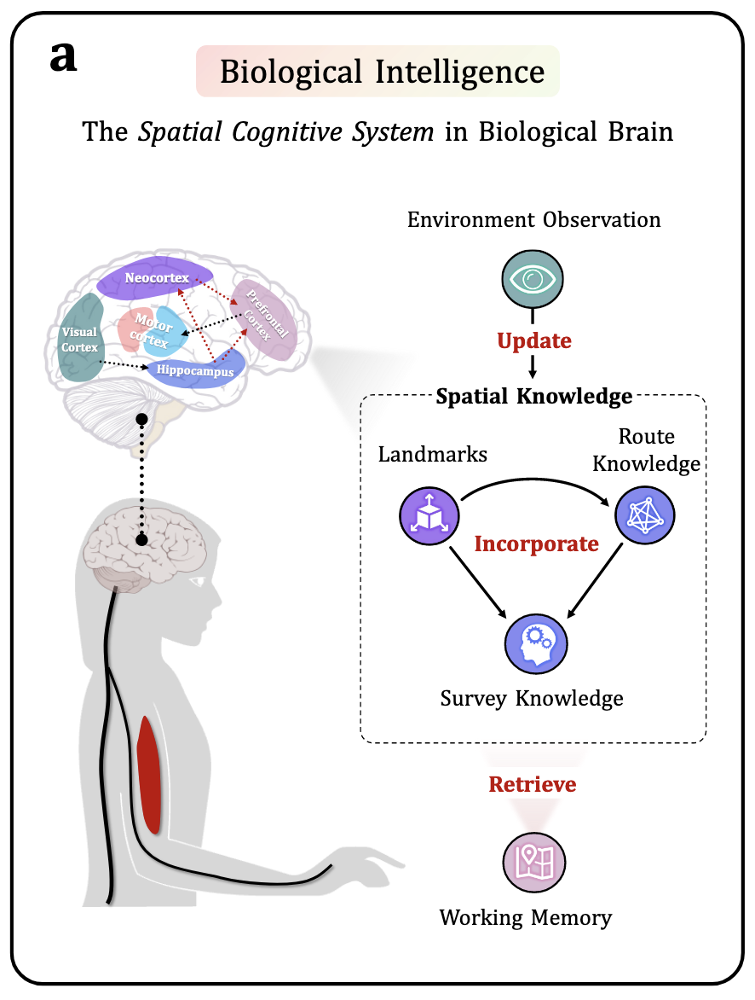{:width 400,:height 800}
				- **a**，生物大脑中的结构化空间记忆（structured spatial memory），由地标（landmarks）、路径知识（route knowledge）和测量知识（survey knowledge）组成。
			- **地标（landmarks）**：编码显著环境线索与空间位置之间的稳定关联，用于定位与语境理解 [23, 24]；[[#blue]]==稀疏的显著参照点（语义＋坐标）==
			  collapsed:: true
				- > 地标（landmarks）：
				  含义：把“显著的环境线索”和它们在世界坐标中的位置绑定起来，同时保存语义描述和置信度（论文用四元组来表示）。
				  *例子：在家里，“冰箱”是一个地标：它有类别（冰箱）、三维坐标、检测置信度和一句描述（例如“银色、靠近厨房岛台”）。地标是稀疏而可检索的记忆单元。*
			- **路径知识（route knowledge）**：捕捉地标之间的自我中心运动轨迹，用于习惯性导航与路径整合 [25]；[[#blue]]==以自我中心视角记录的移动轨迹（行为序列）==
			  collapsed:: true
				- > 路径知识（route knowledge）：
				  含义：记录从地点 A 到 B 的移动序列与自我中心的观测（比如“我从客厅沿着左侧走到厨房门口”），更偏向于经验式的轨迹记忆，用于习惯性导航和路径整合。
				  *例子：你每天从卧室走到厨房的那条常走路线（包括转弯、通过哪些门）就是路径知识。论文说认知地图模块把自我中心的运动序列先积累为路径知识。*
			- **测绘知识（survey knowledge）**：将多条路径整合为他心坐标的地图式表征，用于灵活推理、捷径发现与绕行规划 [26]。[[#blue]]==把多条路径整合成**他心/地图式**（allocentric）表示，能做灵活推理和捷径发现。==
			  collapsed:: true
				- > 测绘知识（survey knowledge）：
				  含义：把多条路径/观测整合成他心坐标的地图式表征（即独立于观察者位置的“俯视地图”），适合做全局规划、找捷径或绕行。论文把这种表征称为“认知地图”或 survey knowledge。
				  *例子：把房子中各房间、门和家具位置整合成一张平面地图，这张地图能让你从客厅规划到达阳台的最佳路线，而不需要从头回忆沿途每一步。*
		- 这些空间表征通过**工作记忆（working memory）**[27]（尤其是**视觉-空间工作记忆（visual-spatial working memory）**[28, 29]）进行访问与协调，从而根据任务需求与环境熟悉程度实现自适应的检索、组合与泛化。[[#blue]]==工作记忆在任务执行时**临时检索/组合**上述三类知识以做决策。==
		  collapsed:: true
			- > 工作记忆（working memory）：
			  含义：一个短时、任务驱动的检索/组合层，只有在接到指令时激活。它负责从地标记忆与认知地图中调出相关信息、生成候选目标坐标并组合成实际的导航策略（分层检索：简单目标优先地标，复杂或基于图像的目标则调用认知地图做精定位）。文中将其类比为视觉—空间工作记忆。
			  *例子：当你被要求“去厨房找烤面包机”时，工作记忆会先问地标库：厨房里有什么地标（炉灶、柜子）？若需要更精确位置，它可能检索认知地图来定位可能的具体格子/坐标，然后生成一个短期的行动序列去检查这些候选点。*
	- **本文工作**
	  collapsed:: true
		- 受这些生物学原理的启发，我们提出了**Brain-inspired Spatial Cognition for Navigation (BSC-Nav)**，一个通过**结构化空间记忆**在具身智能体中实现认知空间智能的统一框架（如图 1b 所示）。
		- BSC-Nav 通过两条协同分支显式构建空间知识：
			- **地标记忆模块（landmark memory module）**：编码显著环境线索与空间位置之间的持久关联，以实例化地标；
			- **认知地图模块（cognitive map module）**：通过将自我中心的运动序列转换为[[#green]]==体素化 (voxelized)==轨迹，积累 路径知识（route knowledge），并将其组织为他心坐标的地图式表征，即 测绘知识（survey knowledge）。
			  collapsed:: true
				- 体素化
					- **简短定义（一句话）**：
						- 体素化就是把连续的三维世界坐标 **离散化成三维格子（voxel grid）**，并把每个格子（体素）与视觉特征缓冲区关联起来，从而在网格上存储和检索视觉-空间信息。论文把观测patch的特征投影到这些体素中，形成可检索的认知地图。
					- **更具体的步骤（根据论文的方法段落）**：
						- **从图像提取 patch 特征**：先用视觉编码器（DINO-v2）把 RGB 图像分成patch，得到每个 patch 的视觉特征向量。
						- **逆透视 + 深度投影到世界坐标**：用对应 patch 的深度值，把 patch 中心点逆投影到相机坐标，再由相机到基座再到世界的变换得到世界坐标。
						- **离散化到体素索引**：把世界坐标除以体素大小 Δ 并取整，得到体素索引 v = (v_x, v_y, v_z)。Δ 是体素体积的边长（空间分辨率），G 是网格维度/偏移（见式 (10)）。每个体素维护一个**特征缓冲区**（最多 B 个特征）。
						- **记忆缓冲与惊讶度更新策略**：新特征投到某体素后，论文用“惊讶度（surprise）”度量判断是否将该特征加入体素缓冲区（即只有当新观测与该邻域现有特征差异足够大时才加入），并在缓冲满时替换掉“最不惊讶”的特征，以保证多样性与效率。这样既能跨视点保存有代表性的视觉样本，又能避免冗余。
					- **为什么要体素化？（直观理由与优点）**：
						- **把视觉信息和空间位置绑定**：体素化把“什么样的视觉特征”固定到“三维空间的哪个格子”，便于后续基于空间的检索与匹配（比如把一个想象的目标图像的特征与体素库匹配来定位目标区域）。
						- **支持他心/地图式表示**：相比只保留自我中心的观测序列，体素化的格网可以被转为**他心坐标（allocentric）**地图，从而支持从任意位置做全局推理与捷径发现。
						- **效率与稳健性**：离散缓冲区加上惊讶驱动的缓存策略能压缩信息（只存多样/有用的特征），同时保持跨视点一致性，增强泛化能力。
					- **举个具体的、容易想象的例子**：
						- 想象你在房子里拍照并把每张照片的局部 patch 都“丢进”一个三维的蜂巢格子里（每个格子就是一个体素）。格子里保存的是这个位置在不同时间、从不同角度看到的若干典型视觉“记忆片段”。后来要找“蓝色椅子”，系统把目标的视觉特征与蜂巢里每个格子的特征比对，找到最相似的体素集合，再把这些体素反投影回世界坐标，生成候选位置供工作记忆安排实际的导航与检查。文中具体就是用这种方式把图像 patch→深度→世界坐标→体素索引→特征缓冲区串起来。
		- BSC-Nav 进一步引入一个**工作记忆模块（working memory module）**，动态地从地标记忆与认知地图中检索并组合空间表征，从而使语义目标与具身空间行动相对齐。
		- 每个组件都能与大规模基础模型无缝衔接：
			- 视觉基础模型（如 DINOv2 [30, 31]）提供环境线索的感知基础，
			- 而多模态大语言模型（如 GPT-4V [21]）引导高层语义解释与基于目标的推理。
		- 通过将基于 MLLMs 的具身智能体与结构化空间记忆相结合，BSC-Nav 实现了稳健的空间认知能力，支持**长时程推理（long-horizon reasoning）**、**经验复用（experience reuse）**以及**局部与全局策略之间的灵活切换（flexible transitions between local and global policies）**。
		- BSC-Nav 在广泛的导航任务中达到了最先进的性能，包括**目标物体导航（object-goal navigation）**、**开放词汇导航（open-vocabulary navigation）**与**实例级导航（instance-level navigation）**，同时在**指令跟随（instruction following）**、**具身问答（embodied question answering）**与**移动操作（mobile manipulation）**中展现出强大的空间泛化能力。
		- 这些结果使 BSC-Nav 成为一个可扩展且具有生物学基础的解决方案，它以**认知空间智能（cognitive spatial intelligence）**补充了 MLLMs 的视觉-语言推理能力，使人工智能在真实物理世界中具备更强的能力、适应性与认知水平。
## 2 结果
collapsed:: true
	- 概述
	  collapsed:: true
		- 我们首先介绍 BSC-Nav 框架，该框架在具身智能体中实现了受大脑启发的结构化空间记忆。
		- 随后我们在模拟与真实世界场景中系统地评估其性能，重点展示：
			- (i) 在基础任务中的通用导航能力；
			- (ii) 在基于指令的视觉-语言导航与主动具身问答中具备的更高级的空间感知技能；以及
			- (iii) 在导航与移动操作中的现实世界效能。
	- ### 2.1 在具身智能体中构建与利用结构化空间记忆
	  collapsed:: true
		- 结构化空间记忆对于在复杂真实世界环境中引导目标导向行为是必不可少的 [3–5]，但在当前的具身智能体中仍大多缺失。借鉴生物系统中稳健的空间表征，即地标（landmarks）[23, 24]、路径知识（route knowledge）[25] 与测绘知识（survey knowledge）[26]，BSC-Nav 实现了一种模块化架构，显式地构建并利用类比的记忆结构以获取空间认知能力（见图 1b，方法部分有详细说明）。
		  collapsed:: true
			- 图1b
			  id:: 209458a5-5fc8-45ab-9845-4b659f5045dc
				- {:width 800}
				- **b**，BSC-Nav 框架在具身智能体（embodied agents）中实例化结构化空间记忆。环境观测（RGB-D 图像与智能体姿态）由以下部分处理：
					- (i) **地标记忆模块（landmark memory module）**——编码并检索多模态环境线索的持久关联以形成地标；
					- (ii) **认知地图模块（cognitive map module）**——累积并组织运动轨迹作为路径知识，并进一步将其转换为测量知识形式的 allocentric（外心坐标）地图式表征；
					- (iii) **工作记忆模块（working memory module）**在任务调用时动态组合相关空间知识，用于自适应规划与推理。
		- BSC-Nav 包含两条在环境探索期间持续更新以积累和组织空间知识的分支。
			- **地标记忆模块 (landmark memory module)**
			  collapsed:: true
				- 首先，地标记忆模块将显著的环境线索编码为关联三元组，包含空间坐标、语义类别与上下文描述，从而巩固周围环境的地标。
				- 该设计生成抽象且稀疏的表征，优先保存显著实例，实现高效检索并形成外部空间的灵活且可解释的支架（方法部分有详细说明）。
			- **认知地图模块 (cognitive map module)**
			  collapsed:: true
				- 同时，认知地图模块将沿运动轨迹的自我中心观测转换为路径知识，随后将其体素化为持久的他心坐标表征作为测绘知识（方法部分有详细说明）。受自由能原理（free-energy principle）[32] 的启发——该原理指出生物系统通过最小化预测误差来精炼内部模型 [32, 33]，我们实现了一种由“惊讶度”驱动的更新策略，该策略选择性地整合新的或出乎预料的空间观测。此外，一个体素化的记忆缓冲区跨视点与时间点保存多样的空间表征，从而增强稳健性与泛化能力。
			- **工作记忆模块 (working memory module)**
			  collapsed:: true
				- 为在任务执行中利用结构化空间记忆，BSC-Nav 进一步引入了一个工作记忆模块，该模块自适应地检索地标、路径知识与测绘知识以用于目标定位与轨迹规划（方法部分有详细说明）。
				- 类似于生物系统中的视觉-空间工作记忆 [28, 29]，该模块根据任务需求与环境熟悉度动态地组合空间表征。
				- 我们提出一种由目标复杂性引导的分层检索策略。
					- 对于简单目标，代理采用仅文本形式的 MLLMs [22, 34] 对地标记忆中的语义关联与上下文线索进行推理（见图 1c）。
						- 图1c
						  id:: 589bdc38-3d1c-4852-a813-e146f2fa443a
							- 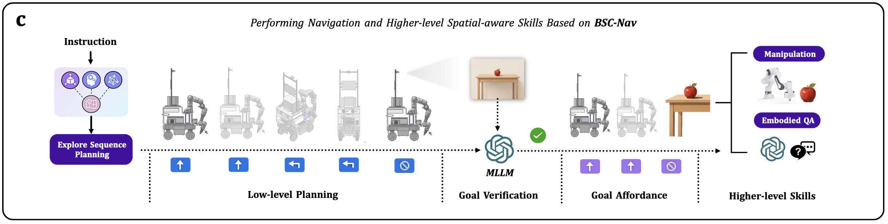{:width 800}
							- **c**，结构化空间记忆不仅支持通用导航（universal navigation），还支持更高层的空间感知技能（spatial-aware skills）。
					- 对于更复杂或模糊的指令，BSC-Nav 激活对认知地图的增强关联检索。
						- 在此过程中，MLLMs 通过推断对象特定属性与场景层面的先验来丰富初始目标描述，将模糊命令转化为语义上更为详尽的表征。
						- 随后，这些被丰富的描述使用文本到图像扩散模型（text-to-image diffusion model）[35] 渲染为想象的视觉原型。
						- 生成的图像被编码并与存储在认知地图中的密集视觉特征进行匹配，以定位候选目标区域。
					- 该分层检索策略使 BSC-Nav 能够根据目标的复杂性（类别级与实例级）与模态（文本与图像）访问互补形式的空间记忆，从而支持通用的目标导向导航的精确定位（见图 2）。
						- 图2
						  id:: f80480aa-56f2-4173-93bf-6b801adc230e
							- 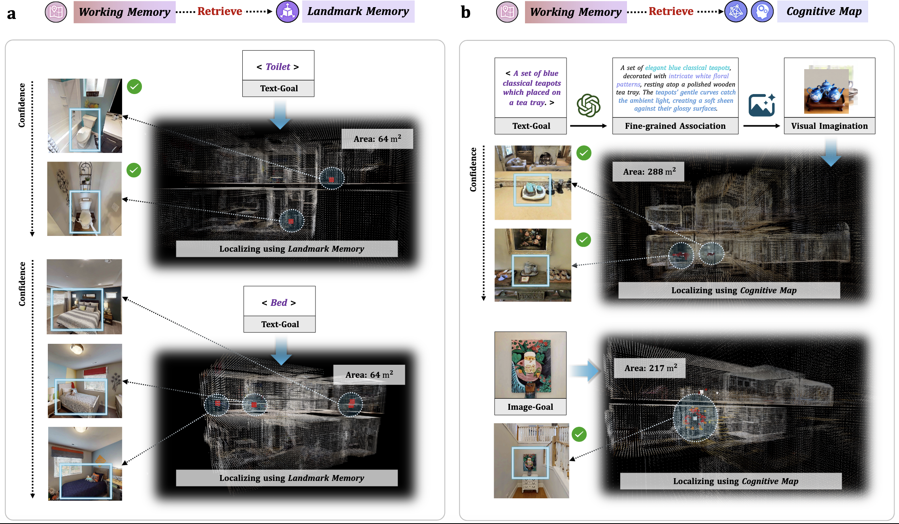{:width 800}
							- **通过工作记忆中的分层检索实现精确定位（Precise localization via hierarchical retrieval in working memory）**
							- **a**，对于简单的类别级目标（category-level goals），工作记忆优先从地标记忆模块中进行检索，以实现快速匹配与候选坐标生成。
							- **b**，对于复杂的实例级目标（instance-level goals），工作记忆采用**关联增强检索（association-enhanced retrieval）**，将文本指令转换为视觉特征，用于查询认知地图模块。对于基于图像的目标（image-based goals），认知地图则直接通过提取的视觉特征进行查询。
					- 工作记忆的检索常常产生多个候选坐标，每个坐标都关联一个置信分数与相对距离。在存在多个有效目标的场景（例如类别级导航）中，单靠置信分数可能无法可靠指示正确性。BSC-Nav 并不贪婪地选择置信度最高的候选项，而是采用一种复合排序策略，整合基于距离与基于置信度的评分，以确定一个高效且自适应的探索序列。沿该序列生成的低级运动策略采用启发式规划。在执行过程中，MLLMs 持续从观测中解析空间-语义上下文，验证地标接近性并确认目标到达，从而实现面向可供性（affordance-aware）的动作生成。到达适当的目标位置后，代理可以调用额外技能，例如抓取物体或回答问题，以完成更复杂的任务驱动目标（见图1c  ((589bdc38-3d1c-4852-a813-e146f2fa443a)) ）。
	- ### 2.2 跨模态与多粒度的通用导航
	  collapsed:: true
		- 通过结合三种空间知识类型的脑启发式空间认知，**BSC-Nav** 在导航任务中展现出卓越的泛化能力，在成功率与效率方面均显著超越了近年来的强基线模型。
		- **实验设置**
		  collapsed:: true
			- 我们在 **Habitat 模拟器** [38] 中对 **来自物理重建环境的 62 个室内场景中的 8,195 个导航回合**（基于 **MP3D [36]** 与 **HM3D [37]** 数据集）进行了系统性评估，涵盖四类具有代表性的导航任务：
				- **目标物体导航（Object-Goal Navigation, OGN）** [18, 39, 40]；
				- **开放词汇物体导航（Open-Vocabulary Object Navigation, OVON）** [41]；
				- **文本实例导航（Text-Instance Navigation, TIN）** [42]；
				- **图像实例导航（Image-Instance Navigation, IIN）** [43]。
			- 在每个回合中，智能体从随机位置初始化，执行离散动作（前进 25 厘米、左转 30°、右转 30°、停止）[44]。依据标准协议 [44]，仅当智能体在目标 1.0 米范围内执行“停止”动作时，导航才被视为成功。
			- 评估指标包括：
				- **成功率（Success Rate, SR）** [45]：衡量效果；
				- **路径长度加权成功率（Success weighted by Path Length, SPL）** [45]：衡量效率（方法部分有详细说明）。
			- 我们将 **BSC-Nav** 与以下方法进行比较：
				- **端到端方法（End-to-End Methods）**：PixNav [11]、DAgRL [41]、PSL [42]；
				- **模块化方法（Modular Methods）**：这些方法仅实例化了类似的地标记忆模块，包括 VLFM [13]、MOD-IIN [46]、UniGoal [47]、GOAT [48]。
		- **类别级导航任务（OGN 与 OVON）**
		  collapsed:: true
			- 如图 3a 所示，BSC-Nav 在 类别级导航任务（OGN 与 OVON）中表现出卓越的空间泛化能力。
				- 图3a
				  collapsed:: true
					- 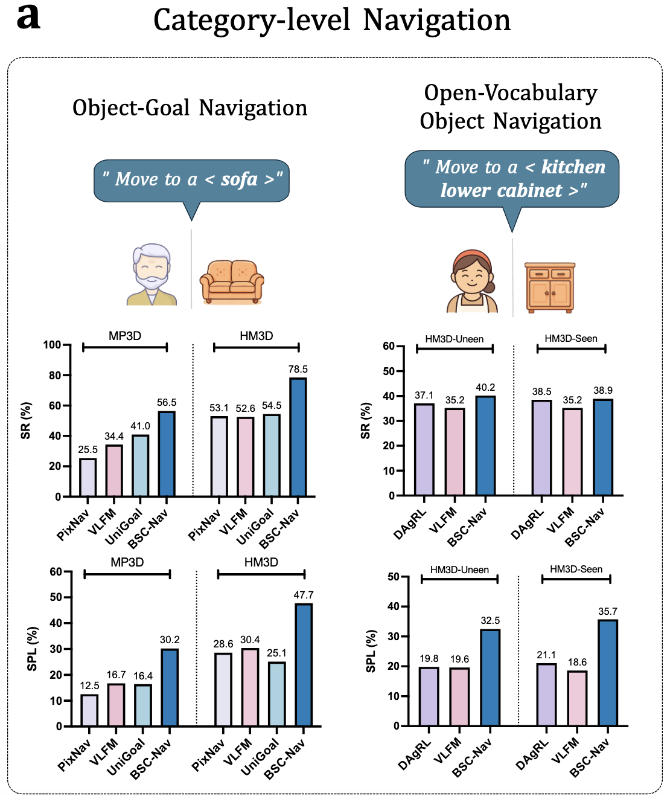{:width 600}
					- **a**，类别级导航任务（category-level navigation tasks），包括**目标物体导航（object-goal navigation）**与**开放词汇物体导航（open-vocabulary object navigation）**。
			- **OGN (Object-Goal Navigation)**
				- 对于常见目标，BSC-Nav 在 HM3D（6 个类别）上达到了 **78.5% 的 SR**，
				- 在 MP3D（包含 20 个类别且面积更大）上达到了 **56.5% 的 SR**，
				- 分别超过最先进方法 UniGoal **24.0% 与 15.5%**。
				- 不同于 UniGoal（仅通过抽象目标与场景图组织地标记忆），BSC-Nav 依托结构化空间记忆，从而获得了显著性能提升。
			- **OVON (Open-Vocabulary Object Navigation)**（更具挑战性, 涉及 79 个日常物体，如“厨房下方柜子”），
				- BSC-Nav 在 MP3D 的未见集与已见验证集上分别保持 **40.2% 与 38.9% 的 SR**，
				- 在零样本（zero-shot）设定下优于监督方法 DAgRL。
		- **实例级导航任务（TIN 与 IIN）**
		  collapsed:: true
			- 实例级导航任务（TIN 与 IIN）的结果进一步验证了 BSC-Nav 在多模态场景中的稳健泛化能力（见图 3b）。
			  collapsed:: true
				- 图3b
					- 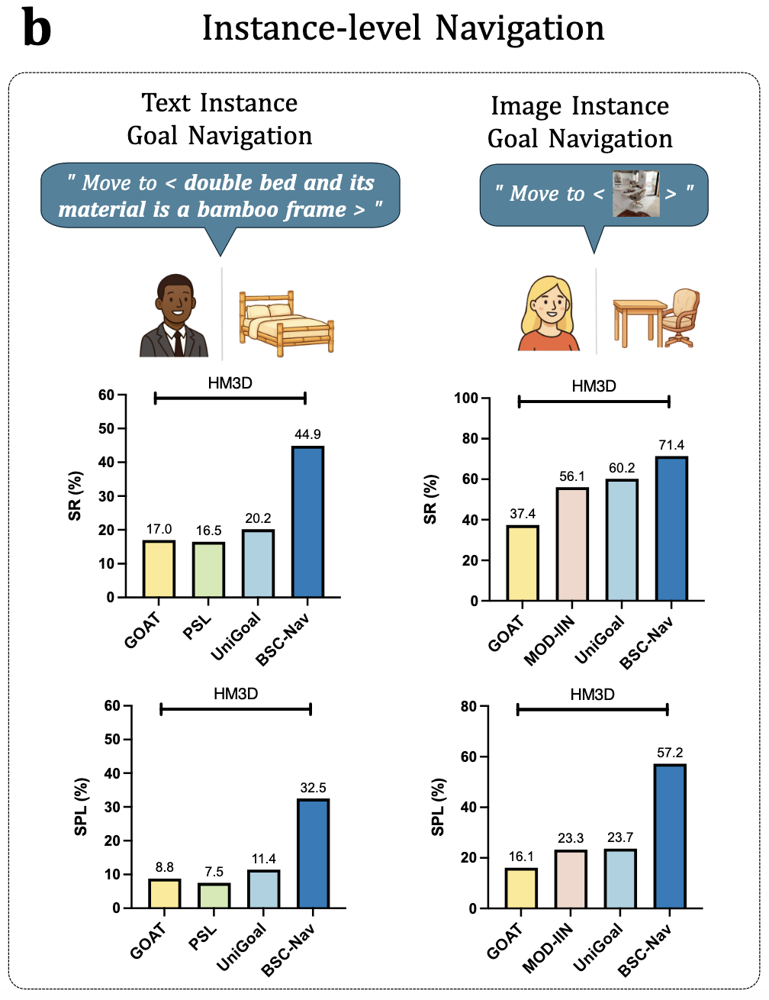{:width 600}
					- **b**，实例级导航任务（instance-level navigation tasks），包括**文本实例导航（text-instance navigation）**与**图像实例导航（image-instance navigation）**。
			- 在 **TIN (Text-Instance Goal Navigation)** 任务中，它的成功率几乎是 UniGoal 与 VLFM 的两倍。
			- 在 **IIN (Image-Instance Goal Navigation)** 任务中，通过将目标图像与认知地图中的视觉特征直接匹配，BSC-Nav 达到 **71.4% 的 SR**，比 UniGoal 高出 **11.4%**。
		- 值得注意的是，在所有任务中，BSC-Nav 在导航效率上（以 SPL 衡量）均显著优于基线方法。这一改进归因于其工作记忆模块中的**基于距离与置信度的评分策略**，该策略使智能体仅需检查少量候选位置即可规划高效的探索序列（补充图 2）。
		  collapsed:: true
			- 补充图2
			  collapsed:: true
			  id:: 0cfa8aa5-0609-484a-9a8a-2f13baa28e7a
				- 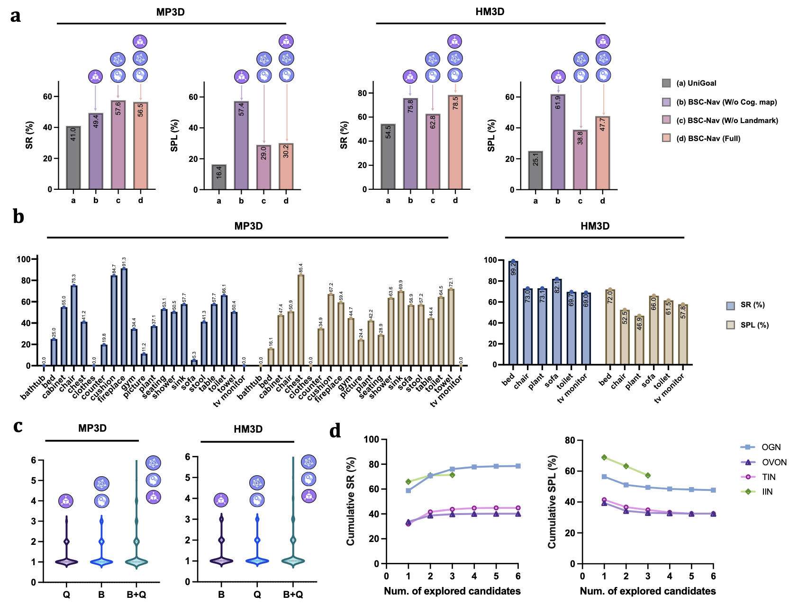{:width 800}
				- en
				  collapsed:: true
					- Fig. 2 Additional results of navigation performance. a, Comparison of SR and SPL between BSC-Nav and the state-of-the-art Unigoal method in object-goal navigation using landmark memory only, cognitive map only, and both. b, Category-wise SR and SPL across 20 object categories in MP3D and 6 object categories in HM3D. c, Number of candidate coordinates explored during successful navigation episodes on MP3D and HM3D. B, landmark memory retrieval only. Q, cognitive map retrieval only. B+Q, both B and Q. It can be seen that most successful navigation episodes achieve the goal at the first explored coordinate. d, The cumulative SR and cumulative SPL as the number of explored candidate locations increases. Additional explorations improve SR (navigation success) but reduce SPL (navigation efficiency).
				- 图 2 导航性能的额外结果。
				- a，BSC-Nav与最先进的Unigoal方法在仅使用地标记忆、仅使用认知地图以及同时使用两者的物体目标导航中的SR和SPL比较。
				- b，在MP3D中的20个物体类别和HM3D中的6个物体类别的类别-wise SR和SPL。
				- c，在MP3D和HM3D上成功导航过程中探索的候选坐标数量。B，仅地标记忆检索。Q，仅认知地图检索。B+Q，同时为B和Q。可以看出，大多数成功的导航过程在第一次探索的坐标上达成目标。
				- d，随着探索的候选位置数量增加，累积SR和累积SPL的变化。额外的探索提高了SR（导航成功率），但降低了SPL（导航效率）。
		- 代表性的可视化示例如图 3c 所示，包括俯视轨迹、第一人称观测以及 MLLM 辅助的目标验证。更多示例可参见**补充视频 1**，基准结果见**补充图 2**。
		  collapsed:: true
			- 图3c
			  collapsed:: true
				- 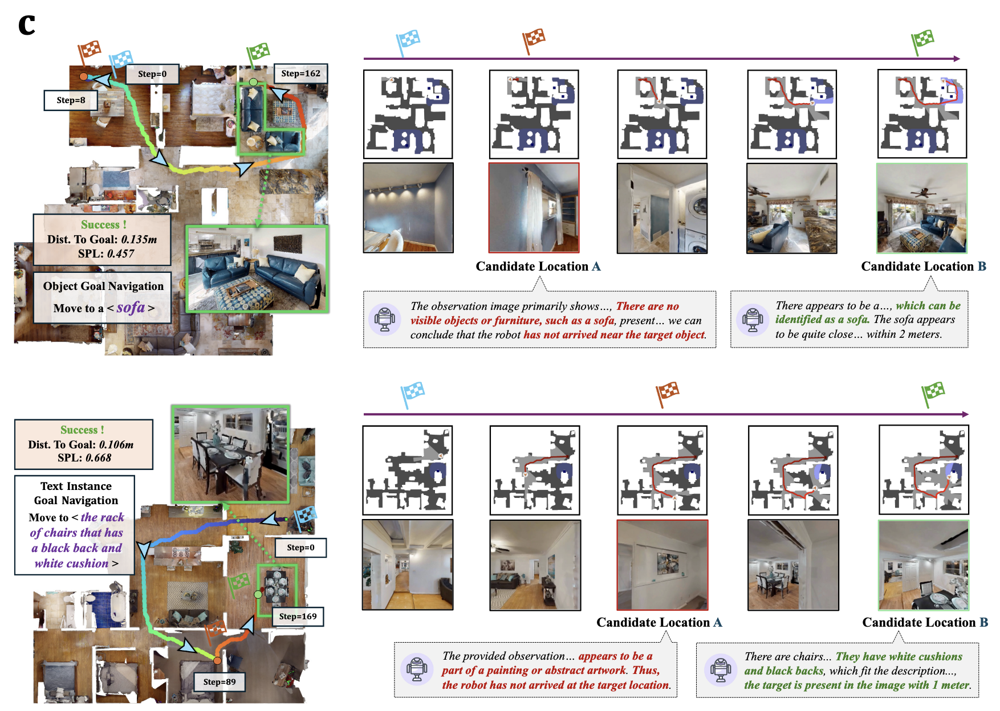{:width 800}
				- 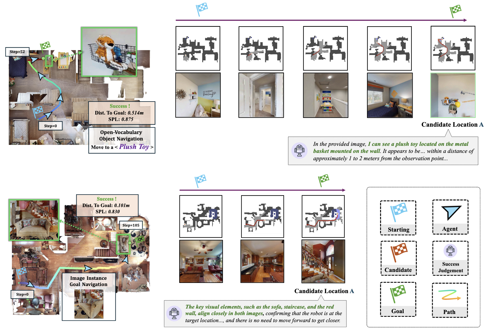{:width 800}
				- **c**，BSC-Nav 导航轨迹的可视化，包括智能体的**自我中心观测（egocentric observations）**以及通过 MLLM 交互进行的**目标验证（target verification）**。
			- 补充视频1
			  collapsed:: true
				- https://drive.google.com/drive/folders/1p1GjpQMQQ-ylmazhjPgqT49AUOcUT3Z-
					- sim_summary.mp4
			- 补充图2 ((0cfa8aa5-0609-484a-9a8a-2f13baa28e7a))
	- ### 2.3 高层次的空间感知技能
	  collapsed:: true
		- 通过将**结构化空间记忆**与**MLLMs 的强大视觉对齐和高层规划能力**相结合，BSC-Nav 在更高层次的空间任务中展现出强劲表现，例如长时程导航与基于复杂语言指令的空间推理。
		- **基于长时程指令的导航（Long-horizon Instruction-based Navigation, LIN）**
		  collapsed:: true
			- 我们在一个具有代表性的任务上对 BSC-Nav 进行了评估，该任务称为基于长时程指令的导航（Long-horizon Instruction-based Navigation, LIN） [49, 50]，该任务要求智能体理解并执行包含多个中间目标与空间约束的复杂指令。
				- 例如，一条指令：“穿过玻璃门，在沙发和茶几之间经过，走到冰箱前，然后右转，在楼梯入口处停下”，需要细腻的视觉-语言推理与空间理解能力。
			- 为此，我们将 BSC-Nav 与具有强大推理能力的 MLLM —— **GPT-o3** [51] 相结合。GPT-o3 基于语言指令与智能体的初始视觉观察生成, 将复杂指令分解为**空间绑定的子目标（waypoints）**（例如“玻璃门”、“冰箱”、“楼梯入口”）。这种分层规划策略将“指令跟随”转化为一系列目标导向的导航步骤，使 BSC-Nav 能够可靠地到达每个中间目标，并最终抵达终点。
			- 我们在 **VLN-CE Room-to-Room (R2R)** 基准 [50] 上对 BSC-Nav 进行评估，该基准包含来自 MP3D 的 **1,000 条人工标注的长时程指令**。
			- 如图 4a 所示，BSC-Nav 在零样本设定下达到 **38.5% 的 SR**，仅比当前最先进的 Vision-Language-Action（VLA）模型 **Uni-Navid** [12] 低 **8.5%**，而后者依赖大量任务特定的监督训练。
				- 图4a
					- 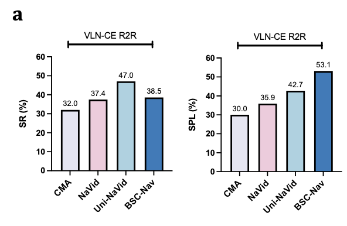{:width 400,:height 800}
					- **a**，BSC-Nav 与基线方法在**长时程指令跟随任务（long-horizon instruction-following tasks）**上的性能比较，使用 **VLN-CE R2R** 基准。
			- 值得注意的是，BSC-Nav 在导航效率上（SPL 为 **53.1%**）显著优于所有基线方法。
			- 这些结果强调了**结构化空间记忆与基础模型结合**在无需指令级监督训练的情况下，能够泛化至复杂的长时程空间任务的能力。
			- 代表性的导航轨迹如图 4d 所示，其中包含简化的子目标描述与由工作记忆检索生成的视觉原型。更多示例见**补充视频 2**。
				- 图4d
				  collapsed:: true
					- 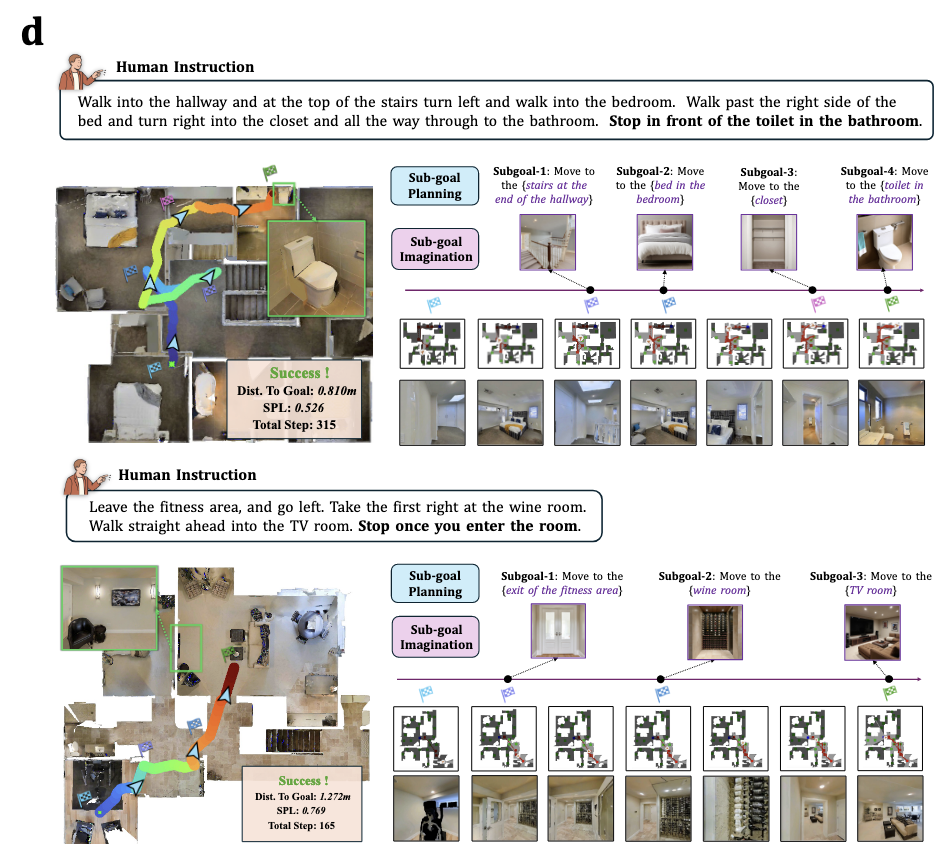{:width 800}
					- **d, e**，BSC-Nav 的代表性导航轨迹示例：
						- **d** 为人类指令导航任务（human instruction navigation），
						- **e** 为具身问答任务（embodied question answering）。
				- 补充视频2
				  collapsed:: true
					- https://drive.google.com/drive/folders/1p1GjpQMQQ-ylmazhjPgqT49AUOcUT3Z-
						- sim-lin.mp4
		- **主动具身问答（Active Embodied Question Answering, A-EQA）**
		  collapsed:: true
			- 空间认知的价值不仅体现在导航中，也延伸至空间推理与场景理解。在此，我们考虑一个具有代表性的任务——主动具身问答（Active Embodied Question Answering, A-EQA） [52–54]，该任务要求智能体通过主动探索环境来回答具有空间关联的问题。不同于静态视觉问答，A-EQA 需要空间理解、探索性规划与动态观测综合——这些都与 BSC-Nav 的优势高度契合。
			- 针对每个问题，BSC-Nav 首先解析目标中间点（与问题相关的实例或区域），随后执行目标导向的探索。当到达合适位置后，**GPT-4o** [34] 将局部观测与原始问题结合，生成具有空间基础的答案。
			- 我们在 **OpenEQA 基准** [54] 的 A-EQA 子集中评估 BSC-Nav，该数据集包含 **184 个问题**，覆盖七类任务：
				- **物体识别（Object Recognition, OR）**
				- **物体定位（Object Localization, OL）**
				- **属性识别（Attribute Recognition, AR）**
				- **空间理解（Spatial Understanding, SU）**
				- **物体状态识别（Object State Recognition, OSR）**
				- **功能推理（Functional Reasoning, FR）**
				- **世界知识（World Knowledge, WK）**
			- 我们将 BSC-Nav 与三个具有代表性的基线进行比较：
				- **无视觉输入的盲 LLM**（仅通过语言回答）；
				- **与问题无关的前沿探索策略** [54]；
				- **ExploreEQA** [55]：一种无结构化空间记忆的主动探索方法。
			- 整体性能通过 **LLM-Match** [54] 进行衡量，该指标使用 LLM 计算生成答案与参考答案之间的语义相似度（方法部分有详细说明）。
			- 如图 4b 所示，BSC-Nav 达到 **54.6 的 LLM-Match 得分**，显著超越所有基线方法。
				- 图4b
				  collapsed:: true
					- 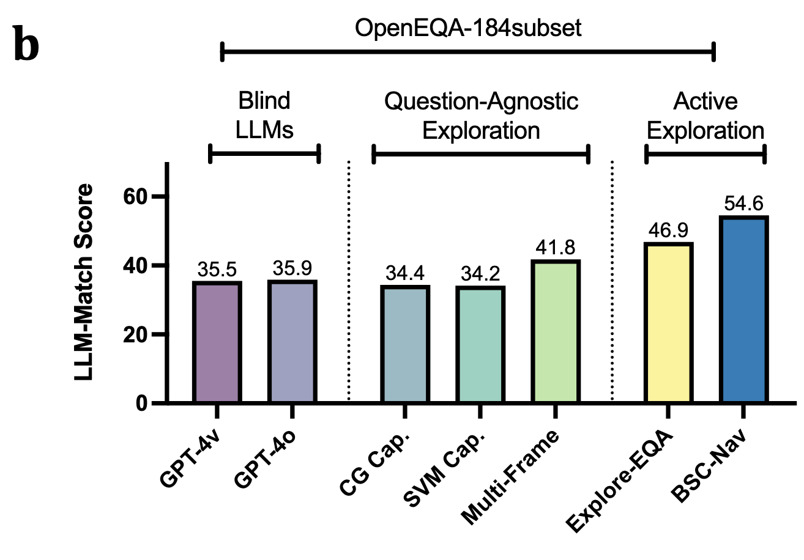{:width 400,:height 800}
					- **b**，BSC-Nav 与基线方法在**主动具身问答任务（Active Embodied Question Answering, A-EQA）**上的性能比较。
			- 图 4c 的按类别细分结果表明，在需要**细粒度空间定位（OL 与 OSR）**以实现快速准确探索的任务中，BSC-Nav 的改进尤为显著。
				- 图4c
					- 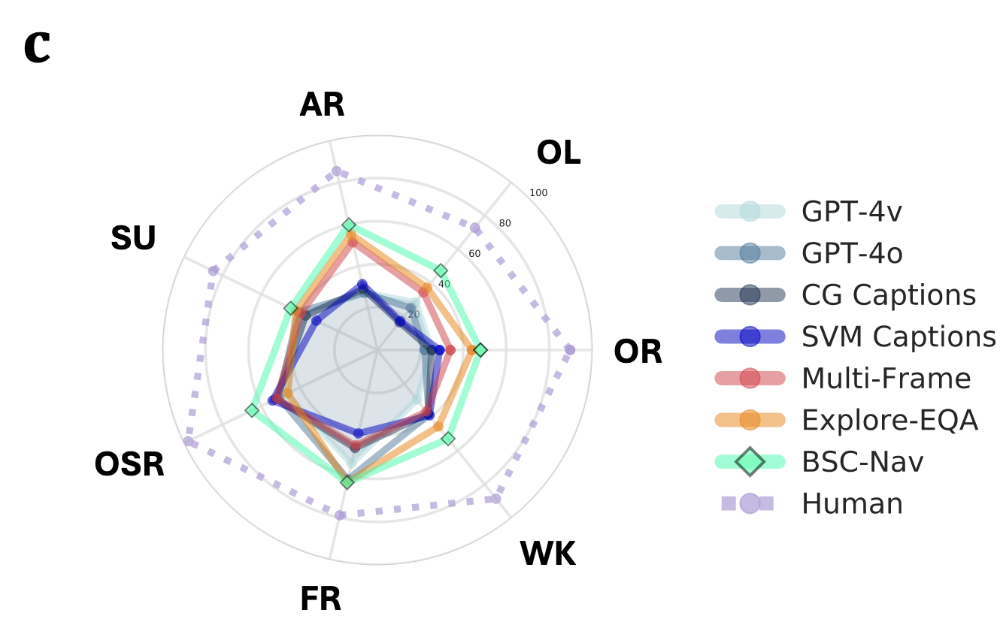{:width 400,:height 800}
					- **c**，在具身问答任务中，BSC-Nav、基线方法与人类在七种问题类型上的分类型性能（category-wise performance breakdown）。
			- 尽管取得这些进展，与人类表现相比仍存在性能差距，这凸显了具身空间认知的持续挑战。
			- 图 4e 中的代表性示例展示了 BSC-Nav 如何结合目标导向的探索与结构化空间记忆来解决多样化的空间推理问题。
				- 图4e
					- 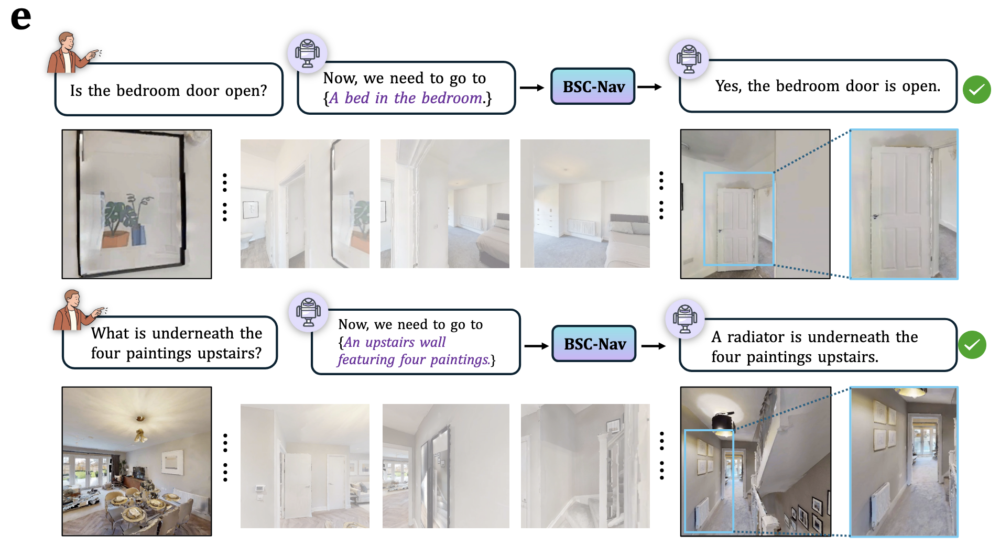{:width 800}
					- **d, e**，BSC-Nav 的代表性导航轨迹示例：
						- **d** 为人类指令导航任务（human instruction navigation），
						- **e** 为具身问答任务（embodied question answering）。
	- ### 2.4 真实世界中的导航与移动操作
	  collapsed:: true
		- **实验设置**
		  collapsed:: true
			- 为展示 **BSC-Nav** 在模拟环境之外的泛化能力及其在下游任务中的广泛适用性，我们将其部署在一个**定制构建的移动机器人平台**上，并在**真实的室内环境**中进行测试。本次评估展示了结构化空间记忆如何在真实物理世界中实现可靠的远距离导航与综合操作。
			- 该移动平台（见图 5a）具有紧凑的机械设计，配备高精度运动控制系统，以及模块化的感知与执行能力。
				- 图5a
					- 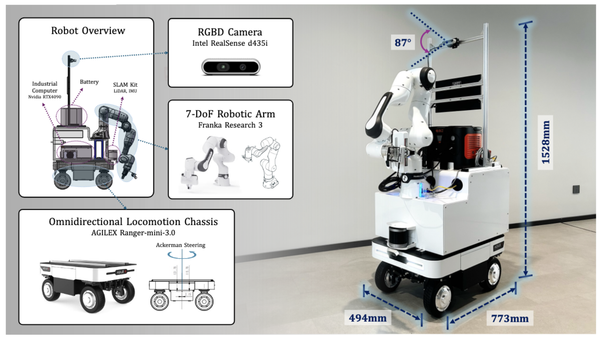{:width 800}
					- **a**，定制的机器人平台，整合了**感知（perception）**、**导航（navigation）**与**操作（manipulation）**能力。
			- 我们在一个两层的室内空间（约 **200 平方米**，见图 5b）中共进行了 **75 个导航回合**，覆盖三种类型的目标导向任务：
				- **目标物体导航（Object-Goal Navigation, OGN）**，
				- **文本实例导航（Text-Instance Navigation, TIN）**，
				- **图像实例导航（Image-Instance Navigation, IIN）**，
				- 图5b
					- 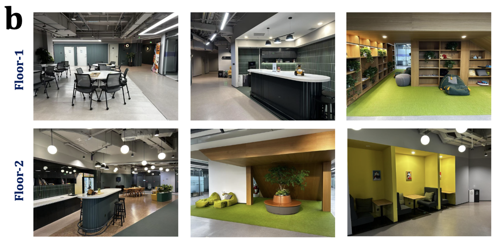{:width 800}
					- **b**，室内实验环境面积为 **200 m²**，包含多种功能区域（例如办公室、休息区、接待区与厨房）。
			- 每种任务包含 **5 个不同的目标**（见图 5c）。每个目标从随机采样的起始位置进行 **5 次试验**，平均路径长度为 **23.4 米**。
				- 图5c
					- 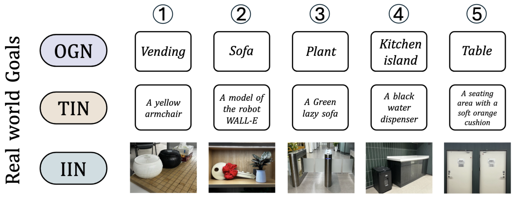{:width 800}
					- **c–f**，真实世界中跨任务的导航性能，包括目标物体导航、文本实例导航与图像实例导航，共含 **15 个不同目标（c）**。
		- **实验结果**
		  collapsed:: true
			- **OGN, TIN, IIN**
			  collapsed:: true
				- BSC-Nav 在所有真实世界任务中均展现出稳健的空间泛化能力。如图 5d 所示，它在每个目标上至少完成 **5 次试验中的 3 次成功**（SR 定义为到达距离目标 1.0 米以内），其中 **IIN 表现最佳**，在 **5 个目标中的 4 个上实现 100% 的 SR**。
				  collapsed:: true
					- 图5d
						- 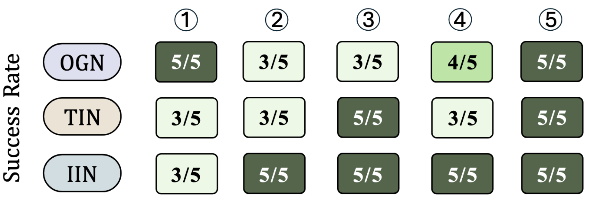{:width 800}
						- 来自 5 次随机起始位置试验的成功率（SR）
				- OGN 和 TIN 均在 2 个目标上达到 **100% 的 SR**，且在所有情形下 SR 均超过 **66.7%**。
				- 即便在失败案例中，BSC-Nav 仍能可靠地定位至语义上合理的区域，展现出强大的空间感知能力。
				- 图 5e 中的 **目标距离分布（Distance-to-Goal, DtG）** 进一步验证了其精准的停止位置：所有任务的最终 DtG 均低于 **2.5 米**，且在目标间分布紧密，特别是在 IIN 任务中表现最为集中。
				  collapsed:: true
					- 图5e
						- 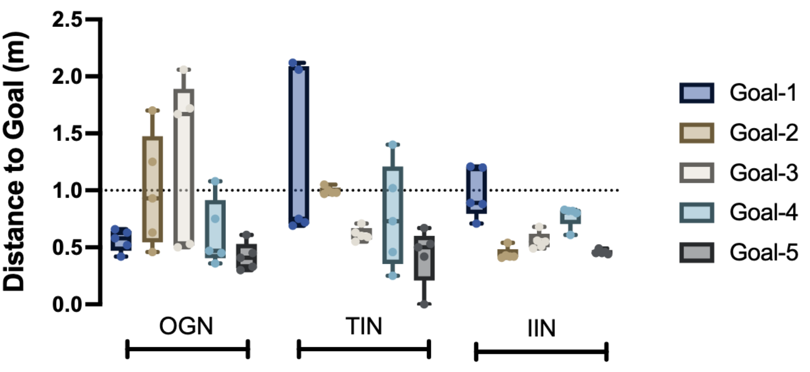{:width 800}
						- 到目标的最终距离（e）
				- 导航效率体现在 **平均速度为 0.76 m/s** 且方差较小（见图 5f），表明运动稳定且高效。
				  collapsed:: true
					- 图5f
					  collapsed:: true
						- 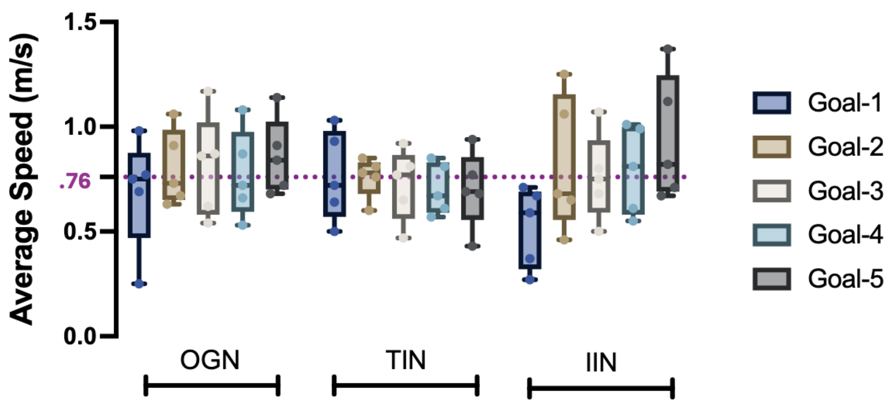{:width 800}
						- 平均导航速度（f）
				- 代表性的导航轨迹在图 5g–h 中可视化，完整演示见 **补充视频 3–7**。
				  collapsed:: true
					- 图5g
					  collapsed:: true
						- 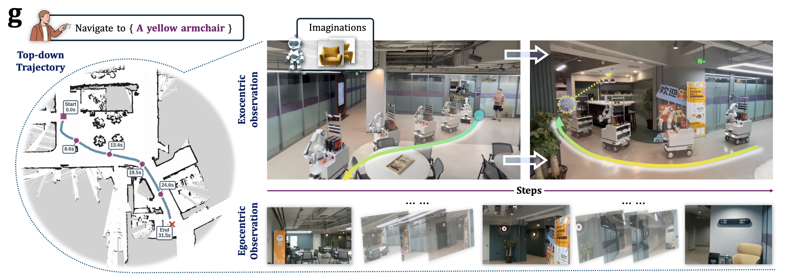{:width 800}
						- **g, h**，真实世界导航的代表性示例。每个示例展示了：
							- 带时间戳的俯视轨迹（左）；
							- 对应的自我中心视图与外心视图（右）。
					- 图5h
					  collapsed:: true
						- 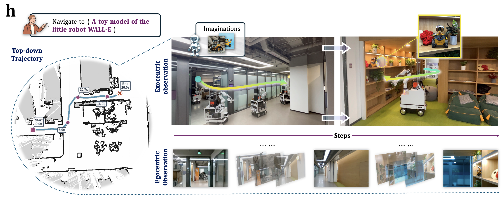{:width 800}
						- **g, h**，真实世界导航的代表性示例。每个示例展示了：
							- 带时间戳的俯视轨迹（左）；
							- 对应的自我中心视图与外心视图（右）。
					- 补充视频3-7
						- https://drive.google.com/drive/folders/1p1GjpQMQQ-ylmazhjPgqT49AUOcUT3Z-
							- Nav_xxx.mp4
			- **长时程导航与基于目标的操作（goal-conditioned manipulation）**
			  collapsed:: true
				- 除了导航之外，BSC-Nav 的结构化空间记忆还支持基于自然语言的稳健移动操作。
				- 尽管以往的具身操作系统 [56–58] 在静态、小尺度环境中展现出一定潜力，但它们往往缺乏在大规模环境中部署所需的空间泛化能力。BSC-Nav 通过将**长时程导航与基于目标的操作（goal-conditioned manipulation）**无缝整合，克服了这一局限。
				- 在我们的演示中，自然语言指令由 **GPT-4** [59] 解析生成一系列**路径点—动作序列（waypoint-action sequences）**。当到达每个路径点时，智能体执行预定义的操作原语（如抓取、放置、倒出等）。
				- 图 6 展示了单步与多步任务的代表性示例。
				  collapsed:: true
					- 图6
						- 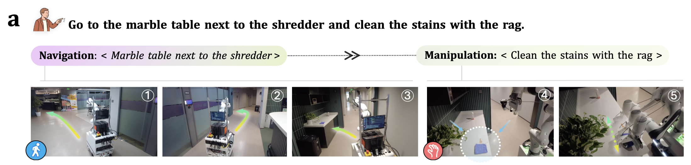{:width 800}
						- 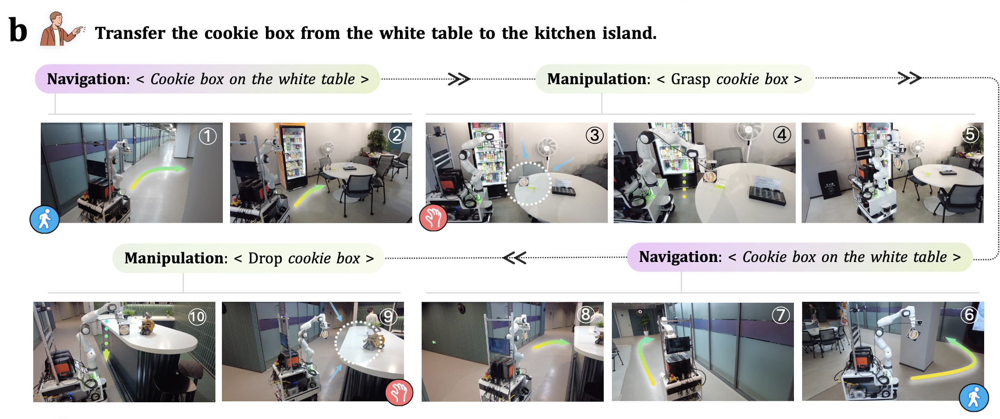{:width 800}
						- 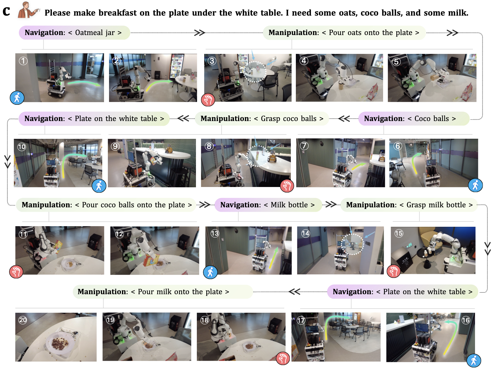{:width 800}
						- 真实世界中的移动操作（Real-world mobile manipulation）. 空间记忆驱动的导航与操作基元（manipulation primitives）之间的协调，使得系统能够根据人类指令执行**长时程任务（long-horizon tasks）**。
						- **a**，单一航点任务（single-waypoint task）：清洁碎纸机旁大理石桌上的污渍。
						- **b**，物体转移任务（object transfer task）：
							- 将饼干盒从桌面搬运到厨房岛台，
							- 该任务要求在多个操作动作之间进行导航。
						- **c**，复杂多步任务（complex multistep task）：
							- 通过依次导航与操作三个开放词汇目标——**燕麦罐（oatmeal jar）**、**可可球（coco balls）**与**牛奶瓶（milk bottle）**，完成“准备早餐（make breakfast）”任务，在盘子上组装好配料。
				- 值得注意的是，“**制作早餐（make breakfast）**”任务（见图 6c）涉及识别并与三个空间上分散的开放词汇物体进行交互，突出了结构化空间记忆在长时程推理与可靠物体对齐中的关键作用。
				- 完整演示可在 **补充视频 8–10** 中查看。
				  collapsed:: true
					- 补充视频8-10
						- https://drive.google.com/drive/folders/1p1GjpQMQQ-ylmazhjPgqT49AUOcUT3Z-
							- Mani_xxx.mp4
## 3 讨论
collapsed:: true
	- 本研究表明，**空间认知的生物学原理**可以被有效地在具身智能体中实例化。
	- 通过构建由**地标（landmarks）**、**路径知识（route knowledge）**与**测绘知识（survey knowledge）**组成的结构化空间记忆，BSC-Nav 不仅提升了导航性能，还促进了**认知空间智能（cognitive spatial intelligence）**的出现，从而补充了现代多模态大语言模型（MLLMs）在感知与推理方面的强大能力，助力实现**通用具身人工智能系统（general-purpose embodied AI systems）**。
	- ### 从反应式行为到认知空间智能
	  collapsed:: true
		- 传统的具身智能体通常依赖于**强化学习（reinforcement learning）**或**模仿学习（imitation learning）**，通过大量的试错或远程操作演示来获得任务特定的策略。虽然在受控环境中有效，但这些方法在本质上仍是**反应式的（reactive）**，仅对即时刺激做出响应，缺乏持久或可复用的空间知识。
		- BSC-Nav 通过将**结构化空间记忆**与**基础模型（foundation models）**相结合，克服了这一局限，使得系统能够从“基于观察的模式匹配”过渡到“多层次空间推理”。
		- 从实证结果来看，BSC-Nav 在不同模态与粒度的导航任务中均表现出强劲的性能，尤其是在开放词汇与实例级设定中。例如，在具有挑战性的 **VLN-CE 基准**中，它在零样本设定下实现了 **38.5% 的成功率（SR）**，仅比最领先的监督方法低 **8.5%**，同时在效率上显著超越。
		- 这些结果展示了**以记忆为中心的空间表征（memory-centric spatial representations）**如何使具身智能体能够：
			- 将规划与感知解耦，
			- 在任务间复用先前经验，
			- 将高层目标转化为具体行动，
		- 从而体现出**认知空间智能的关键特征（hallmarks of cognitive spatial intelligence）**。
	- #### 生物空间认知的计算实现
	  collapsed:: true
		- BSC-Nav 提供了一个计算框架，将**生物系统中长期存在的空间知识理论**[16, 17] 操作化。
		- 尽管神经科学长期以来提出，空间认知依赖于**地标、路径知识与测绘知识**三者之间的互联表征，但大多数实验证据仅限于**行为学或相关性层面**。BSC-Nav 展示了这些要素如何以协同的方式实现，以支持**长时程的空间理解、规划与推理**。
		- 尤其是，其**认知地图模块（cognitive map module）**采用了受**自由能原理（free-energy principle）**[32] 启发的“**惊讶驱动更新策略（surprise-driven update strategy）**”，与以下神经假说相一致：
			- > 生物大脑通过最小化预测误差来精炼内部模型 [32, 33]。
		- 此外，最新研究表明，**序列性路径学习（sequential route learning）**在海马体–内嗅皮层（hippocampus–entorhinal）回路中驱动了**他心坐标认知地图（allocentric cognitive maps）**的形成 [60]，这一过程在 BSC-Nav 的**轨迹体素化机制（trajectory voxelization）**中得到了反映。
		- 这些平行现象揭示了**认知科学与人工智能之间的收敛计算基础（a convergent computational basis shared between cognitive science and AI）**。
	- ### 朝向空间认知的具身图灵测试（Toward an embodied Turing test [61] for spatial cognition）
	  collapsed:: true
		- 随着具身人工智能系统在感知与运动能力上的不断进步，评估它们在**真实世界语境下的空间理解能力**变得愈发重要。类似于经典的语言图灵测试（Turing test），人们可以设想一种**空间认知基准**，用于评估具身智能体是否展现出**基于物理空间的、类似人类的目标导向抽象、规划与推理能力**。
		- 我们的研究突出了若干基础维度：
			- (i) 可复用空间表征的实时构建；
			- (ii) 从稀疏与部分观测中进行抽象与推理；
			- (iii) 将高层目标转换为可执行的空间规划。
		- 尽管 BSC-Nav 在这些维度上取得了显著进展，但仍存在性能差距。例如，BSC-Nav 在 A-EQA 上达到了 **54.6 的 LLM-Match 分数**，显著优于先前的方法，但仍落后于人类表现 **27.5%**。这凸显了人类空间认知的复杂性——其整合了常识知识、因果推理以及从最少环境线索中进行抽象的能力。
		- 未来的基准可能会正式定义一个**用于空间智能的综合具身图灵测试（embodied Turing test）**[61]，其中包含以下挑战：
			- 适应环境变化，
			- 多步路径叙述，
			- 协作式问题求解等。
	- ### 展望与未来方向（Outlook and future directions）
	  collapsed:: true
		- BSC-Nav 展示了**生物启发的结构化空间记忆**可以显著增强具身人工智能系统的泛化性与适应性。未来的工作可以聚焦于：
			- 将该框架扩展到**动态与非结构化环境**；
			- 提升记忆效率以支持**实时部署**；
			- 支持**多智能体协作交互**；
			- 整合更多可用的**感知模态**。
		- 超越导航任务，该架构通过**分层记忆组织（hierarchical memory organization）**为更广泛的认知功能奠定基础，类似于生物系统如何协调感知、认知与决策过程。鉴于当前基于 MLLMs 的具身智能体仍表现出有限的空间能力，BSC-Nav 强调了**以记忆为中心的设计（memory-centric design）**在弥合这一差距中的潜力。
		- 尽管通用人工智能（AGI）的追求仍是一个长期目标，但此类进展为实现**更强大、更具适应性、且具认知能力的真实物理世界 AI**提供了切实的前进路径。
## 4 方法
collapsed:: true
	- ### 4.1 BSC-Nav 框架
	  collapsed:: true
		- 本节描述了 BSC-Nav 的实现细节，包括三个协同模块（见图 1b）以及**构建与利用结构化空间记忆的处理流程**（见补充图 1）。
		  collapsed:: true
			- 图1b ( ((209458a5-5fc8-45ab-9845-4b659f5045dc)) )
			- 补充图1
			  collapsed:: true
				- 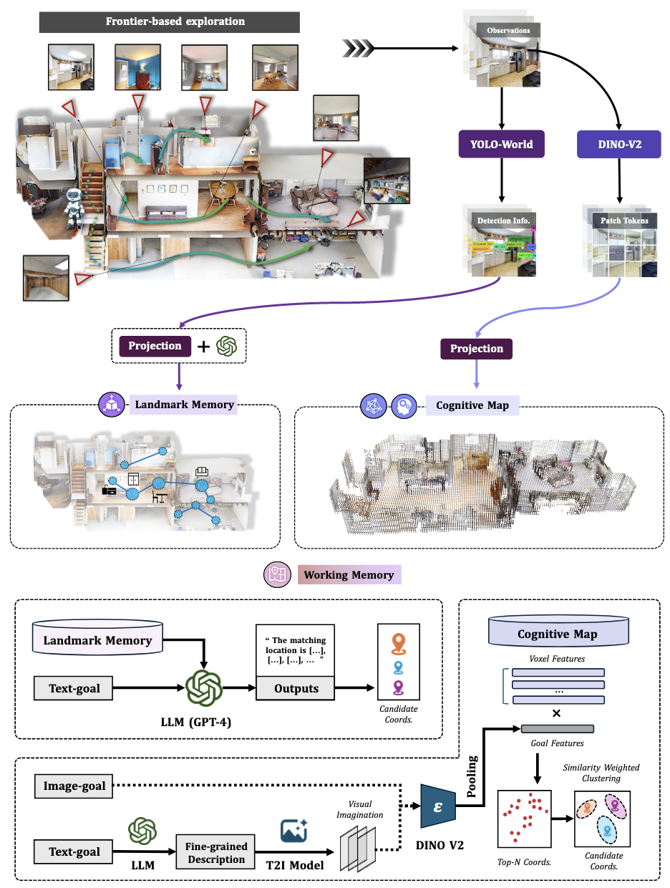{:width 800}
				-
		- #### 观测空间（Observation space）
		  collapsed:: true
			- BSC-Nav 的观测空间定义为：
				- $$
				  
				  \mathcal{O}_t = { I_t, D_t, P_t }
				  
				  $$
				- 其中，
					- $I_t \in \mathbb{R}^{H \times W \times 3}$ 为 RGB 图像；
					- $D_t \in \mathbb{R}^{w \times h}$ 为深度图像；
					- $P_t = (X_t, Y_t, \phi_t^a) \in \mathbb{R}^3$ 表示在时间 $t$ 的智能体位姿。
						- 其中，$X_t$ 与 $Y_t$ 表示智能体在**世界坐标系（world coordinate system）**中的二维位置（默认以 **SLAM** [62] 初始化点为原点的笛卡尔坐标系），
						- $\phi_t$ 表示偏航角（yaw angle），
						- $H$ 与 $W$ 分别为图像的高与宽。
						- 为简化描述，在后续部分中省略时间下标 $t$。
			- RGB 图像用于显著物体检测与视觉特征提取；深度图像与位姿信息用于将像素坐标投影到世界坐标系中。
		- #### 地标记忆（Landmark memory）
		  collapsed:: true
			- 在主动探索过程中，一个观测 $\mathcal{O}$ 被并行地由两个分支处理，用于构建结构化空间记忆（见图 2a）。( ((f80480aa-56f2-4173-93bf-6b801adc230e)) )
			- 对于地标记忆部分，我们将其实例化为由四元组组成的列表：
				- $$
				  
				  \mathcal{M}_{\text{landmark}} = { \{L_k\} }_{k=1}^{N}, \quad L_k = { c_k, \theta_k, \rho_k, \mathcal{T}_k }
				  
				  \tag{1}
				  
				  $$
				- 其中：
					- $\theta_k = (X_k^w, Y_k^w, Z_k^w) \in \mathbb{R}^3$ 表示第 $k$ 个实例在世界坐标系中的三维中心坐标；
					- $c_k \in \mathcal{C}$ 表示预定义类别集合 $\mathcal{C}$ 中的**开放词汇类别**；
					- $\rho_k \in [0,1]$ 表示检测置信度；
					- $\mathcal{T}_k$ 是由 GPT-4o [34] 基于观测生成的该实例描述，包含纹理、形状与空间语义上下文信息。
			- 为了获得世界坐标 $\theta_k$，我们执行一系列坐标变换。
			  collapsed:: true
				- 假设检测到的目标的边界框中心像素坐标为 $(u_k, v_k)$，对应深度值为 $d_k$，则首先计算其在**相机坐标系（camera coordinate system）**中的三维点。
				- 该坐标系定义为：原点位于相机光学中心，xy 平面平行于图像平面，z 轴与光轴方向一致。
				- 通过**逆透视投影（inverse perspective projection）**，该点可计算为：
					- $$
					  
					  \mathbf{p}^{\text{cam}}_k = d_k \cdot \mathbf{K}^{-1}
					  
					  \begin{bmatrix}
					  
					  u_k \\ v_k \\ 1
					  
					  \end{bmatrix}
					  
					  = d_k
					  
					  \begin{bmatrix}
					  
					  (u_k - c_x)/f_x \\
					  
					  (v_k - c_y)/f_y \\
					  
					  1
					  
					  \end{bmatrix}
					  
					  \tag{2}
					  
					  $$
					- 其中 $\mathbf{K} \in \mathbb{R}^{3 \times 3}$ 为相机的内参矩阵（intrinsic matrix），
					- $f_x, f_y$ 为焦距，$(c_x, c_y)$ 为主点坐标。
				- 随后，将该点转换到**世界坐标系**中。
				- 给定来自观测空间的机器人位姿：$P_t = (X_t, Y_t, \phi_t)$, 可构造**基座到世界的变换矩阵**：
					- $$
					  
					  \mathbf{T}_{\text{world}}^{\text{base}} =
					  
					  \begin{bmatrix}
					  
					  \cos \phi_t & -\sin \phi_t & 0 & X_t \\
					  
					  \sin \phi_t & \cos \phi_t & 0 & Y_t \\
					  
					  0 & 0 & 1 & Z_{\text{base}} \\
					  
					  0 & 0 & 0 & 1
					  
					  \end{bmatrix}
					  
					  \in SE(3)
					  
					  \tag{3}
					  
					  $$
					- 其中 $Z_{\text{base}}$ 表示机器人基座在世界坐标系中的高度。
				- 该点通过级联齐次变换（cascaded homogeneous transformation）转换为：
					- $$
					  
					  \begin{bmatrix} 
					  
					  \mathbf{p}^{\text{world}}_k \\ 1 
					  
					  \end{bmatrix}
					  
					  =
					  
					  \mathbf{T}_{\text{world}}^{\text{base}}
					  
					  \mathbf{T}_{\text{base}}^{\text{cam}}
					  
					  \begin{bmatrix}
					  
					  \mathbf{p}^{\text{cam}}_k \\ 1
					  
					  \end{bmatrix}
					  
					  \tag{4}
					  
					  $$
					- 其中 $T_{\text{cam}}^{\text{base}} \in SE(3)$ 表示相机到机器人基座坐标系的固定刚体变换。
				- 最终的世界坐标提取为：
					- $$
					  
					  \theta_k = \mathbf{p}^{\text{world}}_k = (X_k^w, Y_k^w, Z_k^w)^{\top}
					  
					  $$
			- 在实际操作中，我们采用开放词汇物体检测器 **YOLO-World** [63] 来感知显著实例。我们预定义了若干常见物体类别，作为地标类别集合：$\mathcal{C} = { \text{“sofa”}, \text{“sink”}, \text{“bed”}, \dots }$, 并设置检测置信度阈值以排除语义模糊或非显著实例。
			- 为防止重复记录同一实例，我们对每个新检测到的地标 $L_{N+1}$ 进行重叠检测。定义空间重叠集合为：
				- $$
				  
				  \mathcal{U} = \{ L_j \in \mathcal{M}_{\text{landmark}} : \| \theta_{N+1} - \theta_j \|_2 < \delta_{\text{overlap}} \wedge c_{N+1} = c_j \}
				  
				  $$
			- 若 $\mathcal{U} \neq \emptyset$，则对现有地标执行记忆融合（memory fusion）：
				- $$
				  
				  L_{\text{fused}} =
				  
				  \begin{cases}
				  
				  c_{\text{fused}} = c_{N+1} \\
				  
				  \theta_{\text{fused}} =
				  
				  \dfrac{
				  
				  \rho_{N+1} \cdot \theta_{N+1} + \sum_{j \in \mathcal{U}} \rho_j \cdot \theta_j
				  
				  }{
				  
				  \rho_{N+1} + \sum_{j \in \mathcal{U}} \rho_j
				  
				  } \\
				  
				  \rho_{\text{fused}} =
				  
				  \dfrac{
				  
				  \rho_{N+1} + \sum_{j \in \mathcal{U}} \rho_j
				  
				  }{
				  
				  |\mathcal{U}| + 1
				  
				  } \\
				  
				  \mathcal{T}_{\text{fused}} = \mathcal{T}_k, \quad
				  
				  k = \arg\max_{j \in {\{N+1\}} \cup \mathcal{U}} \rho_j
				  
				  \end{cases}
				  
				  \tag{5}
				  
				  $$
			- 记忆融合后，集合 $\mathcal{U}$ 中的所有元素将从 $\mathcal{M}_{\text{landmark}}$ 中移除，并将 $L_{\text{fused}}$ 添加至其中。
			- 此更新确保每个地标四元组表示一个唯一的空间实例，从而避免信息冗余。
		- #### 认知地图（Cognitive map）
		  collapsed:: true
			- 与地标记忆模块（landmark memory module）并行，**认知地图模块（cognitive map module）**利用来自探索轨迹的 RGB 观测，将视觉线索持续投射到体素化（voxelized）的视觉-空间表征中，从而在静态与简化的表示之外，逐步整合并更新路径知识（route knowledge）（见图 2a）。( ((f80480aa-56f2-4173-93bf-6b801adc230e)) )
			- 我们将认知地图定义为离散体素化表示：
				- $$
				  
				  \mathcal{M}_{\text{cog}} = {\{ \mathcal{F}_\mathbf{v} \}}_{\mathbf{v} \in \mathcal{V}}, \quad \text{where } \mathcal{F}_\mathbf{v} = {\{ f_b \}}_{b=1}^{B}, \ f_b \in \mathbb{R}^{\hbar}
				  
				  \tag{6}
				  
				  $$
				- 其中，$\mathcal{V} \subseteq \mathbb{Z}^3$ 表示离散体素索引空间（discrete voxel index space），每个体素 $\mathbf{v} = (v_x, v_y, v_z)$ 维护一个特征缓冲区 $\mathcal{F}_\mathbf{v}$，其中最多包含 $B$ 个特征向量，$\hbar$ 为视觉特征的维度。
			- 为实现精细化的视觉-空间编码，我们采用 **DINO-v2** [30]（一种强大的自监督视觉编码器）从连续的二维 RGB 观测中提取 patch-level 特征。
			- 给定一幅 RGB 图像 $I \in \mathbb{R}^{H \times W \times 3}$，DINO-v2 生成以空间网格形式组织的 patch token：
				- $$
				  
				  \mathbf{F}_{\text{patch}} \in \mathbb{R}^{H' \times W' \times D},
				  
				  $$
				- 其中 $H' = H/s$, $W' = W/s$，$s$ 为 patch stride。
			- 这些 patch 级特征通过多阶段变换过程从二维图像坐标投射到对应的体素坐标。设 $(i, j)$ 表示patch网格中的索引，其中 $i \in \{0, 1, \dots, H'-1\}$，$j \in \{0, 1, \dots, W'-1\}$。对于每个patch $(i, j)$，我们首先确定其在原始图像中的中心像素坐标：
				- $$
				  
				  (u_{ij}, v_{ij}) = (j \cdot s + s/2, \ i \cdot s + s/2),
				  
				  \tag{7}
				  
				  $$
				- 其中 $s$ 为patch stride。
			- 利用该位置的深度值 $d_{ij}$，可计算其在**相机坐标系**中的对应三维点：
				- $$
				  
				  \mathbf{p}^{\text{cam}}_{ij} = d_{ij} \cdot K^{-1}
				  
				  \begin{bmatrix}
				  
				  u_{ij} \\ v_{ij} \\ 1
				  
				  \end{bmatrix}.
				  
				  \tag{8}
				  
				  $$
			- 然后，该点利用来自观测空间的机器人位姿 $P = (X, Y, \phi)$ 转换为世界坐标：
				- $$
				  
				  \begin{bmatrix}
				  
				  \mathbf{p}^{\text{world}}_{ij} \\ 1
				  
				  \end{bmatrix}
				  
				  = \mathbf{T}^{\text{base}}_{\text{world}} \mathbf{T}^{\text{cam}}_{\text{base}}
				  
				  \begin{bmatrix}
				  
				  \mathbf{p}^{\text{cam}}_{ij} \\ 1
				  
				  \end{bmatrix},
				  
				  \tag{9}
				  
				  $$
				- 其中 $\mathbf{T}^{\text{base}}_{\text{world}}$ 由机器人位姿构建（如式 (7) 定义）。
			- 当 $\mathbf{p}^{\text{world}}_{ij} = (X^{w}_{ij}, Y^{w}_{ij}, Z^{w}_{ij})^{\top}$ 时，我们将连续的世界坐标离散化为体素索引：
				- $$
				  
				  \mathbf{v}_{ij} =
				  
				  \left(
				  
				  \bigg\lfloor \frac{X^{w}_{ij}}{\Delta} + \frac{G}{2} \bigg\rfloor,
				  
				  \bigg\lfloor \frac{Y^{w}_{ij}}{\Delta} + \frac{G}{2} \bigg\rfloor,
				  
				  \bigg\lfloor \frac{Z^{w}_{ij}}{\Delta} \bigg\rfloor
				  
				  \right),
				  
				  \tag{10}
				  
				  $$
				- 其中，$\Delta$ 为体素大小（空间分辨率），$G$ 为网格维度。偏移量 $G/2$ 使体素网格以世界原点为中心。
			- patch $(i, j)$ 的视觉特征 $\mathbf{F}_{\text{patch}}[i, j] \in \mathbb{R}^D$ 与体素 $\mathbf{v}_{ij}$ 关联。
			- 在 $\mathcal{M}_{\text{cog}}$ 中，我们避免冗余地存储来自新观测的所有视觉特征，以防止信息过载与低效检索。我们也摒弃了传统的融合方法，如网格平均或基于距离加权 [64, 65]，因为这些方法往往会在视觉特征表示中引入偏差。相反，受到生物学习与记忆机制的启发，我们为每个体素维护动态缓冲区，并引入**基于“惊讶度（surprise）”的更新策略**。
			- 神经科学研究表明，生物大脑通过最小化预测输入与观测输入之间的差异来更新内部模型，这被称为**自由能原理（free-energy principle）** [32, 33]。类似地，BSC-Nav 的认知地图根据新观测与现有记忆在特定空间区域的偏离程度（即“惊讶度”水平）进行更新。
			- 对于投射到体素 $\mathbf{v} \in \mathbb{Z}^3$ 的新视觉特征 $f_{\text{new}}$，我们计算其惊讶度得分为：
				- $$
				  
				  \mathcal{S}(f_{\text{new}}, \mathbf{v}) =
				  
				  \frac{1}{|\mathcal{F}_{\mathcal{N}_n(\mathbf{v})}|}
				  
				  \sum_{f_b \in \mathcal{F}_{\mathcal{N}_n(\mathbf{v})}}
				  
				  \mathcal{D}(f_{\text{new}}, f_b),
				  
				  \tag{11}
				  
				  $$
				- 其中，
					- $\mathcal{N}_n(\mathbf{v}) = { \mathbf{v'} \in \mathbb{Z}^3 : \| \mathbf{v} - \mathbf{v'} \|_{\infty} \le n }$ 表示体素 $\mathbf{v}$ 周围 $n$ 跳立方邻域；
					- $\mathcal{F}_{\mathcal{N}_n(\mathbf{v})} = \bigcup_{\mathbf{v}' \in \mathcal{N}_n(\mathbf{v})} F_{v'}$ 表示该邻域内所有特征缓冲区的并集；
					- $\mathcal{D}(\cdot, \cdot)$ 是距离度量函数（例如余弦距离）。
			- 我们设定预定义阈值 $\tau = 0.5$（默认）。当 $S(f_{\text{new}}, v) > \tau$ 时，将 $f_{\text{new}}$ 添加至 $F_v$。
			- 若 $|F_v| = B$，则替换缓冲区中**惊讶度最低的特征**以维持记忆效率。
			- 这种基于惊讶度的更新策略具有两大优势：
				- (i) 通过在不同视点与时间点选择性缓存多样特征来增强空间知识的稳健性，适应动态环境；
				- (ii) 通过避免对稳定环境元素的冗余编码，保持记忆存储与检索效率。
		- ### 工作记忆（Working memory）
		  collapsed:: true
			- **工作记忆模块（working memory module）**负责从地标记忆 $\mathcal{M}_{\text{landmark}}$ 与认知地图 $\mathcal{M}_{\text{cog}}$ 中进行**分层检索与策略重组（hierarchical retrieval and strategic reorganization）**，使 BSC-Nav 能够应对不同模态与粒度的导航任务（见图 2b）。 ( ((f80480aa-56f2-4173-93bf-6b801adc230e)) )
			- 与两个记忆分支的并行构建与被动更新不同，工作记忆仅在接收到导航指令时被激活。它采用由指令复杂性引导的分层检索策略。
				- 对于简单且具体的目标，优先执行**快速地标记忆检索**；
				- 对于精细化或基于图像的指令，则进一步调用**认知地图**以实现精确的视觉-空间定位（见图 2c）。 ( ((f80480aa-56f2-4173-93bf-6b801adc230e)) )
			- #### 基于 MLLM 推理的地标记忆检索（MLLM-reasoning retrieval for landmark memory）
			  collapsed:: true
				- 地标记忆中的结构化知识库（包括地标类别、置信度与上下文描述）为 MLLM 提供了推理目标位置的坚实基础。与直接的规则匹配不同，该方法支持上下文感知推理，并能基于空间关联推断未记录目标的位置。
				- 例如，即使“烤面包机（toaster）”未被明确记录，系统仍可通过与其共现的地标（如“炉灶（stove）”与“厨房岛台（kitchen island）”）推断其可能位置。
				- 具体而言，我们设计了**检索提示词模板（retrieval prompts）**（见补充附录 A），用于引导仅文本形式的 GPT-4 整合置信度分数与描述性语义，以从 $\mathcal{M}_{\text{landmark}}$ 生成候选坐标集合：$\{ \theta^i_{\text{cand}} \}_{i=1}^{K}$
			- #### 认知地图的关联增强检索（Association-enhanced retrieval for cognitive map）
			  collapsed:: true
				- 为弥合文本指令与视觉表征之间的模态差距，我们在认知地图上执行**关联增强检索**。
				- 首先，使用仅文本形式的 **GPT-4o** 精炼目标描述，通过添加纹理与空间上下文信息进行语义增强。在 LIN 任务中，初始视觉观测也作为环境先验输入，以提高描述的准确性与特异性。
				- 这些增强后的描述随后通过**文本到图像生成模型（text-to-image generation model）**（默认使用 **Stable Diffusion 3.5** [66]）来“想象”目标的可能视觉外观。这种“**想象再定位（imagine-then-localize）**”的过程类似于人类在导航前的预思考阶段。生成的想象图像由 **DINO-v2** 编码以提取patch级特征 $\{ f_i \}_{i=1}^{Q}$，
				- 随后执行**中心距离加权池化（center-distance weighted pooling）**以获得实例级视觉表示：
					- $$
					  
					  f_{\text{target}} =
					  
					  \frac{\sum_{i=1}^{N} w_i \cdot p_i}{\sum_{i=1}^{N} w_i},
					  
					  \quad \text{where }
					  
					  w_i = \exp\left[-\alpha \cdot (x_i, y_i) - (x_c, y_c)_2 \right],
					  
					  \tag{12}
					  
					  $$
					- 其中，$(x_i, y_i)$ 为第 $i$ 个补丁的空间坐标，$(x_c, y_c)$ 为图像中心，$\alpha$ 为温度参数。
				- 该加权策略可抑制背景干扰，强化目标实例的中心特征。
				- 作为中间查询，池化后的视觉特征将与认知地图中存储的特征进行匹配，返回具有最大余弦相似度的前 $K$ 个体素坐标集合。
				- 我们对该体素坐标集合执行**相似度加权的 DBSCAN 聚类（similarity-weighted DBSCAN clustering）** [67]，得到聚类中心的网格坐标，作为最终的空间坐标候选。
				- 这些网格坐标随后需要**反投影到世界坐标系**，得到 $\{ \theta^i_{\text{cand}} \}_{i=1}^{Q}$，供后续低层规划使用。
			- #### 探索序列规划（Exploration sequence planning）
			  collapsed:: true
				- 我们设计了一个**复合评分函数（composite scoring function）**，结合目标存在概率与空间距离来对候选空间坐标进行优先级排序。具体而言：
					- 对于来自地标记忆的候选，使用检测置信度作为存在概率；
					- 对于来自认知地图的候选，使用视觉特征的余弦相似度。
				- 优先级评分函数定义为：
					- $$
					  
					  H_i = \lambda \cdot p_i + (1 - \lambda) \cdot \left(1 - \frac{d_i}{d_{\max}}\right),
					  
					  \tag{13}
					  
					  $$
					- 其中，
						- $p_i$ 表示第 $i$ 个候选的存在概率（置信度或相似度），
						- $d_i$ 表示该候选与起点之间的欧几里得距离，
						- $d_{\max} = \max_j d_j$ 用于归一化距离，
						- 超参数 $\lambda$ 用于平衡存在概率与探索效率，默认 $\lambda = 0.5$，即两者同等重要。
		- ### 低层导航策略生成（Low-level navigation policy generation）
		  collapsed:: true
			- 低层导航策略通常由**基于环境约束与高层空间目标的确定性路径规划（deterministic path planning）**导出 [44]。
			- BSC-Nav 采用**分层导航策略（hierarchical navigation strategy）**：
				- 每个候选坐标的探索序列作为高层策略（high-level policy），
				- 而启发式算法用于生成可执行的低层策略（low-level policy），以引导智能体向每个候选坐标移动。
			- 在模拟环境中，我们使用 **Habitat 模拟器** [38] 提供的**贪婪最短路径算法（greedy shortest path algorithm）**，该算法直接在场景的三维网格（3D mesh）上操作，在离散动作空间中计算最优动作序列。
			- 在真实世界部署中，我们实现了**两层规划架构（two-tier planning architecture）**。
				- 全局规划（global planning）使用 **A*** 算法 [68]，在基于 LiDAR 的 SLAM 构建的占用栅格地图（occupancy grid map）上执行，以获得全局最优路径。
				- 局部规划（local planning）采用 **Timed Elastic Band (TEB)** 算法 [69, 70]，该算法可在保持运动效率的同时动态调整轨迹以避开障碍物。TEB 规划器输出连续的速度命令以控制机器人底盘，从而确保平滑且精确的运动执行。
		- ### 目标验证与可供性（Goal verification and affordance）
		  collapsed:: true
			- 当到达候选坐标后，BSC-Nav 会验证导航目标是否存在于当前位置。
			- 机器人首先执行一次 **360° 旋转扫描**，以捕获一系列 RGB 图像。
			- 然后计算这些图像的 **CLIP 视觉嵌入（visual embeddings）** 与目标文本或视觉嵌入之间的**余弦相似度（cosine similarity）**，以识别与语义最匹配的视角角度。
			- 所选图像随后输入到 **GPT-4o** 中以执行**精确的目标验证**。
			- 除了确认目标存在外，GPT-4o 还会被提示生成一系列**基于可供性（affordance-based）的动作序列**，用于指导机器人微调姿态、调整相对位置与朝向，以获得最佳的接近度与可视性。这确保了下游操作任务的理想初始条件。
	- ### 4.2 实验细节（Experimental details）
	  collapsed:: true
		- #### 模拟器与数据集（Simulator and datasets）
		  collapsed:: true
			- 模拟实验在 **Habitat 3.0 平台** [71] 上进行。该平台是一个常用于**具身人工智能（embodied AI）**与**人机交互（HRI）**的家庭环境模拟框架。我们选择该平台是因为其对大规模具身导航的强大支持，包括：
				- (i) **habitat-sim**：高性能模拟器，提供逼真的渲染与基于物理的交互，支持主流室内数据集；
				- (ii) **habitat-lab**：模块化基准测试套件，支持多种导航任务，具备标准化的管线与评估指标。
			- 在此，我们在四类基础导航任务上评估 BSC-Nav 与基线方法：
				- **1. 目标物体导航（Object-Goal Navigation, OGN）。**
					- 该任务 [72] 包含两个基准集：
						- (i) 在 34 个 HM3D 场景中进行的 2,195 个导航回合，涉及 6 个物体类别；
						- (ii) 在 10 个 MP3D 场景中进行的 2,000 个导航回合，涉及 20 个物体类别。
				- **2. 开放词汇物体导航（Open-Vocabulary Object Navigation, OVON）。**
					- 该任务 [41] 扩展至 10 个 MP3D 场景中的 **79 个开放词汇类别**，以克服传统目标物体导航中类别有限的问题。
					- 我们分别从 **已见验证集（validation-seen）** 与 **未见验证集（validation-unseen）** 各采样 1,000 个回合。
						- 已见集包含在训练中出现过的类别（但非相同实例），
						- 而未见集则完全由新的、语义上不相似的类别组成。
				- **3. 文本实例导航（Text-Instance Navigation, TIN）。**
					- 该任务 [42] 为 36 个 HM3D 场景中的 795 个实例提供**自然语言描述**。描述包含两种属性：
						- **内在属性（intrinsic attributes）**：包括形状、颜色、材质等物体固有特性；
						- **外在属性（extrinsic attributes）**：包括环境上下文信息。
					- 所有描述由强大的多模态语言模型 **CogVLM** [73] 注释生成。
					- 我们评估全部 1,000 个测试回合。
				- **4. 图像实例导航（Image-Instance Navigation, IIN）。**
					- 该任务 [43] 使用**单视角渲染图像**作为导航目标，目标实例来自 34 个 HM3D 场景。我们从验证集采样 1,000 个回合。
					- 除以上基础导航任务外，我们还在两类高层空间感知任务上评估 BSC-Nav 与基线方法：
						- **1. 长时程指令导航（Long-horizon Instruction-based Navigation, LIN）。**
							- 我们采用 **VLN-CE Room-to-Room (R2R)** 基准 [50]，该基准包含 11 个 MP3D 场景中 **1,000 个人工标注的长时程指令导航回合**，运行于 Habitat-lab 框架中。
						- **2. 主动具身问答（Active Embodied Question Answering, A-EQA）。**
							- 我们在 Habitat-lab 内基于 **OpenEQA** [54] 构建了自定义评估管线。智能体从每个已记录探索轨迹的第一帧初始化，并可主动探索环境以回答给定的**空间相关问题**。我们评估 184 个测试查询，涵盖 7 种任务类别。
		- #### 评估指标（Evaluation metrics）
		  collapsed:: true
			- 我们采用二维指标 [45] 来量化导航性能。
			- **成功率（Success Rate, SR）** 衡量成功导航回合数占总测试回合数的比例，用于评估智能体是否能准确地导航到目标物体实例。
				- 值得注意的是，
					- 在 OGN 任务中，只要到达目标类别的任意实例即视为成功，
					- 而在实例级导航中，智能体必须到达**唯一指定实例**。
					- 具体而言，当智能体执行“停止（stop）”动作后，若与目标物体的欧几里得距离小于 1.0 米，则该回合判定为成功。
			- **路径长度加权成功率（Success weighted by Path Length, SPL）** 则同时考虑导航成功率与路径效率：
				- $$
				  
				  \text{SPL} = \frac{1}{N} \sum_{i=1}^{N} S_i \cdot \frac{L_i^{*}}{\max(L_i, L_i^{*})},
				  
				  \tag{14}
				  
				  $$
				- 其中：
					- $N$ 表示总回合数；
					- $S_i$ 为第 $i$ 个回合的成功指示变量（成功为 1，失败为 0）；
					- $L_i^{*}$ 表示测地最短路径长度；
					- $L_i$ 为智能体实际执行的轨迹长度。
				- SPL 取值范围为 $[0, 1]$，数值越高表示导航越高效。
			- SR 衡量任务完成能力，而 SPL 进一步评估路径规划的最优性，两者结合可全面反映导航性能。
			- 对于 **A-EQA** 任务，我们采用 **OpenEQA** [54] 提出的 **LLM-Match 评分指标** 来评估智能体回答的正确性。该指标考虑了回答的开放词汇特性，作为人工评分的替代。
				- 给定问题 $Q_i$、人工标注答案 $\mathcal{A}_i^{*}$ 与智能体生成的答案 $\mathcal{A}_i$，LLM 被提示输出一个评分 $\sigma_i \in {1, \dots, 5}$：
					- $\sigma_i = 1$ 表示错误答案，
					- $\sigma_i = 5$ 表示完全正确答案，
					- 中间值表示部分正确程度。
				- 总体基于 LLM 的正确性计算公式如下：
					- $$
					  
					  \text{LLM-Match} =
					  
					  \frac{1}{N_Q} \sum_{i=1}^{N_Q} \frac{\sigma_i - 1}{4} \times 100\%,
					  
					  \tag{15}
					  
					  $$
					- 其中，$N_Q$ 表示问题总数。
				- 依据 OpenEQA 协议，我们使用**仅文本的 GPT-4**，并在**官方提示模板**下执行，以确保评估公平性。
		- #### 硬件架构（Hardware stack）
		  collapsed:: true
			- 我们为 BSC-Nav 的实际部署开发了一个具身平台，由五个核心组件组成：
				- **移动底盘（locomotion chassis）**
					- 移动系统采用 **Agilex Ranger-mini 3.0 平台**，因其在成本与载荷能力间的平衡而被选中。该平台具备 **阿克曼转向（Ackermann steering）** 与 **零半径转弯能力（zero-radius turning）**，可在复杂环境中灵活机动。
				- **工业计算机（industrial computer）**
					- 一台配备 **NVIDIA RTX 4090 GPU** 的工业级计算机负责所有实时计算，包括 BSC-Nav 推理、SLAM 计算与机械臂控制，从而确保系统端到端响应性。
				- **SLAM 模块**
					- SLAM 模块集成了 **32 线 LiDAR、IMU 传感器**与**深度补偿相机（depth compensation camera）**，以支持碰撞检测与真实世界定位。
				- **机械臂（robotic arm）**
					- 为提供操作能力，我们配备了 **Franka Emika Research 3** 机械臂。
				- **视觉传感器（vision sensors）**
					- 视觉感知系统由两台 **Intel RealSense D435i** 相机组成，一台安装于地面 1.5 米高处，另一台安装在机械臂末端执行器上。两台相机提供分辨率为 **848×480**、视场角为 **87°** 的 RGB-D 图像。为减少深度感知伪影（包括空洞与边缘断裂），我们应用了**时空滤波（spatio-temporal filtering）**与**空洞填充滤波（hole-filling filter）**，并将有效感知范围限制在 **0.3–8.0 米**。
		- #### 实现细节（Implementation details）
		  collapsed:: true
			- 在任务执行之前，**BSC-Nav** 需要进行**环境感知（environmental perception）**，以构建初步的地标记忆（landmark memory）和认知地图（cognitive map）表征。
			- 在模拟环境中，我们实现了一种基于前沿（frontier-based）[44] 的自主探索策略，用于空间记忆的构建：
				- 在每个时间步，系统通过深度投影生成**高度图（height map）**，以识别已探索区域与未探索区域之间的边界。
				- 在可通行的边界上，系统选择距离当前位置最近的前沿点作为下一个探索目标，并利用 Habitat 提供的**基于场景网格（scene-mesh-based）**的贪婪导航器执行低层动作规划。
				- 当到达每个前沿点后，智能体执行一次 **360° 旋转**，以全面感知周围环境。
				- 该探索过程持续进行，直至达到预设迭代上限。
				- 迭代次数会根据场景规模动态调整，定义为可通行区域面积的一半。
			- 在真实世界部署中，由于安全约束，需要通过**人工遥操作（manual teleoperation）**预采集环境观测数据，以构建结构化空间记忆。
			- 这些方法的详细实现可在我们的代码仓库中获取。
			- 在任务执行期间，地标记忆与认知地图都会持续更新。
			- 参数配置如下：
				- 对于地标记忆，检测置信度阈值设为 $0.55$，空间重叠距离设为 $1.0,\text{m}$；
				- 对于认知地图，体素分辨率设为 $\delta = 0.1,\text{m}^3$，网格维度 $G = 1000$，
				- 每个体素的缓冲容量 $B = 10$。
			- 在每个导航回合中，系统首先通过工作记忆模块（working memory module）检索候选目标位置：
				- 地标记忆检索的最大候选数为 $K = 3$；
				- 认知地图检索的最大候选数为 $Q = 3$。
			- 在认知地图检索中，我们使用 **Stable Diffusion 3.5-Medium**，每批生成三张图像，以减轻视觉想象过程中的随机性。
			- 随后，系统按照规划好的探索序列依次导航至每个候选位置，在抵达后执行目标验证（target verification）。当至少一个候选通过验证时，任务判定为成功；若所有候选均未通过验证，则任务被视为失败。
		- #### 基线方法（Baselines）
		  collapsed:: true
			- **端到端导航方法（End-to-end navigation methods）** 利用深度神经网络直接将自我中心观测（egocentric observations）映射为动作序列，在网络参数中隐式编码空间几何先验与语义知识。
				- 这类方法必须同时学习空间记忆追踪（spatial memory tracking）与动作规划（action planning），通常需要大量轨迹数据或专家演示才能有效训练。例如：
					- **PixNav** [11]：通过预测当前视图中显著像素方向的最优动作执行贪婪式导航；
					- **DAgRL** [41]：将预训练视觉-语言编码器与历史动作嵌入相结合（基于 Transformer 架构），并通过基于 DAgger [74] 的在线策略优化实现自适应学习；
					- **PSL** [42]：利用 CLIP 对视觉观测与文本目标进行编码，以最小化两者之间的语义差异。
				- 尽管这些方法在模拟环境中表现良好，但由于视觉域偏移（visual domain shift），它们往往难以泛化到真实世界。
			- 近期的**视觉-语言-动作（Vision-Language-Action, VLA）模型** [75–77]通过扩大模型容量与多样化训练轨迹来缓解这些限制。
				- **Uni-NavId** 便是此类趋势的代表，在解析复杂多模态指令方面取得了优异表现。
				- 然而，这些大规模模型伴随着显著的计算开销，限制了其动作生成频率，并且仍缺乏持续空间记忆整合机制。
			- **模块化导航方法（Modular navigation methods）**
				- 提供了一种更具可解释性与适应性的替代方案，通过显式构建空间表征（explicit spatial representations）来支持低层策略的生成。
				- 例如：
					- **GOAT** [48]：将闭集语义分割结果投影到俯视语义地图（top-down semantic map）上，并从这些地图中学习预测最优子目标（sub-goal）的策略；
					- **MOD-IIN** [46]：将上述范式扩展到图像目标导航（image-goal navigation）；
					- **VLFM** [13]：采用视觉语言模型 **BLIP-2** [78] 构建概率前沿图（probabilistic frontier maps），表示候选视点的目标可能性；
					- **UniGoal** [47]：通过抽象的图结构表示（graph-based representations），将物体类别、实例图像与文本描述进行统一，以支持多粒度的空间建模。通过将低层控制与感知推理解耦，这些方法在**模拟到现实（sim-to-real）迁移**中表现出更好的可移植性。然而，当前实现通常存在**空间记忆不完整**的问题，仅分别建模地标或路径知识，限制了其在高层空间推理任务中的性能。
		- #### 数据可用性（Data Availability）
		  collapsed:: true
			- 本研究中使用的所有模拟场景数据与评估基准均可通过**开源平台或公共数据集**获取。
			- **MP3D** 与 **HM3D** 场景数据可通过 Habitat-sim 仓库获取：
				- [https://github.com/facebookresearch/habitat-sim/blob/main/DATASETS.md](https://github.com/facebookresearch/habitat-sim/blob/main/DATASETS.md)
			- 包括目标物体导航（object-goal navigation）、图像实例导航（image-instance navigation）与 **VLN-CE R2R** 数据集的导航基准，可通过 Habitat-lab 获取：
				- [https://github.com/facebookresearch/habitat-lab/blob/main/DATASETS.md](https://github.com/facebookresearch/habitat-lab/blob/main/DATASETS.md)
			- 开放词汇物体导航基准及配置文件来源于 Yokoyama 等人 [41]：
				- [https://github.com/naokiyokoyama/ovon](https://github.com/naokiyokoyama/ovon)
			- 文本实例导航数据与配置来自 Sun 等人 [42]：
				- [https://github.com/XinyuSun/PSL-InstanceNav](https://github.com/XinyuSun/PSL-InstanceNav)
			- 主动具身问答（A-EQA）数据来源于 Majumdar 等人 [54] 发布的 **OpenEQA** 数据集：
				- [https://github.com/facebookresearch/open-eqa](https://github.com/facebookresearch/open-eqa)
		- #### 代码可用性（Code Availability）
		  collapsed:: true
			- BSC-Nav 在**模拟环境**与**真实环境实验**中的完整实现，以及**数据分析与可视化脚本**，均已在 GitHub 上公开发布：[https://github.com/Heathcliff-saku/BSC-Nav](https://github.com/Heathcliff-saku/BSC-Nav)
			- 该仓库分为两个分支：
				- **sim 分支**：包含模拟环境的实现、基准配置与评估脚本；
				- **phy 分支**：包含适配我们机器人平台的低层控制接口与 BSC-Nav 部署脚本。
			- 研究者可参考这些实现，将 BSC-Nav 部署到自定义构建的具身智能体上。