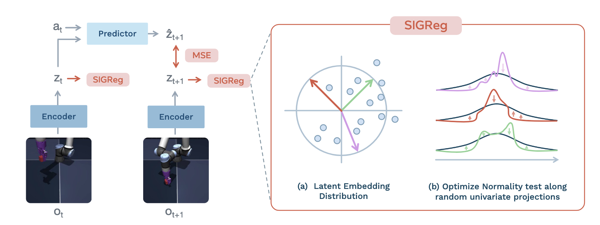
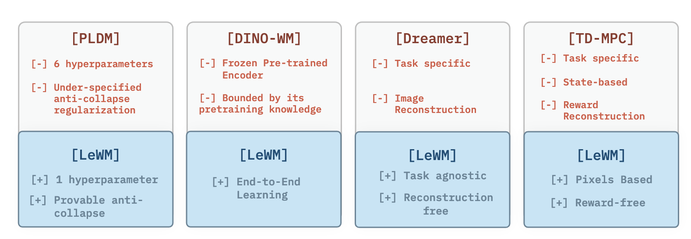
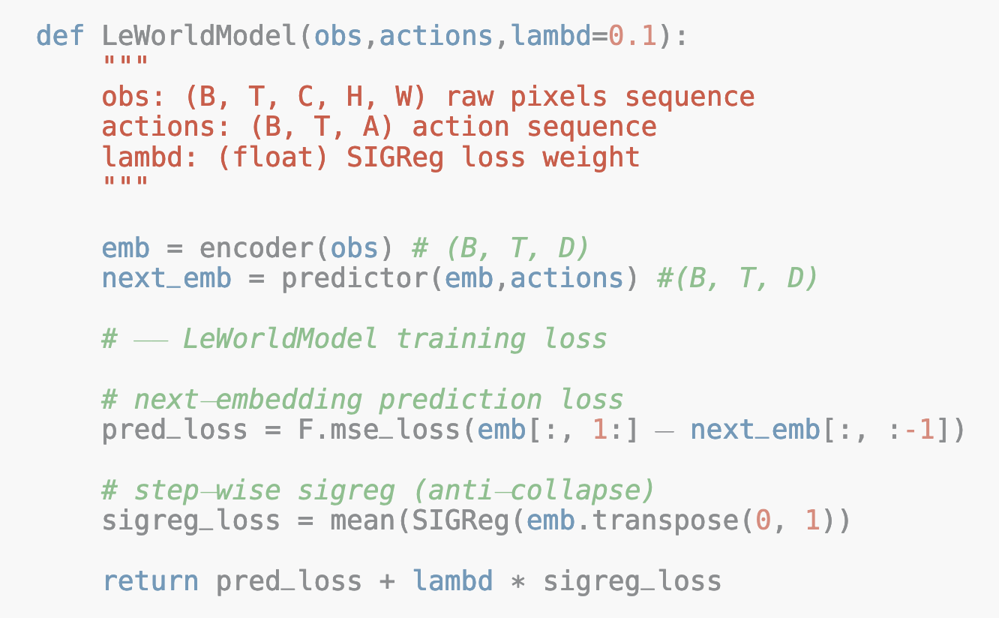
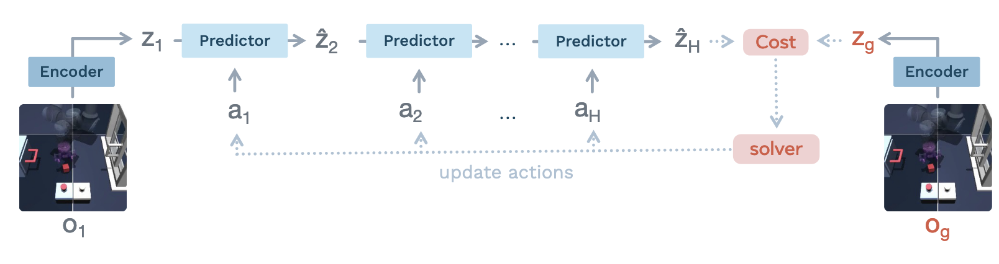
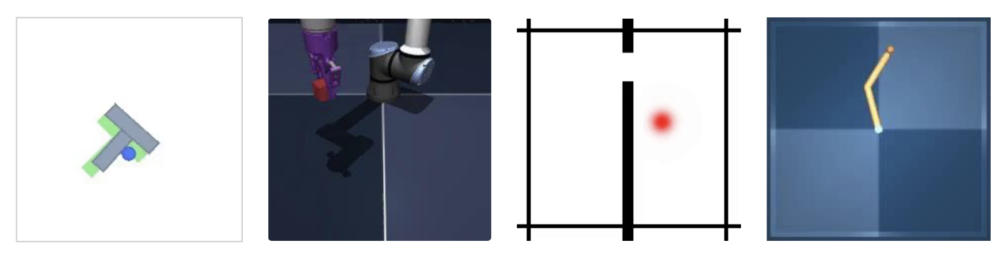
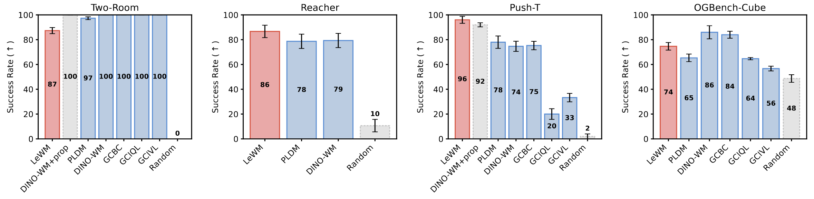
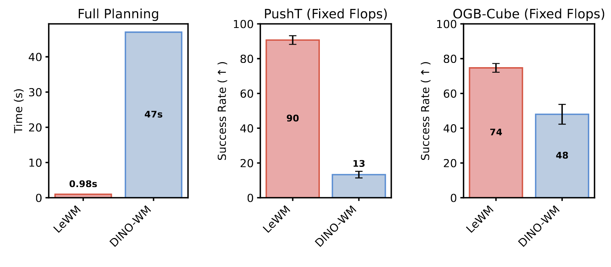
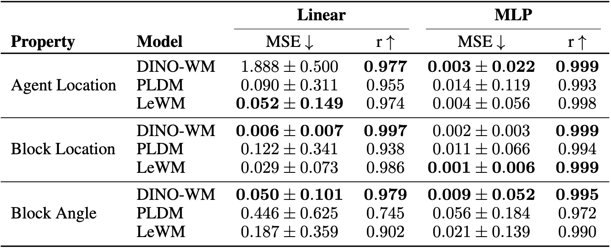

links:: [Local library](zotero://select/library/items/FGM3DKWA), [Web library](https://www.zotero.org/users/9726743/items/FGM3DKWA)
original-title:: LeWorldModel: Stable End-to-End Joint-Embedding Predictive Architecture from Pixels
item-type:: [[document]]
title:: @LeWorldModel: Stable End-to-End Joint-Embedding Predictive Architecture from Pixels

- [[Abstract]]
	- 背景
		- 联合嵌入预测架构（JEPAs）为在紧凑的潜在空间中学习世界模型提供了一个令人信服的框架，
	- 挑战 / 现有不足
		- 然而现有的方法依然脆弱，依赖于复杂的多项损失、指数移动平均、预训练编码器或辅助监督来避免表示崩溃。
	- 本文工作
		- 在这项工作中，我们引入了 LeWorldModel（LeWM），这是首个能够==仅使用两个损失项== ==从原始像素稳定地进行端到端训练==的 JEPA：一个下一嵌入预测损失，以及一个强制潜在嵌入服从高斯分布的正则化项。
		- 与唯一现存的端到端替代方案相比，这将==可调的损失超参数从六个减少到了一个==。
		- 凭借可在==单个 GPU 上于数小时内完成训练==的1500万（15M）个参数，LeWM 的==规划速度比基于基础模型的世界模型快达 48 倍==，同时在各种多样化的 2D 和 3D 控制任务中保持着竞争力。
		- 除控制任务外，我们通过对物理量的探测展示了 LeWM 的潜在空间编码了==有意义的物理结构==。
		- ==惊奇度评估==证实了该模型能够可靠地检测出物理上不合理的事件。
- [[Attachments]]
	- [PDF](zotero://select/library/items/B2MM7YQ5) {{zotero-imported-file B2MM7YQ5, "LeWorldModel Stable End-to-End Joint-Embedding Predictive Architecture from Pixels.pdf"}}
- Code
	- https://github.com/lucas-maes/le-wm
- Website
	- https://le-wm.github.io/
-
- 图1
	- {:width 800}
	- **LeWorldModel 训练流程。**
	- 给定帧观测值 $o_{1:T}$ 和动作 $a_{1:T}$，编码器将这些帧映射为低维的潜在表示 $z_{1:T}$。预测器通过根据当前的潜在状态 $z_t$ 和动作 $a_t$ 自回归地预测下一个潜在状态 $z_{t+1}$，来对环境动力学进行建模。编码器和预测器使用均方误差（MSE）预测损失进行联合优化。
	- LeWM 不依赖于任何训练启发式方法，例如停止梯度、指数移动平均或预训练表示。
	- 为了防止平凡崩溃，SIGReg 正则化项强制潜在嵌入服从高斯分布，从而促进特征多样性。更具体地说，潜在嵌入被投影到多个随机方向上，并且对每一个一维投影应用正态性检验。聚合这些统计数据可促使完整的嵌入分布与各向同性的高斯分布相匹配。
## 1 Introduction
collapsed:: true
	- 背景
		- 人工智能的一个核心目标是开发能够在多样化的任务和环境中，==使用单一且统一的学习范式==来获取技能的智能体——该范式直接基于其周围环境的感官输入进行运作，而无需手工设计的状态表示或特定领域的校准。视觉极其适合这一目标：相机不仅价格低廉且易于扩展，并且从像素中学习能够实现从原始感官输入到动作的完全端到端的训练 [1]。
		- 世界模型（WMs）是一类强大的方法系列 [2]，它们学习预测环境中的动作所产生的后果。一旦成功，世界模型允许智能体仅仅通过它们对世界的模型（即在想象空间中）来进行规划和自我改进。这在离线设定中尤为有价值，在这种设定下，智能体必须在没有环境交互的情况下从固定的数据集中学习——利用该模型来生成合成经验并评估反事实的动作序列 [3, 4]。
		- 最近一种用于学习世界模型的流行方法是联合嵌入预测架构（JEPA）[5]。JEPA 并非试图对环境的每一个方面进行建模，而是专注于捕获预测未来状态所需的最相关特征。具体而言，JEPA 学习将观测值编码到一个紧凑的、低维的潜在空间中，并通过预测未来观测值的潜在表示来对时间动力学进行建模。
	- 挑战 / 现有不足
		- 然而，尽管现有的 JEPA 方法在概念上很简单，但它们极易发生崩溃。在这种失败模式下，模型将所有的输入映射到几乎相同的表示上，以此极其平庸地满足时间预测目标，从而导致得到毫无用处的表示。因此，防止崩溃是训练 JEPA 模型的核心挑战之一。许多具有影响力的工作已经提出了解决该问题的方法。
		- 然而，==这些方法通常依赖于启发式的正则化、多目标损失函数、外部的信息源，或者诸如预训练编码器之类的架构简化==。在实践中，这些策略往往会引入额外的不稳定性或显著增加训练的复杂性。
		- [[#blue]]==进一步梳理==
			- 第一类，用 **EMA target encoder + stop-gradient** 一类技巧去稳定训练。问题是这些技巧虽然常用，但理论上并不总对应一个清晰、良定义的优化目标。
			- 第二类，直接用**冻结的预训练视觉 backbone**，比如 DINO-WM 依赖 DINOv2 特征，这样确实不容易 collapse，但代价是世界模型被预训练表征空间“卡住”了，不再是真正端到端。
			- 第三类，像 PLDM 一样端到端学，但需要很多损失项、很多权重，训练和调参都复杂且不稳。作者的目标就是同时绕开这三类缺点。
	- 本文工作
		- 为了克服这些局限性，我们提出了 LeWorldModel（LeWM），这是首个能够直接从原始像素端到端地学习稳定的 JEPA 的方法，它不依赖于启发式方法，且具有原则性并十分简单（参见图 2）。
		  collapsed:: true
			- 图2
				- {:width 800}
				- **潜在世界模型方法的特征。**
				- 方法按训练范式进行分组。
				- 端到端方法（PLDM）从像素联合学习编码器和预测器，不依赖预训练表示或启发式技巧（如停止梯度或指数移动平均），但需要许多超参数并且缺乏形式化的崩溃保证。
				- 基于基础模型的方法（DINO-WM）通过冻结预训练的基础视觉编码器来避免崩溃，从而放弃了端到端学习。
				- 特定于任务的方法（Dreamer、TD-MPC）在训练期间需要奖励信号或特权状态访问。
				- LeWM 解决了每个类别的局限性：它是端到端的、任务无关的、基于像素的、无重建且无奖励的，并且仅需要一个超参数，同时具有可证明的防崩溃保证。
		- 此外，LeWM 可以在单个 GPU 上进行训练，从而降低了该项研究的准入门槛。
		- 我们在 2D 和 3D 环境下的各类多样化的操作、导航和移动（locomotion）任务中对 LeWM 进行了评估。
		- 除此之外，我们通过在潜在空间中进行有针对性的探测（probing）和惊奇度量化评估，探究了其直观的物理理解能力。
		- 总体而言，我们的主要发现和贡献如下：
			- 我们提出了一种端到端的 JEPA 方法，用于在单个 GPU 上从原始像素中学习潜在的世界模型。该方法依赖于一个简单且稳定的双项目标，该目标在各种网络架构和超参数选择下均保持稳健，同时能够实现高效的对数时间超参数搜索。
			- LeWM 利用一个紧凑的1500万（15M）参数模型，在多样化的 2D 和 3D 任务中实现了强大的控制性能，超越了现有的基于 JEPA 的端到端方法，同时以大幅降低的成本与基于基础模型的世界模型保持着竞争力，使得规划速度快达 48 倍。
			- 我们通过对物理量的探测以及用于检测非物理（不符合物理规律）轨迹的违背预期检验，评估了潜在空间中的物理理解。
## 2 Related Work
collapsed:: true
	- **World Model**
		- 世界模型旨在从数据中学习环境动力学的预测模型，使智能体能够在想象中推理未来状态。
		- 一类主要的世界模型由在像素空间中显式建模环境动力学的生成方法组成。这些以动作为条件的生成模型通过生成以过去状态和动作为条件的未来观测值，充当学习到的模拟器。生成式世界模型已成功应用于模拟现有的类游戏环境。例如，IRIS [3]、DIAMOND [6]、∆-IRIS [7]、OASIS [8] 和 DreamerV4 [4] 对诸如 Minecraft（我的世界）、Counter-Strike（反恐精英）和 Crafter 等环境进行了建模，提高了强化学习中的策略样本效率。
		- 其他方法则生成了全新的交互式模拟器，例如 Genie [9] 和 HunyuanWorld [10]，同时学习到的模拟器也已应用于机器人策略评估 [11]。
		- 重要的是，许多生成式世界模型假设能够访问包含奖励信号的数据集，从而实现了针对下游强化学习的动力学和与价值相关信息的联合建模。
		- 相比之下，我们专注于无奖励设定，这对应于 JEPA 系列工作中考虑的设置，其旨在从观测数据中学习通用的、任务无关的世界模型，而不依赖于奖励监督。
	- **JEPA**
		- JEPA 是一个用于学习世界模型的框架，该框架在一个紧凑的、低维的潜在空间中预测系统的动态演化。自 LeCun [5] 提出以来，JEPA 方法已经发生了显著的演变，==主要区别在于它们的目标任务以及用于学习非崩溃表示（noncollapsing representations）的策略。==
		- 一条突出的研究路线将 JEPA 应用于自监督表示学习，通过预测被掩蔽的输入图块（patches）的潜在嵌入来实现。例子包括用于图像的 I-JEPA [12]、用于视频的 V-JEPA [13, 14]，以及用于医疗数据的 Echo-JEPA 和 Brain-JEPA [15, 16]。
		- 这些方法通常采用目标编码器的指数移动平均（EMA）以及停止梯度（SG）更新来稳定训练并防止表示崩溃。然而，对 EMA 和 SG 的理论理解仍然有限，因为它们通常不对应于一个定义良好的目标的最小化 [17]。
		- 第二条研究路线使用 JEPA 配方进行以动作为条件的潜在世界建模。一些方法依赖于预训练的编码器来获取表示 [14, 18–20]。这避免了崩溃，但将表示的表达能力限制在了所使用的预训练编码器上。相比之下，PLDM [21, 22] 使用带有额外正则化项的 VICReg [23] 端到端地学习表示，但代价是已知的训练不稳定性和可扩展性限制 [24]。几项研究通过整合辅助信号或架构组件（例如本体感受输入或动作解码器）进一步提高了稳定性 [18, 19]。
		- 在这项工作中，我们提出了一种稳定的方法，直接从原始像素训练端到端的 JEPA，使用一个简单的两项损失：一个针对未来嵌入的预测目标，以及一个强制嵌入服从高斯分布的正则化目标 [25]。
	- **使用潜在动力学进行规划。**
		- 世界模型 [26] 开创了直接从高维观测值的紧凑潜在表示中学习策略的先河。
		- 一些工作利用学习到的潜在动力学模型，通过强化学习来训练策略 [27–29, 4]。在这些方法中，生成式世界模型充当一个模拟器，在其中轨迹于想象中展开，使得策略优化主要在潜在空间中的想象里发生。一旦训练完成，策略就会被直接执行，在测试时便不再需要世界模型。
		- 最近的工作则是在测试时使用模型预测控制（MPC）直接在潜在空间中进行规划 [30–33, 18, 22]。与基于想象的策略学习相反，这些方法在线使用世界模型来预测候选动作序列的结果，并在执行过程中迭代地优化它们。因此，该模型在运行时仍然是控制循环的一部分，从而实现了自适应的决策制定，但也增加了计算需求。
## 3 Method: LeWorldModel
collapsed:: true
	- 在本节中，我们介绍 LeWorldModel（LeWM）。我们首先描述用于从离线数据中学习潜在世界模型的精简训练过程，包括数据集、模型架构和训练目标。然后，我们解释如何通过使用模型预测控制（MPC）进行潜在规划，来利用学习到的模型进行决策。
	- ### 3.1 Learning the Latent World Model
	  collapsed:: true
		- **离线数据集**
			- 我们考虑一个完全离线且无奖励的设定。LeWorldModel 仅通过观测和动作的未标注轨迹进行训练，而无法访问奖励信号或任务规范。
			- 这一设定与 JEPA 系列的工作 [18, 14] 保持一致，后者旨在从观测数据中学习通用的、任务无关的世界模型。
			- 我们的目标不是针对特定任务优化行为，而是学习能够捕获环境动力学的表示，并且这些表示随后可以被控制或适应于各类多样化的任务。
			- 训练数据由长度为 $T$ 的轨迹组成，这些轨迹包含原始像素观测值 $o_{1:T}$ 和相关的动作 $a_{1:T}$。轨迹是从没有最优性要求的行为策略中离线收集的；只要它们能充分覆盖环境动力学，它们可以是伪专家级的或探索性的。
			- 额外的实现细节（批次大小、分辨率和子轨迹构建）在附录 D 中提供。
		- **模型架构**
			- LeWM 建立在两个组件之上：一个编码器和一个预测器。编码器将给定的帧观测值 $o_t$ 映射为紧凑的、低维的潜在表示 $z_t$。预测器通过在给定潜在嵌入 $z_t$ 和动作 $a_t$ 的情况下预测下一帧观测值的嵌入 $\hat{z}_{t+1}$，来在潜在空间中对环境动力学进行建模。
			- 编码器：$z_t = \text{enc}_\theta(o_t)$
			- 预测器：$\hat{z}_{t+1} = \text{pred}_\phi(z_t, a_t)$
			- 编码器被实现为一个 Vision Transformer（ViT）[34]。除非另有说明，我们使用微型配置（约 500 万参数），其图块（patch）大小为 14，包含 12 层，3 个注意力头，以及 192 的隐藏层维度。观测嵌入 $z_t$ 是由最后一层的 [CLS] 词元（token）嵌入构建的，随后是一个投影步骤。该投影步骤使用一个带有批量归一化（Batch Normalization）[35] 的单层多层感知机（MLP），将 [CLS] 词元嵌入映射到一个新的表示空间。这一步骤是必要的，因为最终的 ViT 层应用了层归一化（Layer Normalization）[36]，这会阻碍我们的防崩溃目标被有效地优化。
			- 预测器是一个包含 6 层、16 个注意力头和 10% dropout（约 1000 万参数）的 Transformer。动作通过在每一层应用自适应层归一化（AdaLN）[37] 被合并到预测器中。AdaLN 参数被初始化为零，以稳定训练并确保动作条件化能够逐步影响预测器的训练。预测器将 $N$ 个帧表示的历史记录作为输入，并使用时间因果掩码自回归地预测下一个帧表示，以避免查看到未来的嵌入。预测器之后也紧接着一个投影器网络，其实现与用于编码器的投影器网络相同。我们世界模型的所有组件都是使用下一段落中描述的损失进行联合学习的。
		- **训练目标**
			- 我们的目标是学习用于预测未来的潜在表示，即对环境动力学进行建模。LeWorldModel 的训练目标是两项之和：一个预测损失和一个正则化损失。预测损失 $L_{pred}$（教师强制，teacher-forcing）计算连续时间步的预测嵌入之间的误差：
			  $$\mathcal{L}_{pred} \triangleq \|\hat{z}_{t+1} - z_{t+1}\|_2^2, \quad \hat{z}_{t+1} = \text{pred}_\phi(z_t, a_t). \quad (1)$$
			- 通过预测损失，编码器被激励去为预测器学习一种可预测的表示。
			- 然而，仅凭这个损失会导致表示崩溃（representation collapse），产生一个极其平庸的解，即编码器将所有的输入映射到一个恒定的表示上。
			- 为了防止这种行为，我们引入了一个防崩溃（anti-collapse）正则化项，它促进了嵌入空间中的特征多样性。具体而言，我们采用了 Sketched-Isotropic-Gaussian Regularizer（SIGReg）[25]，因为它的简单性、可扩展性和稳定性。SIGReg 促使潜在嵌入去匹配一个各向同性的高斯目标分布。
			- 令 $Z \in \mathbb{R}^{N \times B \times d}$ 表示在历史长度 $N$、批次大小 $B$ 上收集的潜在嵌入张量，其中 $d$ 代表嵌入维度。在高维空间中直接评估正态性是具有挑战性的，因为大多数经典的正态性检验是为单变量数据设计的，并且无法随着维度的增加而可靠地扩展。SIGReg 通过将嵌入投影到 $M$ 个随机的单位范数方向 $u^{(m)} \in S^{d-1}$ 上，并沿着由此产生的一维投影 $h^{(m)} = Z u^{(m)}$ 优化单变量的 Epps-Pulley [38] 检验统计量 $T(\cdot)$，从而规避了这一局限性，如图 1 ( ((69db4dfe-ea7a-401b-99f8-1137fd89876c)) ) 所示。根据 Cramér–Wold 定理 [39]，匹配所有的一维边缘分布等价于匹配完整的联合分布。
			- $$\text{SIGReg}(Z) \triangleq \frac{1}{M} \sum_{m=1}^{M} T(h^{(m)}). \quad (2)$$
			- 关于 SIGReg 的额外细节以及 Epps–Pulley 统计检验的定义在附录 A 中提供。完整的 LeWM 训练目标被定义为：
				- $$\mathcal{L}_{\text{LeWM}} \triangleq \mathcal{L}_{pred} + \lambda \ \text{SIGReg}(Z). \quad (3)$$
		- **算法 1**
			- LeWorldModel 训练程序的伪代码。像素观测值被编码为潜在嵌入，并且预测器通过预测以动作为条件的下一步嵌入来估计动力学。使用下一嵌入预测损失以及分步的 SIGReg 正则化项，模型被端到端地优化，以防止表示崩溃。
			- {:width 600}
			- 该方法仅引入了两个训练超参数：在 SIGReg 中使用的随机投影数量 $M$ 和正则化权重 $\lambda$。
			- 除非另有说明，我们使用 $M = 1024$ 个投影以及 $\lambda = 0.1$。
			- 在实践中，我们观察到投影数量对下游性能的影响可以忽略不计（见第 4 节和附录 G），这使得 $\lambda$ 成为唯一需要调整的有效超参数。这极大地简化了超参数的选择，因为可以使用具有对数复杂度的简单二分搜索来高效地优化 $\lambda$。
			- 我们不使用停止梯度、指数移动平均或其他附加的稳定启发式方法。梯度在损失的所有组件中传播，并且所有参数以端到端的方式被联合优化，从而实现了一个精简且易于实现的训练程序。
			- 训练逻辑总结在算法 1 中。
	- ### 3.2 Latent Planning
		- [[#blue]]==进一步梳理==
			- 论文附录 B 给出的做法是：
				- 先设一个动作序列分布，初始均值  `μ0=0` 、协方差  `Σ0=I` ；
				- 然后每一轮从这个高斯分布里采样很多条长度为  `H`  的候选动作序列；
				- 对每条候选序列，都用冻结的 world model rollout 并计算终点代价；
				- 选出代价最低的 top-K“精英序列”；再用这些精英序列的均值和方差去更新下一轮的采样分布。
				- 重复若干轮后，分布会逐渐向低代价区域收缩，最后取最终分布的均值对应的动作序列，或者取找到的最佳序列。
		- 图4
			- {:width 800}
			- **LeWorldModel 潜在规划。**
			- 给定一个初始观测值 $o_1$ 和一个目标 $o_g$，在图 2 中学习到的世界模型在 LeWM 潜在空间中执行规划。
			- 初始状态嵌入 $z_1$ 和目标嵌入 $z_g$ 是从编码器中获取的。
			- 随后，预测器将未来的潜在状态推演（rolls out）直至范围 $H$。
			- 最终预测状态与目标嵌入之间的潜在代价（latent cost）引导求解器去优化动作序列。
			- 这个预测-优化循环重复进行，直至收敛到一个良好的规划候选（plan candidate）。
		- 在推理阶段，我们在我们的世界模型潜在空间中执行轨迹优化，如图 4 所示。给定一个初始观测值 $o_1$，我们随机初始化一个候选动作序列，并迭代地推演（rollout）预测的潜在状态，直至达到规划范围（planning horizon）$H$。模型根据以下公式预测潜在转移：
		- $$\hat{z}_{t+1} = \text{pred}_\phi(\hat{z}_t, a_t), \quad \hat{z}_1 = \text{enc}_\theta(o_1),$$
		- 规划是通过优化动作序列，以最小化一个终端潜在目标匹配（terminal latent goal-matching）目标函数来执行的：
		  $$C(\hat{z}_H) = \|\hat{z}_H - z_g\|_2^2, \quad z_g = \text{enc}_\theta(o_g), \quad (4)$$
		- 其中 $\hat{z}_H$ 是推演结束时的预测潜在状态，$z_g$ 是目标观测值 $o_g$ 的潜在嵌入。
		- 在规划期间，世界模型的参数保持固定。这个过程对应于一个有限范围（finite-horizon）的最优控制问题：
		- $$a^*_{1:H} = \arg\min_{a_{1:H}} C(\hat{z}_H), \quad (5)$$
		- 我们使用交叉熵方法（CEM）[40] 来求解该问题，这是一种迭代地选择最佳规划，并使用最佳规划的统计信息来更新采样分布参数的采样方法。
		- 规划范围 $H$ 在长期前瞻与增加的计算成本及模型偏差之间进行权衡。特别地，随着推演范围的增加，自回归推演会积累预测误差，这可能会降低优化后的动作序列的质量。为了缓解这种影响，我们采用了一种模型预测控制（MPC）策略：在根据更新后的观测值进行重新规划之前，仅执行计划好的前 $K$ 个动作。我们在附录 D 中提供了关于规划策略的更多细节。
## 4 Latent Planning Performance
	- ### 4.1 规划评估设置
	  collapsed:: true
		- **环境。**
			- 我们在包括导航、运动规划和操作在内的一系列多样化任务上评估 LeWM，涵盖二维和三维环境，所有这些都在图 5 中进行了说明。我们在附录 E 中提供了关于数据集生成和环境的更多细节。
			- 图5
				- {:width 800}
				- **用于评估的环境。**
				- 左图：Push-T，这是一个 2D 操作任务，其中智能体必须将一个方块推向目标构型，通常被用作机器人学基准。
				- 中图 (1)：OGBench-Cube，这是一个视觉上更丰富的 3D 操作环境，其中机械臂与立方体进行交互以到达目标位置。
				- 中图 (2)：Two-Room，这是一个简单的 2D 导航环境，其中智能体在房间之间移动以到达目标位置。
				- 右图：Reacher，这是一个两关节机械臂需要在 2D 平面内达到目标构型的任务。
				- 所有环境都具有连续的动作空间。关于环境和数据集的更多细节可在附录 E 中获取。
		- **基线。**
			- 我们将 LeWM 的性能与几个基线方法进行了比较：
				- DINO-WM 和 PLDM，这是两种最先进的基于 JEPA 的方法；
				- 一个目标条件的行为克隆策略（GCBC）；
				- 以及两个目标条件的离线强化学习算法，GCIVL 和 GCIQL。
			- 在这些基线中，PLDM 与我们的设置最接近，因为它也直接从像素观测中端到端地学习一个世界模型。然而，它依赖于从 VICReg 准则派生出的包含七个项的训练目标，这引入了训练的不稳定性并增加了超参数调整的复杂性。
			- 相比之下，DINO-WM 使用 DINOv2 [41] 作为特征编码器来对动力学进行建模以缓解表示崩溃，但其原始公式还额外结合了其他模态，例如本体感受输入；为了公平比较，除非另有说明，我们从 DINO-WM 中排除了本体感受信息。
			- 附录中提供了基线的其他实现细节（附录 C）和评估设置（附录 F.1）。对于每种方法，我们在所有环境中保持超参数固定。
	- ### 4.2 迈向使用世界模型的高效规划
	  collapsed:: true
		- 图6
			- {:width 699, :height 179}
			- **跨环境的规划性能。**
				- 结果展示了 Two-Room（左图）、Reacher（中图1）、PushT（中图2）和 OGBench-Cube（右图）。
				- LeWM 在 Push-T 和 Reacher 上始终优于 PLDM 和 DINO-WM。
				- 在 OGBench-Cube 上，DINO-WM 略优于 LeWM，这可能是由于环境具有更高的视觉复杂性和 3D 性质，这使得编码器训练更具挑战性。
				- 在更简单的 Two-Room 环境中，PLDM 和 DINO-WM 优于 LeWM，这可能是因为 SIGReg 正则化鼓励在高维潜在空间中形成高斯分布，而该环境的内在维度却低得多。
		- 我们在图 6 中报告了规划性能。在更具挑战性的规划任务中，LeWM 相比 PLDM 有所改进，在 PushT 上实现了高出 18% 的成功率，同时与 DINO-WM 保持着竞争力。
		- 值得注意的是，在 PushT 上，LeWM（仅像素）超越了 DINO-WM，即使在 DINO-WM 能够访问额外的本体感受信息的情况下也是如此，这证明了 LeWM 捕获底层任务相关物理量的能力。
		- 有趣的是，LeWM 在最简单的环境 Two-Room 中表现较差。一个可能的解释是，该数据集的低多样性和低内在维度使得编码器难以在高维潜在空间中匹配由 SIGReg 强制施加的各向同性高斯先验，这可能导致潜在表示的结构化程度降低。这突显了 SIGReg 正则化在极低复杂度环境中的一个潜在局限性。
		- 此外，当比较规划加速时（图 3），LeWM 实现了快达 48 倍的规划时间，完整的规划在不到一秒钟的时间内完成，同时在各项任务中保持了具有竞争力的性能。对于固定的规划设置，该规划时间在不同环境中是一致的，从而缩小了与实时控制之间的差距。
		  collapsed:: true
			- 图3
				- {:width 800}
				- **固定计算量下的规划时间和性能。**
				- 左图：50次运行的平均规划时间比较。使用比 DINO-WM 少约 200 倍的 token 来编码观测值，使得 LeWM 能够实现与 PLDM 相当的规划速度，同时比 DINO-WM 快达约 50 倍。
				- 中右图：在相同的计算预算（固定的 FLOPs）下的规划性能。在 Push-T（中图）和 OGBench-Cube（右图）上，LeWM 显著优于 DINO-WM。
				- 有关规划设置的详细信息，请参见附录 D。
		-
	- ### 4.3 迈向世界模型的稳定训练
	  collapsed:: true
		- **消融实验。**
			- 我们对 LeWM 的几个设计选择进行了消融实验。
			- 首先，我们分析了 SIGReg 对其内部参数的敏感性，即随机投影的数量和积分节点（integration knots）的数量。性能在很大程度上不受这些数量的影响，这表明它们不需要进行仔细的调整。因此，正则化权重 $\lambda$ 仍然是唯一有效的超参数。由于只有一个超参数需要调整，因此可以使用简单的二分搜索策略（$O(\log n)$）高效地执行网格搜索，而 PLDM 则需要多项式时间（$O(n^6)$）进行搜索。
			- 我们还研究了嵌入维度的影响。虽然表示的维度必须足够大才能使该方法表现良好，但性能在超过某个特定阈值后会迅速饱和，这表明该方法对编码器容量的精确选择具有鲁棒性。
			- 此外，我们通过将默认的 ViT 编码器替换为 ResNet-18 主干网络（表 8）来检验编码器架构的影响。LeWM 在这两种架构下均实现了具有竞争力的性能，这表明它在很大程度上与视觉编码器的选择无关。
			- 关于所有消融实验的细节可在附录 G 中获取。
		- **训练曲线。**
			- 我们在图 18 和图 19 中分别报告了 LeWM 和 PLDM 在 PushT 上的训练损失曲线。LeWM 的双项目标表现出平滑且单调的收敛：预测损失稳定下降，而 SIGReg 正则化项在训练的早期阶段急剧下降，随后趋于平稳，这表明潜在分布快速接近了各向同性的高斯目标。相比之下，PLDM 的七项目标在其几个损失组件中表现出嘈杂且非单调的行为。
			- 这些观察结果突显了 LeWM 的一个关键优势：通过将训练目标减少到仅有两项表现良好的项，训练变得显著更加稳定，从而消除了平衡来自多个正则化器的竞争梯度的需要。
## 5 Quantifying Physical Understanding in LeWM
collapsed:: true
	- 在本节中，我们评估 LeWM 的潜在空间所捕获的动力学质量，方法是学习从潜在嵌入中提取物理量，或者测量世界模型检测物理变化的能力。
	- ### 5.1 潜在空间的物理结构
		- **探测物理量。** 作为物理理解的首个测量指标，我们评估了哪些物理量可以从 LeWM 的潜在表示中恢复。我们训练了线性和非线性探测器（probes），以从给定的嵌入中预测感兴趣的物理量。在 Push-T 环境上的结果报告在表 1 中。我们的方法始终优于 PLDM，同时与 DINOv2 等大型预训练模型产生的表示保持竞争力。我们在附录 F.2 中提供了在其他环境上的探测结果。
			- **表1**
				- 
				- 在 Push-T 上的物理潜在探测结果。
				- LeWM 始终优于 PLDM，同时与 DINO-WM 保持竞争力。DINO-WM 在某些属性上强大的探测性能可能源于其基础模型预训练：DINOv2 编码器在跨越远为多样化的分布的多达两个数量级的数据（约 1.24 亿张图像）上进行了训练，这可能使其能够在默认情况下于其嵌入中捕获某些物理属性。
		- **解码潜在空间。** 为了进一步评估潜在表示中捕获的信息，我们在图 8 中报告了由一个解码器生成的图像，该解码器在训练期间被训练为从单一潜在嵌入（192 维）重建像素观测值。尽管在训练期间从未使用过重建，但解码器能够从学到的表示中恢复视觉场景，这证实了低维且紧凑的潜在空间保留了关于底层物理状态的充足信息。关于解码器架构的细节在附录 D 中提供。
		- **可视化潜在空间。** 我们进一步使用 t-SNE 可视化了潜在空间的结构。图 9 提供了 PushT 环境中潜在空间的定性可视化。该可视化表明，学到的表示捕获了环境的空间结构，并在潜在空间中保留了邻域关系和相对位置。
		- **时间潜在路径拉直。** 受神经科学中时间拉直假设（temporal straightening hypothesis）[42] 的启发，我们测量了整个训练过程中连续的潜在速度向量之间的余弦相似度（公式 9）。我们发现，作为一种纯粹的涌现现象，LeWM 在 PushT 上的潜在轨迹随着训练的进行变得越来越直，而没有任何明确鼓励这种行为的正则化，参见图 17。值得注意的是，LeWM 实现了比 PLDM 更高的时间平直度（temporal straightness），尽管 PLDM 采用了专用的时间平滑度正则化项。我们在附录 H 中详细说明了我们的发现。
	- ### 5.2 违背预期框架
		- 另一种量化物理理解的方法是检测对学习到的世界模型发生违背的能力。受发展心理学中使用并最近被机器学习采用的违背预期（VoE）范式 [43–45] 的启发，该框架评估模型是否会对与学习到的物理规律相矛盾的事件赋予更高的惊奇度（surprise）。
		- 遵循先前的工作，我们通过测量模型预测的未来观测值与实际观测到的未来之间的差异来量化惊奇度。我们在三个环境中评估了这个框架：TwoRoom、PushT 和 OGBench Cube。对于每个环境，我们引入了两种类型的扰动。第一种是视觉扰动，即物体的颜色在轨迹中突然发生改变。第二种是物理扰动，即一个或多个物体被瞬移到一个随机位置，从而违背了场景预期的物理连续性。
		- 图 10 表明，与未受扰动的对应帧相比，LeWM 始终对包含物理违背的帧赋予更高的惊奇度。我们在附录 F.3 中提供了关于 VoE 的更多细节。
## 6 Conclusion
collapsed:: true
	- 本工作引入了 LeWorldModel（LeWM），这是一种用于学习环境的潜在世界模型的稳定端到端方法。LeWM 是一种联合嵌入预测架构，它使用一个编码器将图像观测值映射到潜在空间中，并使用一个预测器通过预测以动作为条件的未来嵌入，在嵌入空间中对时间动力学进行建模。
	- 在各种连续控制环境中，且仅使用原始像素输入，LeWM 在数据效率、规划时间、训练时间以及稳定性方面均优于先前的方法，同时保持着具有竞争力的最终任务性能。训练的稳定性和简单性源于明确地鼓励潜在嵌入服从各向同性高斯分布以避免崩溃。
	- 总而言之，LeWM 为现有的潜在世界模型方法提供了一种可扩展的替代方案，提供了具有原则性的训练动力学以及可解释的且涌现的表示属性。
	- **局限性与未来工作**
		- 尽管这些结果令人充满希望，但一些局限性也凸显了重要的研究方向。
		- 首先，使用当前潜在世界模型进行规划仍然局限于短期范围（short horizons）。分层世界建模代表了解决长期推理和规划的一个有前景的方向。
		- 其次，我们的方法仍然依赖于具有充足交互覆盖范围的离线数据集，这在收集上可能是昂贵或困难的。特别是，有限的数据多样性可能会影响 SIGReg 正则化在具有低内在维度的极其简单环境中的有效性，在这些环境中，在高维潜在空间中匹配各向同性高斯先验变得具有挑战性。在庞大且多样化的自然视频数据集上进行预训练，可以提供强大的表示先验，并减少对特定领域数据的依赖。
		- 最后，当前的端到端潜在世界模型依赖于动作标签来预测未来状态，获取这些标签也可能是昂贵的。一个有前景的方向是通过逆向动力学建模来学习未来动作表示，这可能会减少对显式动作注释的需求。
-
## SR
collapsed:: true
	- ### 节点
		- 从训练数据集里，每隔 200 个观测取一个样本，一共大约得到 **4600 个节点**。每个节点都通过**冻结的 JEPA encoder** 编码成一个 **192 维 latent embedding**。
	- ### 边
		- 时间边（temporal edges）
			- 如果两个观测在同一个 episode 中相邻，那么就在它们对应节点之间连边。
			- 这类边反映了**真实环境动力学中实际发生过的转移**, 所以它们是最可信的“可达性证据”。
		- k-NN 边
			- 对每个节点，在 latent 欧几里得空间里找 **15 个最近邻**，并与它们连边。
			- 这类边的作用是：
				- 增加图的连通性；
				- 弥补离散采样过稀造成的覆盖不足；
				- 让图在局部更平滑，不至于只靠稀疏的时间转移边。
		- 最后把邻接矩阵对称化，也就是把图变成无向图。
		- 什么既要 temporal edge，又要 k-NN edge
		  collapsed:: true
			- 只用 temporal edge 的问题
				- 如果只连真实轨迹中的相邻状态，那么图可能非常稀疏：
				- 很多局部相似状态未必在数据里刚好相邻出现；
				- 图会碎，谱分解不稳定；
				- diffusion geometry 会很粗糙。
			- 只用 k-NN edge 的问题
				- 如果只按 latent 欧氏近邻连边，那么又会把问题绕回去：
				- latent 欧氏近邻可能跨墙、跨拓扑瓶颈；
				- 这会引入一些“虚假近邻”。
			- 所以两者结合的作用是：
				- **temporal edge** 给出“真实动力学合法转移”的主骨架；
				- **k-NN edge** 给出局部覆盖和平滑结构。
				- 然后谱方法会在整个图的全局结构上提炼出“真正重要的慢模态/拓扑模态”。这正是后面扩散坐标的意义。
	- ### 通过谱分解得到 diffusion coordinates
		- **邻接矩阵与归一化**
		- 先得到图的邻接矩阵 A，再构造度矩阵 D，然后做归一化：
		- $P_{\text{sym}} = D^{-1/2} A D^{-1/2}$
		- 这个矩阵可以理解为一种**对图上随机游走结构的对称化表达**。
		- 它编码了：
			- 哪些状态之间局部相连；
			- 哪些区域之间容易扩散；
			- 哪些区域之间存在瓶颈。
	- ### 取前 50 个特征向量
		- 然后对 PsymP_{\text{sym}}Psym​ 做谱分解，取前 **50 个特征向量**。
		- 为什么特征向量重要？
			- 因为图的特征向量，尤其是对应大特征值的那些，往往刻画的是图上的**慢变化模态**。
			- 而所谓拓扑瓶颈、房间结构、连通块之间的差异，恰恰通常体现在这些慢模态里。
			- 直观地说：
				- 如果图中某两个区域虽然局部距离不远，但中间被“瓶颈”隔着，
				- 那么随机游走从一个区域扩散到另一个区域会很慢，
				- 这种“慢混合”会在谱分解中显现出来。
	- ### SR 折扣加权
		- 这是最体现“SR”的地方。论文对每个特征值 $\lambda$ 乘上权重：
			- $\frac{|\lambda|}{1 - \gamma |\lambda|} \quad\text{其中 } \gamma=0.95$
			- 并用它去加权特征向量，得到 diffusion coordinates。
			- 这一步为什么和 SR 有关？
				- 因为 SR 的本质是：
					- $(I - \gamma P)^{-1}$
					- 如果在谱空间里看，矩阵函数会变成对每个特征模态的缩放。
					- 于是那些对应大特征值的慢模态，会因为 11−γλ\frac{1}{1-\gamma\lambda}1−γλ1​ 这样的因子而被放大。
					- 而慢模态正是最能体现**长程转移结构**、**房间-走廊-门这类拓扑形状**的部分。
					- 这个加权会**强调 long-range transition structure**。
	- ### 得到的 diffusion coordinates 是什么
		- 最后，每个图节点都得到一个 **50 维 diffusion coordinate**。
		- 在这个 50 维空间里，距离不再主要反映“原始欧氏近邻”，而是反映“多步可达性”。
		- 因此：
			- 同一房间内、容易互达的点，会比较近；
			- 不同房间、被墙隔开的点，即使 latent 欧氏距离小，在 diffusion space 里也会远。
			- 这就是它为什么能修正 Two-Room 里的问题。
	- ### 这里的 diffusion distance 为什么可以理解为“SR 距离”
		- 因为扩散几何本身就在描述：
			- > 从一个点出发，经过多步图随机游走后，它的未来分布和另一个点有多像。
		- 而 SR 描述的是：
			- > 从一个状态出发，未来折扣访问分布是什么。
		- 这两者本质上都在衡量**未来可达性结构**。所以这里的 diffusion coordinates，其实可以理解成对 SR 几何的一种低秩、谱化、可计算近似。
		- 也就是说，这个方法不是真的把 SR 矩阵完整算出来，而是：
			- 用谱分解提取最关键的后继结构模态；
			- 再把这些模态当作一个新的坐标系；
			- 在这个坐标系里计算“SR 风格的距离”。
	- ### 规划时如何把这个距离用进去
		- 原始 LeWM 代价
			- 原始 LeWM 在测试时只看：
				- $\text{cost}_{\text{eucl}} = \|\text{pred\_emb} - \text{goal\_emb}\|^2$
			- 也就是预测终点 latent 和目标 latent 的欧氏 MSE。
		- 增强后的 v3 代价
			- SR 方法把它改成：
			- $\text{cost} = \text{euclidean\_mse} \times (1 + \alpha \times \text{diffusion\_distance})$
		- 原始欧式代价保留；再乘上一个由 diffusion distance 控制的放大因子。
		- 为什么不是相加，而是相乘
			- 如果直接做 $\text{cost} = \text{euclidean} + \beta \cdot \text{diffusion}$ 那问题是：在那些本来欧氏距离就已经很好用的任务里，额外的 diffusion 项会持续干扰；很难统一兼顾“平滑任务”和“拓扑瓶颈任务”。
			- 而乘法结构：$\text{cost} = \text{euclidean} \times (1 + \alpha \cdot \text{diffusion})$ 带来的效果是：
				- 在平滑区域（Push-T、Reacher）
					- 如果 diffusion distance 和 euclidean distance 大致成比例，那么放大因子大约是个接近常数的缩放：$1 + \alpha c$这不会改变最优解排序太多，等价于“仍然主要按原始欧氏代价行为”。所以**原本欧氏几何已经合适的任务不会被明显破坏**。
				- 在拓扑瓶颈处（Two-Room 的墙）
					- 如果两个状态：欧氏距离小但 diffusion distance 很大, 那么乘法因子会急剧变大。这意味着那些“看起来离目标很近、但其实是隔墙相望”的候选动作序列，会被大幅惩罚。于是 CEM 就不会再被这种“假近”误导。
	- ### 预测出来的 latent 并不一定刚好是图上的节点，怎么办
		- 使用了 **Nyström extension** 方法
		- 因为图上的 diffusion coordinates 只对那约 4600 个离散节点有定义。但在真实规划时：predictor rollout 得到的  `pred_emb` 和 目标  `goal_emb` 都是连续 latent 向量，不一定恰好等于图中的某个节点。所以必须有一个办法，把**任意连续 latent** 映射到 diffusion coordinate 空间。
-
- | **Task** | **Euclidean (baseline)** | **SR-v3 (ours)** | **Δ** |
  | ---- | ---- | ---- |
  | Two-Room | 88.0% | 98.0% | +10.0% |
  | Push-T | 96.0% | 92.0% | -4.0% |
  | Reacher | 76.0% | 80.0% | +4.0% |
- ---
-
-
-
## 现有尝试总结
	- ### Baseline LeWorldModel
	  collapsed:: true
		- 核心: 损失项
			- L = L_pred + 0.09 × SIGReg(z)
				- L_pred = ||predictor(z_t, a_t) − sg(z_{t+1})||² —— 下一步嵌入预测
				- SIGReg(z) —— 草图化各向同性高斯正则化器 (Sketched Isotropic Gaussian Regularizer)。将嵌入投影到 1024 个随机单位方向上，计算在每个投影上衡量偏离 N(0,I) 的 Epps-Pulley 统计量，并在各个投影上求平均。强制边缘嵌入分布趋向于各向同性高斯分布。
		- 架构
			- ViT-tiny 编码器（5M 参数，192 维 CLS 输出）→ 投影器 MLP → 带有 AdaLN-Zero 动作条件作用的 6 层 Transformer 预测器（10M 参数）。总计约 15M。
		- 复现的基线：(直接使用官方放出的checkpoints进行测试)
			- | **任务** | **论文** | **复现** |
			  | ---- | ---- | ---- |
			  | Two-Room | 87% | 88% |
			  | Push-T | 96% | 96% |
			  | Reacher | 86% | [[$red]]==76%== |
			  | OGBench-Cube | 74% | 72% |
			- [[#green]]==Reacher 的复现性能与原论文相比有较大差距==
				- 随机种子不同导致的?
				- 测试配置的问题? 原论文与源代码不同?
				- 可以自己实际训练一下, 然后测一下性能?
		- 诊断：
			- PR=61.4/192，
			  collapsed:: true
				- ### PR (Participation Ratio / 参与率或有效维度)
					- **含义**：PR 是用来衡量高维向量空间中**“有效利用的维度数量”**的指标（有时也称为有效秩）。
					- **在文中的语境 (PR=61.4/192)**：
						- 该模型的特征向量总维度是 192 维（对应架构中的  `192-d CLS output` ）。
						- PR = 61.4 意味着在这个 192 维的空间中，模型实际利用了大约 61.4 个维度的容量来编码信息。
					- **为什么重要**：
						- 在自监督学习和强化学习中，模型很容易发生**“维度坍塌”（Dimensional Collapse）**——即模型偷懒，把所有状态信息都压缩到了同一两个维度上。你可以看到在后面失败的方法中，PR 变成了  `1.20 💀`  或  `1.08 💀` ，这就是严重的坍塌现象。而 61.4 属于健康的状态，说明特征分布得比较广。
			- std≈1.0（各向同性），
			  collapsed:: true
				- **含义**：特征在各个方向上的标准差。
				- **在文中的语境 (std≈1.0 (isotropic))**：
					- 文中的基线模型使用了  `SIGReg`  正则化器，它的明确目标是强制模型的特征分布趋近于各向同性高斯分布（Isotropic Gaussian, 也就是均值为 0，协方差为 $I$ 的标准正态分布 $N(0,I)$）。
					- `std≈1.0`  表明这个正则化器成功起作用了。特征向量不仅在各个维度上的尺度被规范到了 1.0 左右，而且是“各向同性”的（没有在某一个特定方向上被异常拉长或压扁，像一个完美的球体）。后面的失败方法（方法2）中提到嵌入幅度“发散”（diverged），就是因为失去了这种约束。
			- 探测器 R²(x,y)=0.65
			  collapsed:: true
				- ### probe  $R^2(x,y)$  (Linear Probe R-squared / 线性探测决定系数)
					- **含义**：这是一种诊断特征中是否包含了“真实世界有用信息”的测试方法。
						- **Probe（线性探测）**：在评估表征时，研究人员会冻结（Freeze）已经训练好的编码器，然后在它输出的特征向量上，外接一个简单的“线性回归器”（Linear Probe），看它能不能预测出环境中的真实客观事实。
						- $(x,y)$：代表智能体或物体在环境中的真实二维物理坐标（例如在 Two-Room 或 Push-T 任务中的位置）。
						- $R^2$：统计学中的决定系数（Coefficient of Determination），范围通常在 0 到 1 之间。
					- **在文中的语境 (probe $R^2(x,y)=0.65$)**：
						- 这表示：仅使用一个简单的线性模型，就能从这 192 维的隐藏特征中，准确预测出智能体真实空间坐标 $(x,y)$ 的 **65% 的方差变化**。
					- **为什么重要**：
						- 这个值越高，说明编码器在压缩像素图像时，成功地保留了下游任务（如导航、抓取）最需要的核心物理状态信息。如果 $R^2$ 接近 0（如文中 Reacher 任务崩溃时的 0.005），说明特征中没有任何有用的物理位置信息，模型只是在瞎猜或拟合背景噪声。
	- ### ~~蒙特卡洛后继草图 (MC Successor Sketch)~~
	  collapsed:: true
		- 动机：用任务接地的目标取代 SIGReg 的任务无关高斯先验。将编码器的输出回归到未来可观测草图的折扣总和——即后继表示的蒙特卡洛估计。
		- 损失：L = L_pred + 0.09 × ||W z_t − sg((1−γ) Σ_{k=1}^H γ^k u_{t+k})||²
			- u_t = avg_pool(pixels_t, 8×8) —— 固定的 192 维像素草图（外生的，无学习参数）
			- W —— 可学习的线性头 (192 → 192)
			- γ = 0.95，H = 8 个未来帧
			- 目标除以 (1−γ) 进行归一化，以匹配单步草图的尺度
		- 原理：总体最小化器为 W Q*(s) = W (I−γP)^{−1} U(s)，即该可观测草图的后继表示。如果 U 能够分离双模拟类 (bisimulation classes)，则 Q* 的秩 ≥ 类的数量 → 坍塌将是一个次优解。
		- 结果 (8×8，K=N/A，4k 步，Two-Room)：
			- PR = 1.20 💀，R² = 0.030，cos_to_mean = 0.9997
			- 坍塌了。可学习头 W 吸收了所有判别信号——它学会了将恒定的编码器输出映射到正确的目标上，因此编码器本身没有收到用于区分状态的梯度压力。
		- 教训：在编码器和 SR 目标之间存在的一个自由的线性头会将它们解耦。该线性头可以在没有编码器贡献有意义结构的情况下拟合目标。定理 1（贝尔曼秩）对复合的 W·z 成立，但对单独的 z 不成立。
	- ### ~~TD Grounded SR~~
	  collapsed:: true
		- 动机：使用贝尔曼一致的 TD 目标代替蒙特卡洛估计。TD 的不动点是相同的后继表示，但是通过自举 (bootstrapping) 学习到的。
		- 损失：L = L_pred + 0.09 × ||W z_t − sg(u_t + γ W z_{t+1})||²
			- 与方法 1 相同的可观测草图 u_t 和线性头 W
			- sg(·) = 在目标侧的停止梯度 (没有单独的目标网络)
		- 原理：当 γ < 1 时，贝尔曼残差 q − (u + γ q') 具有唯一的不动点 Q* = (I−γP)^{−1} U。对于非平凡的动态，一个恒定的编码器无法满足这一点。
		- 结果 (8×8，4k 步，Two-Room)：
		- PR = 1.08 💀，R² = −0.035，cos_to_mean = 0.9999
			- 在训练期间，sigreg_loss 从 28 增长到了 216（嵌入幅度发散）
			- 坍塌且发散了。如果没有目标网络，自举目标 u + γ q' 会产生一个反馈循环。嵌入在单一方向上漂移到极高的幅度。这就是众所周知的没有目标网络情况下的 TD 不稳定性。
		- 教训：在线网络上的停止梯度不足以实现稳定的 TD 学习。需要一个单独的 EMA 目标网络——但这又重新引入了 LeWorldModel 旨在消除的精准启发式方法（EMA 教师）。
	- ### Successor-Softmax SR
	  collapsed:: true
		- 我们没有在嵌入上强加一个统计形状（高斯分布），而是要求编码器做一些有用的事情：预测接下来会发生什么。
		- 具体来说，我们提取每张未来的图像，将其缩小为一个微小的 14×14 缩略图，并将这些缩略图分类到 $K = 256$ 个桶（通过 k-means 找到的簇）中。每个桶代表一个独特的“场景类型”——例如，在 Two-Room 任务中，第 42 号桶可能是“智能体在左侧房间的左上角”，而第 187 号桶可能是“智能体在门口附近”。
		- 编码器的工作：给定当前图像，预测下一张图像将落入哪个桶中。
		- **为什么这能防止坍缩（Softmax 瓶颈）**
			- 该预测是通过 softmax 分类器进行的：编码器的输出馈入一个线性层，产生 256 个分数（每个桶一个），然后 softmax 将这些分数转化为概率。损失函数是交叉熵：正确桶的出现让我们感到多惊讶？
			- 这是借鉴自语言建模（Yang 等人，2018）的关键数学洞见：
				- 如果输入 $z$ 是一个常数向量，那么基于 $K$ 个类别的 softmax 分类器 $p(k) = \text{softmax}(W \times z)$ 在结构上就无法运作。原因如下：
				- 如果 $z$ 始终相同，那么 $W \times z$ 就始终是相同的分数向量
				- 那么 $\text{softmax}(W \times z)$ 就始终是相同的概率分布
				- 但是不同的状态具有不同的正确桶（不同的未来场景）
				- 单个固定的概率分布无法同时匹配所有这些不同的目标
				- 交叉熵损失将会很高 → 梯度会迫使编码器让 $z$ 在不同状态下变得不同
			- 更准确地说，编码器的输出矩阵 $Z$（跨越所有状态）的秩（rank），必须至少等于可区分的未来桶分布的数量。在 Two-Room 中，大约有 3-4 种截然不同的“未来类型”（左房间、右房间、门口等），因此编码器必须使用至少 3-4 个维度。这被称为 softmax 瓶颈秩下界（softmax bottleneck rank floor）。
		- 为什么这比 SIGReg 更好：
			- 无论任务如何，SIGReg 都会将秩强制设为 $\approx 61$（192 个维度的三分之一）。而 softmax 机制在 Two-Room 上将秩强制设为 $\approx 3-4$ ——这正是任务所需要的。编码器会自动调整其有效维度，以匹配任务的内在复杂性。
		- **与后继表示（Successor Representations）的联系**
			- “后继表示（Successor Representation）”一词来自神经科学和强化学习（Dayan，1993）。其理念是：大脑不仅仅表示你现在在哪里——它还表示你未来将在哪里。
			- 在老鼠的海马体中，“位置细胞”的放电不仅仅基于当前位置，还基于老鼠将要访问的位置的未来折扣占用率。如果位置 B 经常通向位置 A，那么当老鼠处于位置 B 时，针对位置 A 的细胞也会部分放电。这就是后继表示：一种编码了未来状态分布的当前状态表示。
			- 我们的方法近似了这一点：通过预测接下来是哪个“桶”（未来场景类型），编码器隐式地学习到了一种编码了未来占用率的表示——即智能体可能会访问哪个桶。在最简单的版本（$t+1$ 目标）中，这是一个单步后继。在几何未来版本（$\tau \sim \text{Geometric}$）中，它将是完整的折扣后继表示（SR）——尽管目前发现单步版本在实践中效果更好。
			- “后继-Softmax”这个名字：“后继”部分是指我们预测了什么（未来观察桶）。“Softmax”部分是指我们如何预测它（通过 softmax 层进行分类，这提供了结构性的秩保证）。
		- **完整的损失函数**
			- 最终的训练损失包含两项：
				- $L = L_{pred} + \lambda \times L_{softmax}$
					- $L_{pred} = ||\text{predictor}(z_t, action_t) - \text{sg}(z_{t+1})||^2$  [学习动力学]
					- $L_{softmax} = -\log \text{softmax}(W \times z_t)_{\text{bucket}(\text{next\_image})}$ [防止坍缩]
				- $L_{pred}$ 教导预测器在给定当前状态和动作的情况下预测下一个嵌入。这是动力学（DYNAMICS）学习。
				- $L_{softmax}$ 教导编码器生成能够分类下一个观察桶的嵌入。这是防止坍缩（COLLAPSE PREVENTION）。
			- 权重 $\lambda = 0.09$（与原始论文中 SIGReg 的权重相同）。
		- **实际流程（Pipeline）**
			- 原始图像 (224×224×3)
			  
			  ↓
			  
			  ViT-tiny 编码器 → 192 维嵌入 $z_t$
			  
			  ↓                    ↓
			  
			  ↓              线性头 $W$ (192 → 256)
			  
			  ↓                    ↓
			  
			  ↓              softmax → 256 个桶的概率
			  
			  ↓                    ↓
			  
			  ↓              与下一张图像的真实桶计算交叉熵 → $L_{softmax}$
			  
			  ↓
			  
			  Transformer 预测器 (以动作为条件) → 预测的 $z_{t+1}$
			  
			  ↓
			  
			  与实际的 $z_{t+1}$ 计算均方误差 (MSE) → $L_{pred}$
			- “真实桶”的确定方式如下：
				- 提取下一张图像，缩小至 14×14 → 588 维向量
				- 在 256 个预先计算的质心（在线 k-means）中找到最近的质心
				- 该质心的索引即为目标类别
		- **为什么它在 Two-Room 上有效，但在 Reacher 上无效**
			- Two-Room 任务：智能体是一个在 2D 房间中移动的彩色大圆圈。当你将图像缩小到 14×14 时，圆圈的位置清晰可见（占据约 2-3 个缩略图像素）。不同的位置映射到不同的桶。编码器获得了一个强烈的学习信号：“状态 A 进入 42 号桶，状态 B 进入 187 号桶。”Softmax 迫使编码器区分这些状态。
			- Reacher 任务：机械臂是在均匀背景下的一条 2-3 像素的细线。当你将其缩小到 14×14 时，机械臂变得几乎不可见（亚像素级）。所有的帧看起来都像“均匀背景” → 全部映射到同一个桶。交叉熵损失变得微不足道地简单（总是预测“背景桶”）。编码器没有获得任何区分机械臂形态的信号 → 导致坍缩。
			- 根本问题：该方法的抗坍缩能力源于桶的多样性（DIVERSITY）。当像素草图（缩小后的图像）无法区分状态时，这些桶就不包含有用信息，softmax 机制也就无从发挥作用。
		- **混合解决方案**
			- 为了处理那些桶的区分度不够高的任务（Reacher，Push-T），我们结合了这两种机制：
				- $L = L_{pred} + \lambda_1 \times \text{SIGReg}(z) + \lambda_2 \times L_{softmax}$
			- SIGReg 提供了一个无条件的安全网——即使在桶缺乏信息时也能防止坍缩
			- $L_{softmax}$ 提供了任务自适应的结构——在桶包含信息时，将表示集中在内在流形上
			- 在 Two-Room 任务上，$L_{softmax}$ 占主导地位 → 高效的 3-4 维表示 → 100% 的成功率。在 Reacher 任务上，SIGReg 占主导地位 → 192 维各向同性表示 → 达到基线匹配的性能。编码器会根据桶所含信息的多少，自动在这两种机制之间进行切换。
		- 结果 (8×8，K=64，4k 步，Two-Room)：
			- PR = 3.09，R² = 0.989，cos_to_mean = 0.50
			- Two-Room 成功率：98%（简化的求解器），在 20k 步时为 100%（完整的求解器） 🎯
			- 没有坍塌。任务自适应的秩。
		- 在其他任务上的结果 (8×8，K=64/128，8k 步)：
			- Push-T：PR=2.33，R²=0.780，成功率=5%
			- Reacher：PR=2.53，R²=0.005，坍塌 💀
		- 教训：softmax 瓶颈提供了真正的结构性防坍塌保护——但只有当可观测草图 u_t 具有足够的判别力来创造锚点多样性时才有效。在 Two-Room（可见的大型智能体）中，锚点自然地划分了位置空间。在 Reacher（细小的机械臂，主导性的背景）中，所有帧都映射到同一个“背景”锚点 → 交叉熵变得微不足道地等于零 → 没有防坍塌的梯度。
	- ### 消融 1 —— 更精细的草图
	  collapsed:: true
		- 动机：Reacher/Push-T 的失败是一个草图分辨率问题。在 8×8 的池化下，Reacher 的机械臂是亚像素级的。将其增加到 14×14（以匹配 ViT 的补丁网格），这样每个草图“像素”覆盖的是 16×16 的原始像素，而不是 28×28。
		- 变更：sketch_pool_size: 8 → 14（sketch_dim: 192 → 588），K: 64 → 256
		- 结果 (14×14，K=256，t+1，8k 步)：
			- | **任务** | **修改前 (8×8)** | **修改后 (14×14)** | **变化** |
			  | ---- | ---- | ---- |
			  | Two-Room | PR=3.98, R²=0.991, 98% | PR=4.61, R²=0.990, 98% | 没有倒退 |
			  | Push-T | PR=2.33, R²=0.780, 5% | PR=3.53, R²=0.881, 15% | R² +10pp，成功率 3 倍 |
			  | Reacher | 坍塌 | PR=2.66, R²=0.004, 坍塌 | 没有改善 |
		- 教训：更精细的分辨率有助于 Push-T（方块在 14×14 下可见），但无助于 Reacher（机械臂仍然太细）。草图的判别力是激活 softmax 机制的必要条件。
	- ### 消融 2 —— 几何未来目标
	  collapsed:: true
		- 动机：即使连续两帧在草图级别上看起来完全相同（Reacher），相隔 10 步的帧也可能会有很大不同。从 τ ~ Geometric(1−γ) 中采样目标，而不是固定的 τ = 1，从而让锚点分类捕获长视野下的状态区分。
		- 变更：use_geometric_future: True，γ = 0.95，num_steps: 4 → 11（以允许 τ 高达 10）
		- 结果 (14×14，K=256，几何未来 γ=0.95)：
			- | **任务** | **消融 1 (t+1)** | **消融 2 (几何未来)** | **变化** |
			  | ---- | ---- | ---- |
			  | Two-Room | PR=4.61, R²=0.990, 98% | PR=1.69, R²=0.906, 62% | ↓↓ 倒退 |
			  | Push-T | PR=3.53, R²=0.881, 15% | PR=2.13, R²=0.479 | ↓↓ 更糟 |
			  | Reacher | 坍塌 | PR=2.71, R²=0.009, 坍塌 | 没有改善 |
		- 教训：几何未来目标过于有远见（期望的 τ=20 步 = 100 个原始时间步）。预测任务变成了“2秒后智能体会在哪里”，而不是“接下来智能体要去哪里”——这难得多，需要更多的训练才能收敛。softmax 瓶颈定理适用于任何 γ，包括 γ→0（t+1的极限），所以理论上的保证并不需要长视野。t+1 目标是样本效率最高的点。
	- ### MI-Softmax —— 熵正则化的 Softmax SR
	  collapsed:: true
		- 动机：根本原因分析揭示了 Softmax SR 的防坍塌信号是以锚点判别力为条件的 (CONDITIONAL)。当锚点没有信息量时（Reacher），编码器就会坍塌。添加一个无条件的 (UNCONDITIONAL) 防坍塌项：最大化批次内 softmax 预测的边缘熵 H(p̄)，强制产生预测多样性，无论锚点质量如何。
		- 损失：L = L_pred + 0.09 × (CE − 1.0 × H(p̄))
			- CE = −E_t log softmax(W z_t)*{k*{t+1}} —— 条件交叉熵
			- H(p̄) = −Σ_k p̄_k log p̄_k，其中 p̄ = (1/B) Σ_t softmax(W z_t) —— 边缘熵
			- 最小化 CE − H(p̄) ≈ 最大化互信息 I(anchor; z_t)
		- 原理：如果所有的编码器输出都是相同的（坍塌），p̄ 将集中在一个类别上 → H(p̄) 变得很低 → 损失惩罚变得很高。即使锚点很差，编码器也必须产生多样化的预测。这在 softmax 框架内提供了一种无条件的防坍塌力量。
		- 结果 (14×14，K=256，entropy_weight=1.0，8k 步)：
			- | **任务** | **仅 Softmax** | **MI-Softmax** | **变化** |
			  | ---- | ---- | ---- |
			  | Two-Room | PR=4.61, R²=0.990, 98% | PR=5.03, R²=0.994, 100% | 轻微改善 |
			  | Push-T | PR=3.53, R²=0.881, 15% | PR=2.85, R²=0.906, 4% | R² 上升，成功率下降 |
			  | Reacher | 坍塌 | PR=2.60, R²=0.013, 坍塌 | 依然坍塌 |
		- 教训：熵项提高了编码器质量（在两项任务上 R² 均上升），但并没有修复 Reacher 的坍塌或 Push-T 的规划。熵强制了多样的预测，但在 Reacher 上，这种多样性是建立在噪声特征（渲染伪影）之上的，而不是建立在与任务相关的状态变量之上的。根本问题依然存在：如果没有具有判别力的锚点，任何基于 softmax 的机制都无法从像素中提取出与任务相关的信号。
	- ### 混合 (Hybrid) (SIGReg + Softmax SR)
	  collapsed:: true
		- 动机：分析揭示了一个根本性的张力——SIGReg 是无条件的（随处有效，但与任务无关），而 Softmax SR 是有条件的（自适应任务，但需要具有判别力的锚点）。将两者结合起来：SIGReg 提供分布安全网，Softmax SR 增加任务自适应结构。
		- 损失：L = L_pred + 0.09 × SIGReg(z) + 0.09 × (CE − H(p̄))
		- 三项：预测 + 分布调节 + 任务自适应结构。
		- 在 8k 步时的结果 (14×14，K=256，完整求解器)：
			- | **任务** | **仅 SIGReg 8k** | **混合 8k** | **MI-Softmax 8k** |
			  | ---- | ---- | ---- |
			  | Two-Room | 96% | 96% | 100% |
			  | Push-T | 12% | 6% | 4% |
			  | Reacher | 80% | 76% | 80% |
		- 诊断比较：
			- | **任务** | **SIGReg 8k (PR/R²)** | **混合 8k (PR/R²)** | **MI-Softmax 8k (PR/R²)** |
			  | ---- | ---- | ---- |
			  | Two-Room | 16.0 / 0.920 | 18.1 / 0.972 | 5.03 / 0.994 |
			  | Push-T | 4.77 / 0.827 | 3.96 / 0.795 | 2.85 / 0.906 |
			  | Reacher | 2.93 / −0.023 💀 | 2.52 / −0.022 💀 | 2.60 / 0.013 💀 |
		- 关键发现：在 8k 步时，所有方法在 Reacher 上都坍塌了（包括单独使用 SIGReg），且都在 Push-T 上失败了（~4-12%）。预训练的基线之所以能够成功，是因为它训练了约 1M 步。性能差距是一个训练预算问题，而不是方法问题。
		- 当前正在运行：使用完整的 100 个 epoch（轮次）训练混合模型，以匹配基线的计算预算。已完成 Epoch 1/100。这将决定 SIGReg + Softmax SR 是否能够在匹配 Push-T/Reacher 上的基线的同时，在 Two-Room 上击败它。
	- ### 总结表 (所有结果，有条件的则使用完整求解器)
	  collapsed:: true
		- | **方法** | **Two-Room** | **Push-T** | **Reacher** | **训练** |
		  | ---- | ---- | ---- |
		  | 基线 (预训练) | 88% | 96% | 76% | 约 1M 步 |
		  | MC 后继 (想法 2) | 坍塌 | — | — | 4k 步 |
		  | TD 接地 (想法 1) | 坍塌 | — | — | 4k 步 |
		  | Softmax SR (8×8，K=64) | 100% 🎯 | 4% | 坍塌 | 20k 步 |
		  | + 修复 1 (14×14，K=256) | 98% | 15% | 坍塌 | 8k 步 |
		  | + 修复 2 (几何未来) | 62% | 更糟 | 坍塌 | 8k 步 |
		  | MI-Softmax (+熵) | 100% 🎯 | 4% | 80% | 8k 步 |
		  | 混合 (SIGReg+Softmax) | 96% | 6% | 76% | 8k 步 |
		  | 仅 SIGReg (对照组) | 96% | 12% | 80% | 8k 步 |
		  | 混合 (完整算力) | 待定 | 待定 | 待定 | 100 epoch (运行中) |
-
### Baseline reproduction (full solver, pretrained checkpoints):
	- | Task | Paper | Reproduced | Status |
	  | :--- | :--- | :--- | :--- |
	  | Two-Room | 87% | 88% | ✓ |
	  | Push-T | 96% | 96% | ✓ |
	  | Reacher | 86% | 76% | ~10pp gap |
	  | OGBench-Cube | 74% | 72% | ✓ |
-
- ((69db6125-6187-4261-b96b-e6d7bd723ee3))
-
- 两者使用了完全相同的损失函数（$L_{\text{pred}} + 0.09 \cdot \text{SIGReg}$）。唯一的区别在于训练时长。
  
  96% > 88% 这个结果本身非常有趣且值得探讨。这可能有两种解释：
- **方差问题：** 在 50 个回合 (episodes) 且固定随机种子的情况下，模型层面的方差约为 5pp。88% 和 96% 可能都在噪声重叠范围内。使用多个随机种子进行评估可以澄清这一点。
- **训练时间越长，SIGReg 导致的过度正则化越严重（一种更大胆的解释）：** 仅训练 8k 步时，SIGReg 还没有足够的时间将表示完全推向 $N(0,I)$ 分布。该表示仍然保留了一些对 Two-Room 任务有益的自然低秩（low-rank）结构。而在经过约 100 万步的训练后，SIGReg 已经彻底使 192 维的嵌入空间变得各向同性（isotropicized），在仅需约 2D 流形的任务上浪费了模型容量。如果情况属实，这将直接支撑我们论文的核心论点 —— SIGReg 会对简单环境施加过度的约束。
-
## TODOs
	-
	-
-