item-type:: [[preprint]]
date:: [[Jul 30th, 2025]]
tags:: /unread
authors:: Ziyu Zhu, Xilin Wang, Yixuan Li, Zhuofan Zhang, Xiaojian Ma, Yixin Chen, Baoxiong Jia, Wei Liang, Qian Yu, Zhidong Deng, Siyuan Huang, Qing Li
links:: [Local library](zotero://select/library/items/Q9GVVKIY), [Web library](https://www.zotero.org/users/9726743/items/Q9GVVKIY)
title:: @Move to Understand a 3D Scene: Bridging Visual Grounding and Exploration for Efficient and Versatile Embodied Navigation

- [[Abstract]]
  collapsed:: true
	- en
	  collapsed:: true
		- Embodied scene understanding requires not only comprehending visual-spatial information that has been observed but also determining where to explore next in the 3D physical world. Existing 3D Vision-Language (3D-VL) models primarily focus on grounding objects in static observations from 3D reconstruction, such as meshes and point clouds, but lack the ability to actively perceive and explore their environment. To address this limitation, we introduce \underline{\textbf{M}}ove \underline{\textbf{t}}o \underline{\textbf{U}}nderstand (\textbf{\model}), a unified framework that integrates active perception with \underline{\textbf{3D}} vision-language learning, enabling embodied agents to effectively explore and understand their environment. This is achieved by three key innovations: 1) Online query-based representation learning, enabling direct spatial memory construction from RGB-D frames, eliminating the need for explicit 3D reconstruction. 2) A unified objective for grounding and exploring, which represents unexplored locations as frontier queries and jointly optimizes object grounding and frontier selection. 3) End-to-end trajectory learning that combines \textbf{V}ision-\textbf{L}anguage-\textbf{E}xploration pre-training over a million diverse trajectories collected from both simulated and real-world RGB-D sequences. Extensive evaluations across various embodied navigation and question-answering benchmarks show that MTU3D outperforms state-of-the-art reinforcement learning and modular navigation approaches by 14\%, 23\%, 9\%, and 2\% in success rate on HM3D-OVON, GOAT-Bench, SG3D, and A-EQA, respectively. \model's versatility enables navigation using diverse input modalities, including categories, language descriptions, and reference images. These findings highlight the importance of bridging visual grounding and exploration for embodied intelligence.
	- 背景
		- 具身场景理解不仅要求理解已经观察到的视觉-空间信息，还要求决定在三维物理世界中接下来应该探索哪里。
	- 现有不足
		- 现有的三维视觉-语言（3D-VL）模型主要集中在从三维重建（如网格和点云）的静态观测中进行物体定位，但缺乏主动感知和探索环境的能力。
	- 本文工作
		- 为了解决这一局限，我们提出 **Move to Understand (MTU3D)**，一个统一框架，将主动感知与三维视觉-语言学习相结合，使具身智能体能够高效探索和理解其环境。
		- 这通过三项关键创新得以实现：
			- **基于在线查询的表征学习**：能够直接从 RGB-D 帧构建空间记忆，而无需显式的三维重建；
			- **统一的定位与探索目标**：将未探索的位置表示为前沿查询（frontier queries），并联合优化物体定位和前沿选择；
			- **端到端轨迹学习**：结合从模拟环境和真实世界 RGB-D 序列中收集的超过一百万条多样化轨迹，进行视觉-语言-探索预训练。
		- 实验结果
			- 在多种具身导航和问答基准上的广泛评估表明，MTU3D 的成功率分别比最先进的强化学习和模块化导航方法在 HM3D-OVON、GOAT-Bench、SG3D 和 A-EQA 上高出 14%、23%、9% 和 2%。
			- MTU3D 的多样性使其能够利用不同模态的输入进行导航，包括类别、语言描述和参考图像。
			- 在真实机器人上的部署验证了 MTU3D 在处理真实世界数据时的有效性。
			- 这些发现强调了在具身智能中弥合视觉定位与探索的重要性。
- [[Attachments]]
	- https://arxiv.org/abs/2507.04047
- [[Notes]]
	- Comment: Embodied AI; 3D Vision Language Understanding; ICCV 2025 Highlight; https://mtu3d.github.io ; Spatial intelligence
-
- 图 1
	- 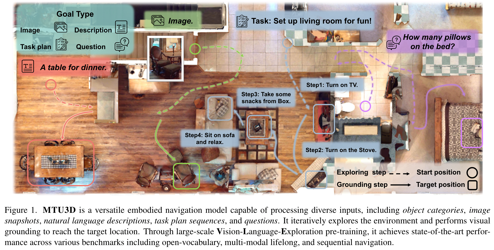{:height 386, :width 746}
		- MTU3D 是一种通用的具身导航模型，能够处理多样化的输入，包括物体类别、图像快照、自然语言描述、任务计划序列和问题。它通过迭代地探索环境并执行视觉定位来到达目标位置。借助大规模的视觉-语言-探索预训练，它在多个基准测试中达到了最新的性能，包括开放词汇、多模态终身学习和序列导航。
-
## 1. 引言
collapsed:: true
	- 背景
		- 具身场景理解不仅需要识别已观察到的物体，还需要在三维物理世界中主动探索和推理 [8, 18, 47, 93]。
			- 想象走进一个陌生的房间，目标是“找到可以吃的东西”。作为人类，你的直觉是开始探索：也许先走向厨房，然后查看操作台、打开冰箱，或者环顾是否有餐厅区域。你的搜索依赖于常识知识、空间推理和视觉定位的无缝结合 [8, 42, 64, 76]。
		- 类似地，具身智能体在新的环境中导航时，也必须在探索、感知、推理和行动的连续闭环循环中运行 [31, 64, 73]。这一过程中的关键部分是理解三维视觉与语言（3D-VL）[1–3, 9, 48, 85, 88]，从而使智能体能够进行空间思考并做出明智的探索决策 [32, 54, 94]。
	- 现有工作
		- 近年来，三维视觉-语言领域取得了显著进展 [10, 29, 31, 55, 93, 94]。这些模型利用三维重建来执行视觉定位 [9, 26, 69, 87]、问答 [3, 48, 92]、密集描述 [12] 和情境推理 [31, 48]。近期的方法，如 3DVLP [84]、PQ3D [94] 和 LEO [31]，试图通过预训练 [84, 93] 或统一训练 [5, 29, 31] 在单一架构中处理多任务。
	- 现有不足
		- 然而，现有的 3D-VL 模型依赖于静态的三维表示 [9, 63, 67]，假设环境的完整重建在事先即可获得 [10, 93]。这种假设虽然适用于离线的视觉-语言定位，但对于在部分可观测和动态环境中运行的真实具身智能体来说并不现实 [42, 51, 64]。
		- 此外，这些模型通常缺乏主动感知和探索能力 [37, 79, 94]。
		- 相比之下，基于强化学习（RL）的具身智能体能够探索环境，但往往面临样本效率低下 [71]、由于训练数据有限而泛化能力不足 [20, 57, 62]，以及缺乏显式空间表征的问题。
		- 在被动的 3D-VL 定位和主动探索之间建立联系，仍然是开发能够高效探索与理解三维世界的智能系统的关键挑战。
	- 挑战
		- 要开发具备主动感知能力的 3D-VL 模型，必须解决三大挑战：
			- 如何在无需昂贵三维重建的情况下，从原始 RGB-D 输入中有效地在线学习表征，确保其具有丰富语义、空间感知和终身记忆？
			- 物体定位与空间探索的联合优化仍然是尚未充分研究的问题；
			- 训练具身智能体需要大规模轨迹数据来学习鲁棒的探索策略，但收集多样化的真实轨迹面临巨大挑战，如何有效利用这些数据仍然是一个开放问题。
	- 图2
		- 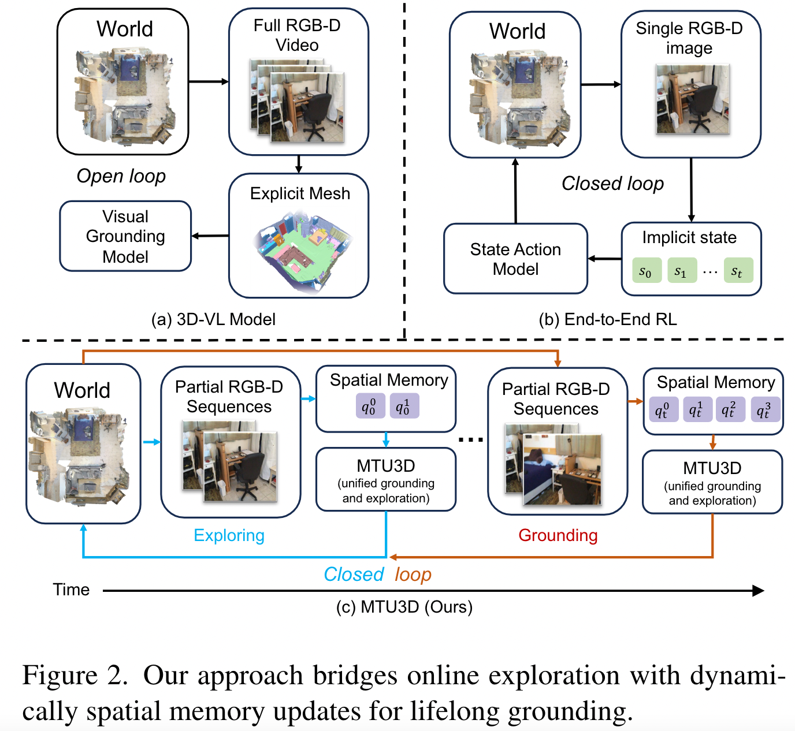{:width 500}
	- 表1
		- 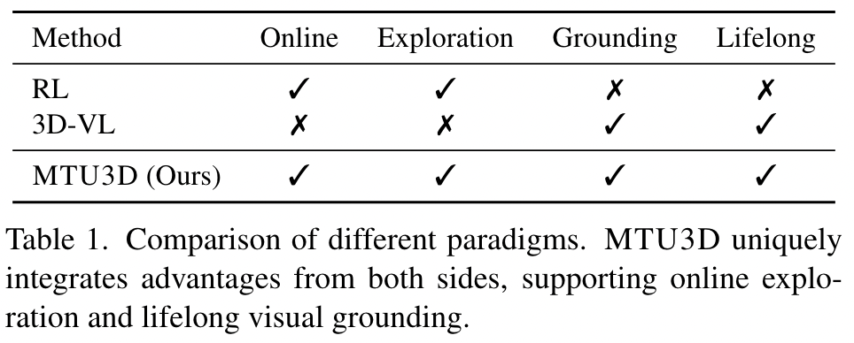{:width 400,:height 800}
	- 本文工作
		- 为应对这些挑战，我们提出 **Move to Understand (MTU3D)**，一个统一的框架，用于弥合视觉定位和探索之间的鸿沟，实现多样化的具身导航（见图 2）。
		- 我们的方法包含三项关键创新：
			- **在线查询表征学习**：模型以原始 RGB-D 帧为输入，生成单帧局部查询，并将其写入全局空间记忆库。通过结合 DINO [6, 53] 和 SAM [39] 等二维基础模型的特征提取和分割先验，我们的查询表征能够捕获丰富语义和精确的三维空间信息 [73]。
			- **统一的探索-定位目标**：我们引入联合优化框架，将未探索区域表示为前沿查询。这允许同时学习物体定位和探索。通过将从空间记忆库中检索的物体查询与占用图 [30] 中检测到的前沿查询 [75] 一同输入，我们实现了整合两类任务的训练过程。
			- **端到端的视觉-语言-探索 (VLE) 预训练**：我们利用大规模轨迹数据训练 MTU3D，总计结合了超过一百万条真实世界 RGB-D 轨迹和来自 HM3D 的模拟数据。为提升训练的多样性，我们设计了自动轨迹混合策略，将专家导航数据与含噪声的数据结合 [57]。经过 VLE 预训练后，MTU3D 能够无缝迁移到模拟环境和真实场景中进行推理。
		- 实验结果
			- 大量的具身导航与问答基准实验表明，**MTU3D 超越了现有的离线模块化方法和基于强化学习的方法**，实现了更高的探索效率、更强的环境泛化能力以及更优的实时决策能力。
			- 具体而言，MTU3D 在 HM3D-OVON [79]、GOAT-Bench [37] 和 SG3D [87] 上分别将当前最优结果在成功率（SR）上提升了 13.7%、23.0% 和 9.1%，在路径长度加权成功率（SPL）上提升了 2.4%、13.0% 和 6.3%。当与大型视觉-语言模型结合，并将其作为轨迹生成器时，我们的方法在具身问答中将 LM-SR 提升了 2.4%，LLM-SPL 提升了 29.5%。
			- 此外，我们还将模型部署在真实机器人上，展示了其在处理真实三维环境中的有效性。
			- 这些结果突显了弥合视觉定位与探索之间的鸿沟的重要性，这是迈向高效、多样化且可泛化的具身智能的关键一步。
		- 我们的主要贡献总结如下：
			- 提出 **MTU3D**，弥合视觉定位与探索，用于高效且通用的具身导航；
			- 提出 **统一目标函数**，联合优化定位与探索，利用二者的互补性提升整体性能；
			- 提出一种新颖的 **视觉-语言-探索训练方案**，利用来自模拟和真实世界的大规模轨迹数据；
			- 通过广泛实验验证了方法的有效性，在开放词汇导航、多模态终身导航、任务导向的序列导航和主动具身问答基准上显著提升了探索效率与定位精度。
## 2. 相关工作
collapsed:: true
	- **三维视觉-语言理解。**
		- 任务介绍
			- 近年来，三维视觉-语言（3D-VL）学习 [18, 31, 32, 54, 93] 受到广泛关注，主要聚焦于通过理解空间关系 [2, 68]、物体语义 [9, 24, 26, 67] 和场景结构 [35, 36, 44, 69]，在三维场景中进行语言定位。
			- 该领域衍生出多种任务，包括三维视觉定位 [1, 2, 9, 85]、问答 [3, 48, 88] 和密集描述 [12]。近期，该领域进一步扩展到意图理解和任务导向的序列定位 [87]，推动了三维视觉-语言模型在复杂推理 [4, 58] 和交互 [33, 45, 65] 上的能力。
		- 现有 3D-VL 模型大致分为三类：
			- **任务特定模型** [10, 26, 27, 34, 81]：为单一任务设计专门架构；
			- **预训练模型** [84, 93]：利用大规模多模态数据提升泛化能力；
			- **统一模型** [11, 13, 29, 31, 90, 94]：试图在单一框架内处理多任务。
		- 现有不足
			- 尽管已有进展，但现有 3D-VL 模型的关键局限在于依赖静态三维表示（如预计算网格 [63, 67] 或点云 [9]），这使得其不适用于真实世界的具身人工智能（EAI），因为智能体必须在实时环境中进行探索和感知。
			- EmbodiedSAM [73] 部分解决了这一问题，它将流式 RGB-D 视频作为输入进行在线三维实例分割 [25, 72]；然而，它缺乏主动探索与高层推理能力。
		- 本文工作
			- 相比之下，我们提出的 MTU3D 框架是一个统一模型，旨在在在线 RGB-D 探索过程中，直接从动态空间记忆库中同时学习场景表征、探索策略和定位。
	- **具身导航与推理。**
		- 近年来，具身人工智能在具身导航 [28, 38, 61, 66] 与推理 [17, 42, 50, 59, 64] 方面取得了快速发展，其核心依赖于三项关键能力：**感知、推理与探索**。研究人员提出了一系列基准 [37, 79]，用于在不同目标规格（图像、物体或语言指令）下评估导航能力，考察序列感知能力 [87]，或在具身场景中进行问答 [51]。
		- 应对这些挑战的研究主要分为两类方法 [37, 46, 83, 95]：
			- **端到端强化学习方法**（如 PIRLNav [57]、VER [71]）：利用 RNN 或 Transformer [19, 82]，直接针对导航任务进行训练，将感知与推理整合以驱动行动。然而，由于缺乏显式的三维表征，这类方法在复杂环境中的指令执行表现有限 [28, 80]；
			- **模块化方法** [7, 43, 59, 77, 78, 80]：将导航任务分解为独立组件，分别维护映射与导航策略的模型。
		- 近期，CLIP on Wheels [23, 40, 56] 利用预训练的视觉-语言模型，在无需微调的情况下解释导航目标 [49]。与这些方法不同（见表 1），我们的模型采用 **视觉-语言-探索训练范式**，通过主动探索构建场景表征，并在端到端系统中进行推理。
## 3. MTU3D
collapsed:: true
	- 在本节中，我们介绍模型的架构（见图 3）及训练流程。首先，我们详细说明 **查询表征学习**，该模块从部分 RGB-D 序列中提取物体与前沿查询，并将其动态存储在空间记忆库中。接着，我们介绍 **统一的定位与探索目标**，通过空间推理层对查询进行选择。最后，我们描述 **轨迹收集策略与训练流程**。
	- 图3
		- 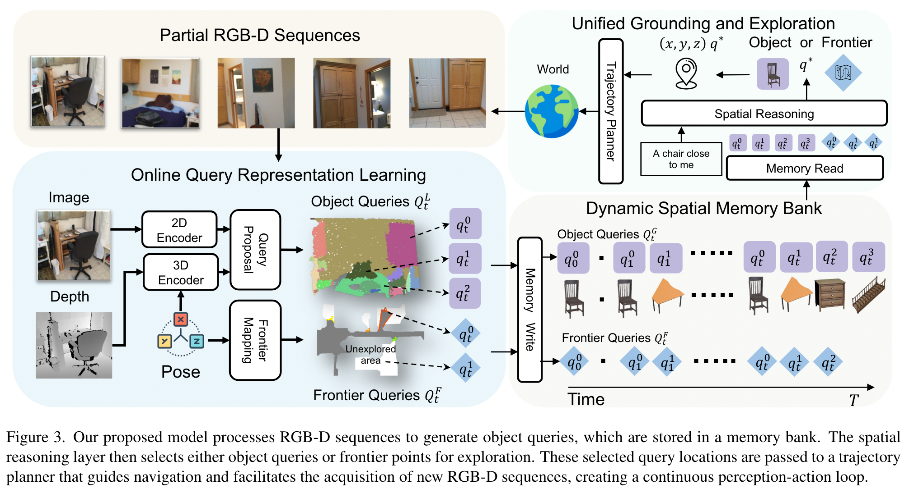{:width 777}
		- 我们提出的模型处理 RGB-D 序列以生成物体查询，这些查询存储在记忆库中。空间推理层随后选择物体查询或前沿点进行探索。所选的查询位置被传递给轨迹规划器，引导导航并获取新的 RGB-D 序列，形成一个连续的感知—行动闭环。
	- ### 3.1 在线查询表征学习
		- 我们的模型输入为一个覆盖任意时间范围的部分 RGB-D 序列，记作 $O = [o_{t_1}, o_{t_2}, \dots, o_t]$。在每个时间步 $t$，我们提取局部查询 $Q_t^L$，随后在区间 $[t_1, t_2]$ 内进行聚合，生成全局查询 $Q_{t_2}^G$，并存储于记忆库中。该过程以在线方式运行，使得模型能够在任意时间步进行灵活处理。
		- 我们的在线表征学习框架包含以下三个关键组成部分：
			- #### 二维与三维编码
				- 对于每个输入观测 $o_t = [I_t, D_t, P_t]$，我们处理三个部分：
					- RGB 图像 $I_t \in \mathbb{R}^{H \times W \times 3}$
					- 深度图像 $D_t \in \mathbb{R}^{H \times W}$
					- 相机位姿 $P_t \in SE(3)$
				- 参考 ESAM [73]，我们采用 FastSAM [39, 89] 将图像分割为不同区域，生成分割索引图 $S_t \in \mathbb{N}^{H \times W}$，其中每个值表示一个区域 ID。
				- 在 **二维特征提取** 中，我们将 $I_t$ 输入 DINO 主干网络 [6, 53]，得到像素级特征 $F^{2D}_t \in \mathbb{R}^{H \times W \times C}$。这些特征根据 $S_t$ 进行池化，得到分割级表示 $\hat{F}^{2D}_t \in \mathbb{R}^{M \times C}$，其中 $M$ 表示 FastSAM 识别出的分割区域数。每个分割对应于一片粗粒度图像区域，关联到一组像素及其对应的三维点。
				- 在 **三维特征提取** 中，我们将深度图 $D_t$ 投影为点云，并均匀下采样为 $N$ 个点 $P_t \in \mathbb{R}^{N \times 3}$，再输入稀疏卷积 U-Net [14, 15, 63]，生成三维特征 $F^{3D}_t \in \mathbb{R}^{N \times C}$。然后根据 $S_t$ 进行分割级池化 [22]，得到分割级三维表示 $\hat{F}^{3D}_t \in \mathbb{R}^{M \times C}$。
			- #### Local Query Proposal (局部查询生成)
				- 在获得二维与三维特征后，我们通过多层感知机生成物体查询 (object queries)：
					- $Q_t = \text{MLP}(\hat{F}^{2D}_t, \hat{F}^{3D}_t) \in \mathbb{R}^{M \times C}$
				- 这些初始查询通过受 PQ3D [94, 96] 启发的解码器层进一步优化，得到局部输出查询 $Q_t^L$。每个优化后的局部查询 $q_t^L \in Q_t^L$ 包含多个组件：
					- $q_t^L = [b_t, m_t, f_t, v_t, s_t]$
				- 其中：
					- $b_t \in \mathbb{R}^6$：三维包围框（全局坐标系），
					- $m_t \in \mathbb{R}^M$：分割级掩码预测（实例分割），
					- $v_t \in \mathbb{R}^C$：开放词汇特征嵌入（语义对齐），
					- $f_t \in \mathbb{R}^C$：查询解码器输出特征，
					- $s_t \in \mathbb{R}$：置信度分数（检测可靠性）。
				- 掩码 $m_t$ 可转换为二维掩码 $(H \times W)$ 或单帧三维点云掩码（N 个点）。由于输入点云通过位姿信息转换到世界坐标系，预测的 $b_t$ 存在于共享坐标系统中，便于后续查询合并操作。
			- #### 动态空间记忆库
				- 我们通过计算当前局部查询 $Q_t^L$ 与历史全局查询 $Q_{t-1}^G$ 的包围框 IoU，将局部查询与存储于空间记忆库 [52, 73, 91] 中的历史查询进行合并，生成更新后的全局查询 $Q_t^G$，其中包含 $f_t$ 和 $v_t$，用于后续的定位与探索。
				- 对于匹配的查询对，我们采用融合策略：包围框参数 $b_t$、特征嵌入 $f_t$、语义向量 $v_t$ 和置信度分数 $s_t$ 通过指数滑动平均更新，而实例分割掩码 $m_t$ 通过并集操作融合 [73]。
				- 为识别未探索区域，我们维护一个占用图 $M \in \mathbb{R}^{X \times Y \times 3}$，将空间单元划分为已占用、未占用或未知。我们探索方法的核心是 **前沿（frontier）** 的概念，记作 $Q_t^F$，即已探索（已知）与未探索（未知）区域之间的边界。这些前沿通过遍历已探索空间边界并检测相邻未知区域获得。每个前沿元素对应一个三维坐标 $\mathbb{R}^3$，作为潜在的探索目标 [75]。在到达每个目标位置后，前沿点会定期更新，引导智能体继续探索未映射区域。
	- ### 3.2 统一的定位与探索
		- 我们提出的统一方法将物体定位与探索结合在单一决策框架中。给定自然语言目标 $L$（例如“找到一把红色椅子”），模型需要在当前全局查询 $Q_t^G$ 与前沿查询 $Q_t^F$ 之间做出选择。
		- 一个空间推理 Transformer（详见附录）融合语言指令、物体表示与前沿信息，为每个候选决策生成统一得分：
			- $S^U_t = f(Q_t^G, Q_t^F, L)$
		- 前沿点通过一个两层 MLP 编码后输入 Transformer；全局查询输入由 $f_t$ 和 $v_t$ 构成。我们引入类型嵌入，以区分物体查询与前沿查询。
		- 对于语言目标，我们使用 CLIP 文本编码器 [56]；
		- 对于基于图像的目标，我们使用 CLIP 图像编码器 [41, 56]。
		- 这些嵌入被投影到 Transformer 的特征空间，与查询表征进行交叉注意力计算。最终决策选择得分最高的查询：
			- $q^\ast = \arg\max_{q_i \in Q_t^G \cup Q_t^F} S^U_t(q_i)$
		- 若 $q^\ast \in Q_t^G$，系统对对应物体进行定位；若 $q^\ast \in Q_t^F$，系统导航至该前沿位置。我们采用 Habitat-Sim 最短路径规划器生成局部轨迹。该机制能够基于当前场景知识与目标动态平衡探索与定位 [8]。
	- ### 3.3 轨迹数据收集
		- 训练我们的统一模型需要多样化的轨迹数据，但人工收集代价极高 [57, 70]。因此，我们设计了一个覆盖模拟环境与真实环境的系统性收集流程，将视觉定位数据与探索数据结合（见表 2）。
		- 表2
			- 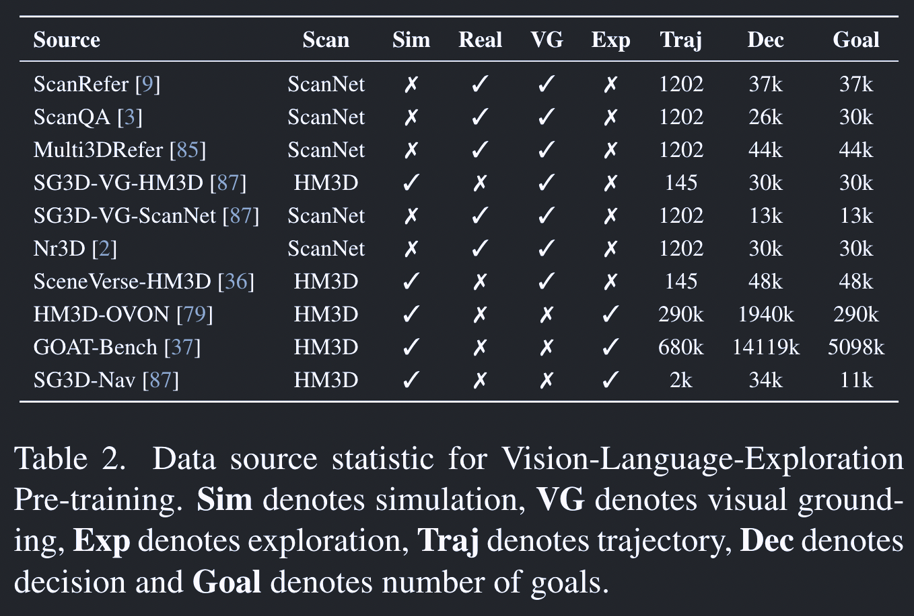{:width 555}
		- #### 视觉定位轨迹
			- 视觉定位数据格式为：
				- $(\text{Object } Q_t^G, \text{ Language } L) \;\to\; (\text{Decision } S^U_t)$
			- 利用 ScanNet [16, 60] 的离线 RGB-D 视频作为轨迹，我们可直接将这些配对样例用于预训练。每个样本将物体查询与语言描述关联，以生成决策。
		- #### 探索轨迹
			- 探索数据格式为：
				- $(\text{Object } Q_t^G, \text{ Frontier } Q_t^F, \text{ Goal } G) \;\to\; (\text{Decision } S^U_t)$
			- 其中前沿在探索过程中不断变化 [75]。若仅使用最优前沿（即距离目标最近者），容易导致过拟合。为此，我们引入随机前沿选择，以及结合随机与最优的混合策略 [57]。
			- 我们利用 Habitat-Sim [61] 在 HM3D [74] 的模拟扫描中收集探索轨迹。探索在目标变得可见且可达时视为成功。为避免不必要的探索，我们维护已访问前沿列表，并仅在存在更优潜在前沿（显著更接近目标）时继续探索；否则触发异常并终止当前收集。完整收集流程详见附录。
	- ### 3.4 视觉-语言-探索训练
		- **阶段 1：低层感知训练**
			- 我们利用 ScanNet 与 HM3D 的 RGB-D 轨迹训练查询表征，采用实例分割损失。损失函数包含多项：
				- $L = \lambda_b L_{\text{box}} + \lambda_m L_{\text{mask}} + \lambda_v L_{\text{vocab}} + \lambda_s L_{\text{score}}$
					- $L_{\text{box}}$：三维包围框 IoU 损失，
					- $L_{\text{mask}}$ 与 $L_{\text{score}}$：二元交叉熵损失，
					- $L_{\text{vocab}}$：余弦相似度损失。
			- 该设计保证局部查询 $Q_t^L$ 有效捕获空间、语义与置信度信息。
		- **阶段 2：视觉-语言-探索预训练**
			- 在 VLE 预训练阶段，我们利用阶段 1 输出的查询，同时训练探索与定位。基于表 2 的数据集，我们在超过一百万条轨迹上训练决策模型。统一决策得分 $S^U_t$ 通过二元交叉熵损失进行优化，指导模型根据当前状态与目标为合适的查询位置分配更高得分。
		- **阶段 3：任务特定导航微调**
			- 在此阶段，我们沿用阶段 2 的目标函数，对 MTU3D 在特定导航轨迹上进行微调，以优化其在目标部署场景下的性能。
## 4. Experiment
collapsed:: true
	- ### 4.1. Experimental setting
		- **数据集与基准测试**
		  collapsed:: true
			- 我们在多个不同的基准测试上进行评估：GOAT-Bench [37]（多模态终身导航）、HM3D-OVON [79]（开放词汇导航）、SG3D [87]（序列任务导航），以及 A-EQA [51]（具身问答）。
			- 常用的评价指标包括
				- 成功率（ $SR = N_{success} / N_{total}$ ）
				- 路径长度加权成功率（ $SPL = \frac{1}{N_{\text{total}}} \sum_{i=1}^{N_{\text{total}}} \frac{S_i \cdot l_i}{\max(p_i, l_i)}$ ），其中 $S_i$ 表示成功与否，$l_i$ 表示最短路径长度，$p_i$ 表示智能体实际路径长度。
				- 在 SG3D 中使用任务成功率（t-SR）来衡量任务步骤的一致性。
				- 在 A-EQA 中使用 **大模型匹配分数（LLM-SR）** 和 **按探索路径长度平均的得分（LLM-SPL）**。
			- 我们与多种基线方法进行了对比，包括模块化方法（如 GOAT [37]、VLFM [78]）、端到端强化学习方法 [57, 79]，以及基于视频的方法 [83]。
		- **实现细节**
			- 在第 1 阶段中，我们训练 50 个 epoch，优化器使用 AdamW（学习率 1e-4，β1 = 0.9，β2 = 0.98），损失权重设置为 λb = 1.0, λm = 1.0, λv = 1.0, λs = 0.5。
			- 第 2 阶段和第 3 阶段使用相同的优化器设置，每个阶段训练 10 个 epoch。第 1、2 阶段均采用 4 层 Transformer。第 1 阶段训练查询生成器，之后冻结；第 2、3 阶段训练空间推理模块。[[#red]]==所有训练在 4 张 NVIDIA A100 GPU 上进行，总计约 164 GPU 小时。==
			- 在仿真评估中，我们遵循 [37, 79, 87]，使用 Stretch 机器人作为具身平台（1.41m 高，底座半径 17cm），输入包括 360×640 的 RGB 图像 It、深度图 Dt 和位姿 Pt，动作集合为：**前进（0.25m）**、**左转**、**右转**、**抬头**、**低头**。空间推理模块在到达每个目标位置后被激活。我们在相邻目标之间的轨迹上均匀采样 18 帧。
			- 在 A-EQA [51] 中，我们的模型仅用于生成探索轨迹，并收集相应的视频以回答每个问题。
	- #### 4.2. 定量结果
		- **开放词汇导航。**
		  collapsed:: true
			- 表3
				- 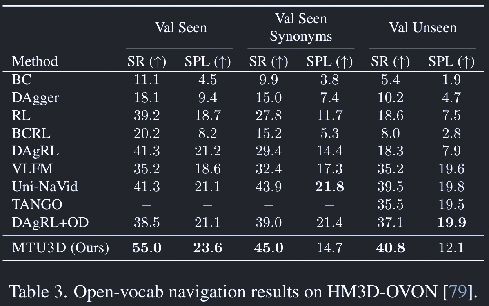{:width 400,:height 800}
			- 表 3 的结果表明，
				- 我们提出的 MTU3D 在 **成功率（SR）** 上显著超越了所有基线方法，无论是在 **已见验证集（Val Seen）** 还是 **未见验证集（Val Unseen）** 设置下。
				- 特别是在 Val Unseen 中，MTU3D 达到了 **40.8% 的 SR**，展示了其在新环境中强大的泛化能力。这表明相比于没有利用大规模语言数据进行预训练的 RL 或行为克隆（BC）方法，我们的方法在处理新场景时更有效。
			- 然而，我们观察到 MTU3D 的 **SPL 低于 Uni-Navid**，尤其是在 Val Synonyms 和 Val Unseen 设置下。由于 HM3D-OVON 数据集中的轨迹相对较短，基于视频的方法在识别到目标后可以直接导航，因此天然具有优势。
		- **任务导向的序列导航。**
		  collapsed:: true
			- 表4
				- 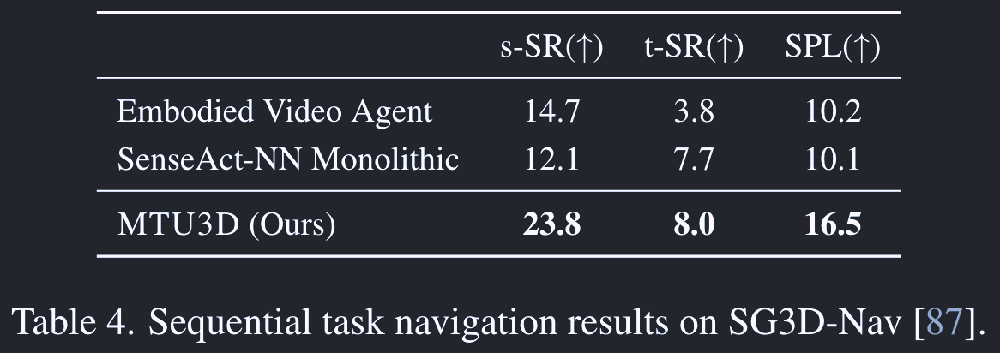{:width 400,:height 800}
			- 表 4 给出了序列任务导航的结果，这是一项更具挑战性的任务，要求具身智能体理解任务步骤之间的关系。结果显示，MTU3D 在 SG3D 基准上取得了 **最高的 s-SR（23.8%）、t-SR（8.0%）和 SPL（16.5%）**，证明了其在任务序列执行和任务理解上的有效性。
			- 与其他基准不同，SG3D 更强调跨多个步骤的任务一致性，因此复杂度更高。虽然 MTU3D 显著优于 **Embodied Video Agent [21]** 和 **SenseAct-NN Monolithic [37, 87]**，但总体成功率仍低于 GOAT-Bench 和 HM3D-OVON，突显了 SG3D 在要求同时具备导航能力和持续任务精确性方面的挑战性。
		- **多模态终身导航。**
		  collapsed:: true
			- 表5
				- 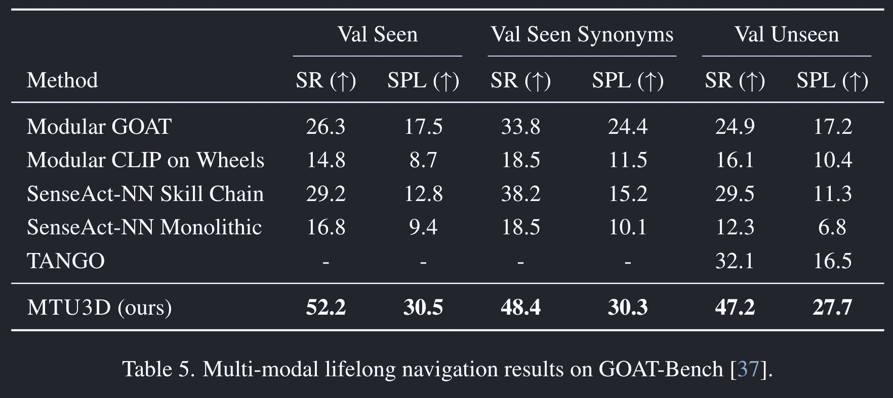{:width 600}
			- 表 5 的结果表明，在终身导航任务中，MTU3D 相较基线方法有显著性能提升。值得注意的是，MTU3D 在所有设置下都取得了最高的 SR：**Val Seen 52.2%，Val Seen Synonyms 48.4%，Val Unseen 47.2%**，显示了其卓越的导航能力。
			- 与开放词汇导航相比，多模态终身导航更具挑战性，因为它需要持续的空间记忆和长期推理。我们的模型通过 **终身空间记忆** 有效保留并利用过去的经验，从而比基线方法取得了更大幅度的性能提升。
			- 此外，MTU3D 在所有设置下也获得了最高的 SPL：**Val Seen 30.5%，Val Unseen 27.7%**，这表明它不仅能更准确地到达目标，还能选择更高效的路径。结果表明，我们的方法能有效平衡成功率和效率，这在终身导航中至关重要。总体而言，这些结果强调了终身空间记忆在多模态导航中的关键作用，且 MTU3D 的显著改进验证了其处理复杂任务的有效性。
		- **主动具身问答。**
		  collapsed:: true
			- 表6
				- 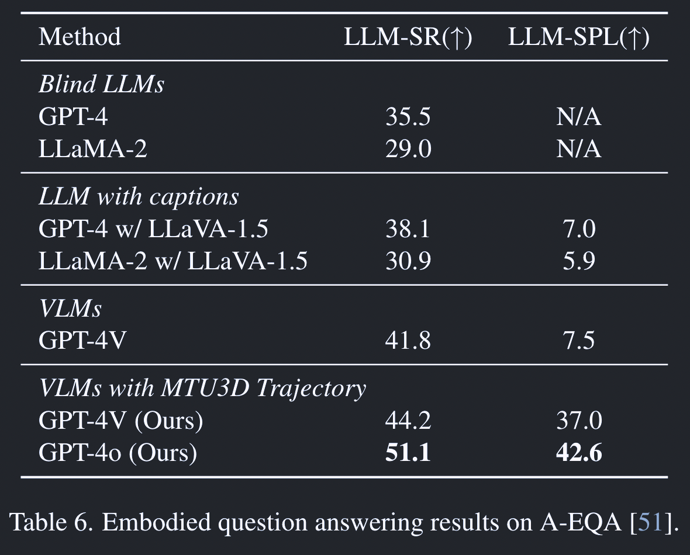{:width 400,:height 800}
			- 表 6 的结果表明，结合 MTU3D 的 GPT-4V 显著优于基线 GPT-4V 模型，取得了 **44.2% 的 LLM-SR（vs. 41.8%）**，以及大幅提升的 **LLM-SPL（37.0% vs. 7.5%）**。这表明我们的方法能够生成更高效的轨迹，避免了基线模型依赖的对所有位置进行穷尽搜索。
			- 此外，结合 MTU3D 的 GPT-4o 表现更好，达到了 **51.1% 的 LLM-SR** 和 **42.6% 的 LLM-SPL**。
	- ### 4.3. 讨论
		- **视觉-语言-探索预训练是否有助于导航？**
		  collapsed:: true
			- 图4a
				- 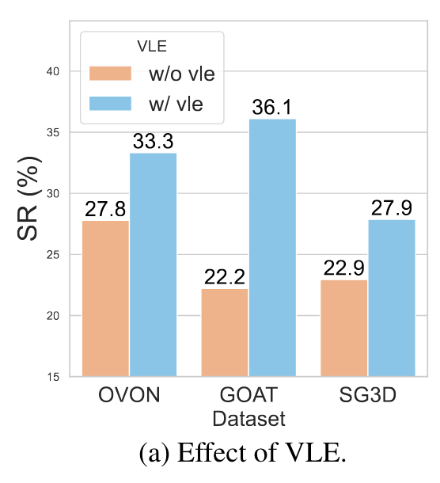{:width 300}
			- 图 4a 的结果表明，**视觉-语言-探索（VLE）预训练**显著提升了导航性能，这从所有数据集的 SR 指标提升中得到了验证。
				- 具体而言，SR 在 OVON 上从 27.8% 提升至 33.3%，在 GOAT 上从 22.2% 提升至 36.1%，在 SG3D 上从 22.9% 提升至 27.9%。这表明 VLE 在不同任务设置和分布中都能带来一致的收益。
		- **有监督的定位训练是否能带来更高效的探索？**
		  collapsed:: true
			- 图4c
				- 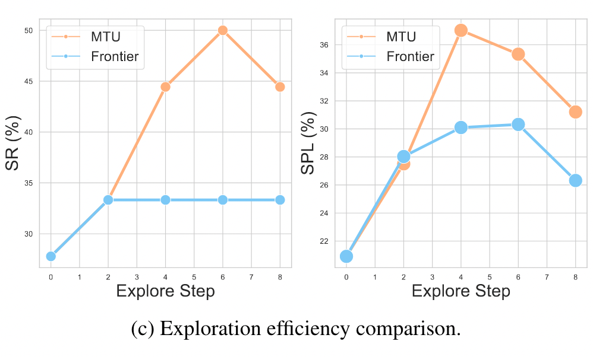{:width 600}
			- 图 4c 的结果显示，随着探索步数的增加，MTU 在 SR 和 SPL 上均超过了前沿探索（frontier exploration）。与仅依赖选择最近前沿点的盲目探索不同，MTU 借助语义信息进行更高效、目标导向的探索。特别是在第 6 步时，MTU 获得了更高的 SR（50.0% 对 33.3%）和更优的 SPL（35.3% 对 30.3%）。
		- **空间记忆库能否增强终身导航？**
		  collapsed:: true
			- 图4b
				- 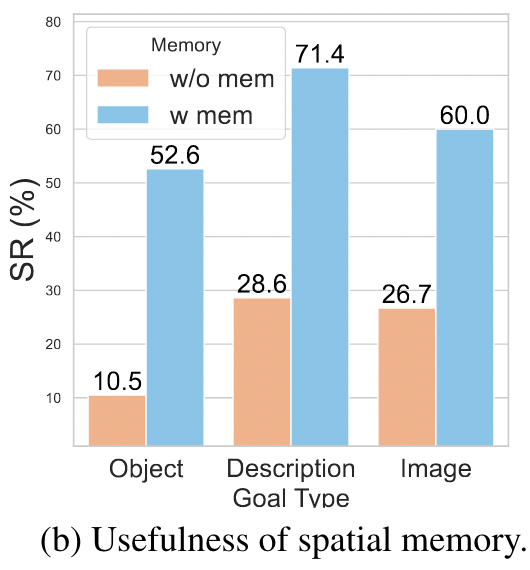{:width 300}
			- 我们在 GOAT-Bench 中的 **w/o mem** 设置下重置了每个子任务的空间记忆。实验结果（图 4b）显示，记忆显著提升了所有目标类型下的 SR。具体而言，**物体目标的 SR 从 10.5% 提升至 52.6%，描述目标从 28.6% 提升至 71.4%，图像目标从 26.7% 提升至 60.0%**，这表明空间记忆有助于保留有用的空间信息。
		- **MTU3D 能否实现实时运行？**
		  collapsed:: true
			- 表7
				- 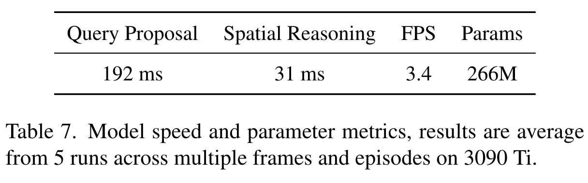{:width 400,:height 800}
			- [[#red]]==表 7 显示，我们的模型在保持 266M 参数规模的同时，实现了高效的查询生成（192 ms）、快速推理（31 ms），并维持了具有竞争力的帧率（3.4 FPS）。这些结果表明模型在速度与性能之间达成了最佳平衡，使其非常适合实时应用。==
	- ### 4.4. 定性结果
	  collapsed:: true
		- 图5
			- 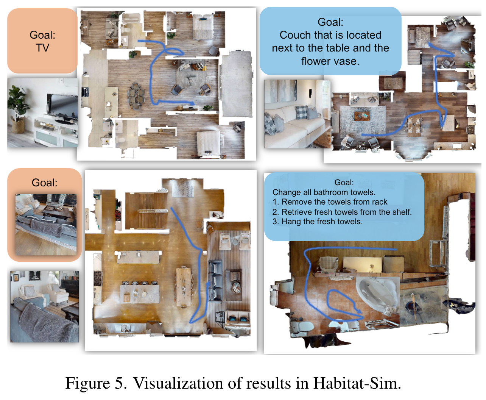{:width 600}
		- 图 5 展示了智能体在不同目标类型下的导航与任务完成能力，包括 **语言目标、图像目标、描述目标和任务规划目标**。轨迹结果说明智能体能够基于视觉和语义线索高效定位目标，表现出对图像指令和文本指令的理解能力。特别是在任务规划目标中，智能体遵循了一系列有结构的动作步骤。
	- ### 4.5. 实际环境测试
	  collapsed:: true
		- [[#red]]==我们将 MTU3D 部署在 **NVIDIA Jetson Orin** 上，使用 Kinect [86] 提供实时 RGB-D 数据，并结合搭载激光雷达的移动机器人进行探索，在真实的三维环境中对其进行评估。==
		- 图6
			- {:width 400,:height 800}
		- 在没有任何真实世界微调的情况下，我们在三个不同场景中对模型进行了测试：**家庭、走廊和会议室**。如图 6 所示，MTU3D 有效地导航至目标位置。由于 MTU3D 在训练中同时使用了模拟数据和真实数据，它克服了基于 RL 方法普遍面临的 **仿真到现实迁移（Sim-to-Real）**问题。这一能力不仅增强了其在现实中的适用性，还使其具有很高的可扩展性，并有望推动未来具身智能的发展。
## 5. 结论
collapsed:: true
	- 本文提出了 **Move to Understand (MTU3D)**，一个统一的框架，通过结合 **视觉定位（grounding）** 与 **探索（exploration）**，推动了具身场景理解的发展。
	- 通过对定位与探索的联合优化，MTU3D 在多样化输入模态下实现了高效导航，并促进了对空间环境的更深层理解。我们提出的 **视觉-语言-探索（VLE）训练**利用大规模轨迹，帮助模型在多个具身智能基准任务上取得了最新最优的性能。
	- 实验结果强调了 **空间记忆** 在实现终身多模态导航与空间智能中的关键作用，使智能体能够在复杂环境中进行推理与适应。此外，真实环境的部署结果验证了 MTU3D 的泛化能力，证明了其结合仿真与真实数据训练的有效性。
	- 通过连接视觉定位与探索，MTU3D 为更强大、更具可扩展性和更普适的具身智能体奠定了基础，推动我们向真正智能的具身 AI 更进一步。