public:: true

- [[TL;DR]]
	- [[#blue]]==**开放世界 无人机 主动跟踪**==
	- [[#blue]]==胜在系统性, 全面性, 完整性, 实验非常丰富==
	- [[#blue]]==创新型并不强, 所用技术也较为简单==
- [[Abstract]]
	- en
	  collapsed:: true
		- Drone Visual Active Tracking aims to autonomously follow a target object by controlling the motion system based on visual observations, providing a more practical solution for effective tracking in dynamic environments. However, accurate Drone Visual Active Tracking using reinforcement learning remains challenging due to the absence of a unified benchmark and the complexity of open-world environments with frequent interference. To address these issues, we pioneer a systematic solution. First, we propose DAT, the first open-world drone active air-to-ground tracking benchmark. It encompasses 24 city-scale scenes, featuring targets with human-like behaviors and high-fidelity dynamics simulation. DAT also provides a digital twin tool for unlimited scene generation. Additionally, we propose a novel reinforcement learning method called GC-VAT, which aims to improve the performance of drone tracking targets in complex scenarios. Specifically, we design a Goal-Centered Reward to provide precise feedback across viewpoints to the agent, enabling it to expand perception and movement range through unrestricted perspectives. Inspired by curriculum learning, we introduce a Curriculum-Based Training strategy that progressively enhances the tracking performance in complex environments. Besides, experiments on simulator and real-world images demonstrate the superior performance of GC-VAT, achieving a Tracking Success Rate of approximately 72% on the simulator. The benchmark and code are available at https://github.com/SHWplus/DAT_Benchmark.
	- 背景
		- ==无人机视觉主动跟踪==（Drone Visual Active Tracking）旨在通过基于视觉观测控制运动系统来自主地跟随目标物体，为在动态环境中实现有效跟踪提供更实用的解决方案。
	- 现有不足 (挑战)
		- 然而，基于强化学习的精确无人机视觉主动跟踪仍然具有挑战性，部分原因在于
			- 缺乏统一的基准
			- 以及频繁干扰的开放世界环境的复杂性。
	- 本文工作
		- 为了解决这些问题，我们提出了一个系统性的解决方案。
		- ==首先，我们提出了 DAT，这是第一个面向开放世界的无人机空对地主动跟踪基准。==
			- 该基准包含 24 个城市级场景，具有类人的目标行为与高保真动力学仿真。
			- DAT 还提供了一个用于无限制场景生成的数字孪生工具。
		- ==其次，我们提出了一种名为 GC-VAT 的新型强化学习方法==，旨在提升无人机在复杂场景中追踪目标的性能。
			- 具体而言，我们设计了一种“以目标为中心的奖励（==Goal-Centered Reward==）”，用于在不同视角间向智能体提供精确反馈，使其能够通过不受限的视角扩展感知与移动范围。
			- 受课程学习（==curriculum learning==）启发，我们引入了一种基于课程的训练策略，逐步增强在复杂环境中的跟踪性能。
		- 此外，在模拟器与真实图片上的实验展示了 GC-VAT 的优越性能，在模拟器上实现了约 72% 的跟踪成功率。
	- 开源
		- 该基准与代码可在 [https://github.com/SHWplus/DAT_Benchmark](https://github.com/SHWplus/DAT_Benchmark) 获取。
- [[Attachments]]
	- https://arxiv.org/pdf/2412.00744
- [[Notes]]
	- Comment: NeurIPS 2025
-
## 1 Introduction
	- ### 背景
		- 视觉主动跟踪（Visual Active Tracking, VAT）旨在通过基于视觉观测控制跟踪器的运动系统来自主地跟随目标物体 [80, 75]。它被广泛用于无人机目标跟踪与安全监控等现实应用场景 [22, 73, 77, 54]。
		- 不同于被动视觉跟踪（passive visual tracking）[3, 74, 33, 5, 9, 84, 67, 58]——后者是在固定相机姿态下逐帧为目标提出二维边界框——VAT 会主动调整相机位置以将目标保持在视野内。由于大多数目标具有高度动态性，被动视觉跟踪在现实场景中往往不足以应对。因此，VAT 为在动态环境中实现有效跟踪提供了一个更实用但也更具挑战性的解决方案。
	- ### 现有工作
		- 近来，VAT 方法演化为两大类：流水线式 VAT 方法（pipeline VAT methods）[40, 46, 15] 与基于强化学习的 VAT 方法（reinforcement learning-based VAT methods）[19, 39, 18, 80]。
			- 流水线式方法采用顺序化框架，将视觉跟踪 [32, 4, 62, 33] 与控制模型串联。
				- 跟踪模型估计输入图像中的目标位置，而控制模型产生控制信号。
				- 尽管这种模块化设计便于任务划分清晰，但
					- 通常需要大量人工标注训练数据，
					- 且控制模块在不同场景下需要额外调优。
			- 为了解决这些问题，基于强化学习的 VAT 方法将视觉跟踪与控制集成到统一框架中。
				- 这些方法通过统一框架将原始视觉输入直接映射到控制动作，消除了对跟踪模块与控制模块分别调优的需求。因此，基于强化学习的 VAT 方法简化了系统设计并提高了在动态环境中学习自适应跟踪行为的效率。
	- ### 现有不足
		- 不幸的是，使用强化学习实现精确的无人机 VAT 仍然具有挑战性，原因部分包括以下几点。
		- **1) 缺乏统一的基准。**
			- 现有基准场景复杂度较低，忽视跟踪器动力学或依赖过于简化的模型，使其不足以验证智能体性能（参见表 1）。
				- 表1
					- 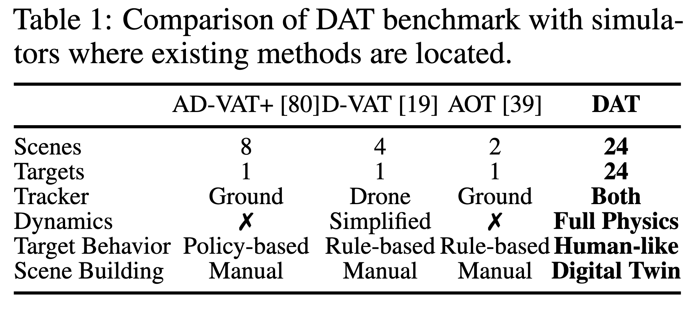{:width 400,:height 800}
						- [[#blue]]==Tracker==
						  collapsed:: true
							- 这一项说明“谁在追踪”——是地面摄像头（ground）、是空中的无人机（drone），还是两者都支持（both）。这会影响物理模型、动作空间（能移动的方向、速度限制）和所需的仿真复杂度。DAT 标注为 “Both”，说明它既能用于地面追踪器也能用于无人机追踪（本工作主要关注空对地的无人机追踪，但框架支持两类追踪器）。
						- [[#blue]]==Dynamics==（动力学模型）
						  collapsed:: true
							- **“Dynamics 中的 Full Physics 是指什么？”**
								- 通俗解释（关键句）：**Full Physics = 完整的物理动力学仿真**。
									- 简单／简化模型（Simplified 或 表里用 ✗ 表示没有）只关心“位置怎么变”，或者用很简单的速度、直接设置位置的方式来移动无人机或目标（像把物体在地图上“瞬移”到下一个点），不考虑质量、空气阻力、转向延迟、云台抖动等真实世界的物理特性。
							- **Full Physics（论文里 DAT 所用）则模拟真实无人机的物理行为**：包括质量、转动惯量、空气动力学影响、推进器响应延迟、云台（gimbal）的响应和抖动等。也就是说仿真里无人机不会“瞬间转向”或“无惯性地停止”，而是有真实的物理限制，控制命令会经过动力学系统的响应后才产生位置/姿态变化。论文明确说他们用 ==Webots== 来做“full dynamics”，并模拟了质量、惯性、气动力、以及云台的响应和抖动来更贴近真实无人机。
							- 为什么重要（举例）：如果仿真里不模拟这些物理因素，你在仿真里训练出的策略在真实飞行时可能会失效——因为真实无人机会有延迟、会被风吹偏、转弯不能太快等。Full Physics 能让训练更可信、更能直接迁移到真实世界。
						- [[#blue]]==Target Behavior==（目标行为）
						  collapsed:: true
							- **“Target Behavior 中的 Human-like 是指什么？”**
								- 通俗解释：这里指的是被追踪对象（比如车、人、机器人）在仿真里**如何移动和决策**。
							- 不同方式的含义：
								- **Policy-based / Rule-based（以前的做法）**：目标的移动由简单规则或固定策略控制（例如“按直线走/遇到红灯停/随机左转”之类简单规则），行为比较刻板、可预测，和真实人的驾驶或行走差异较大。
								- **Human-like（DAT）**：他们尽量模拟真实人的/司机的行为习惯，让目标的运动更“像人/真实车辆” —— 比如会遵守交通规则（红绿灯）、有堵车、会变道、会刹车、会在交叉口等待、会做 U-turn、会出现自然的速度波动和随机性等。论文描述他们把道路网络与 ==SUMO==（真实交通模拟器）结合，然后用控制器把 SUMO 的运动数据转换为 3D 场景中“看起来像真实驾驶/行人的动作”。这就叫“human-like” —— 更随机、更有规则交互、更接近现实人的行为。
								- 为什么重要（举例）：如果目标一味按固定路线走，训练出来的无人机会学到“刻板”的追踪手法，遇到真实司机突发变道或堵车就会跟丢。把目标做得“像真实人/车”，能训练出更鲁棒的追踪策略。
						- [[#blue]]==Scene Building==（场景构建）
						  collapsed:: true
							- **“Scene Building 中的 Digital Twin 是指什么？”**
								- 通俗解释：**Digital Twin（数字孪生）在这里就是把真实地图/环境自动化地“转成”仿真场景的工具**，而不是人手一块一块地在编辑器里建模型。具体说法和步骤（论文里描述）：
								- 他们用基于 ==OpenStreetMap== 的工具（结合 webots 的 osm_importer）把真实地区的数据（道路、车道数、红绿灯位置、地形高程、植被信息等）下载、预处理，并自动生成仿真需要的网络文件（.net.xml）和 3D 资产（buildings, trees, roads 的模型），再把交通规则、信号灯等信息加入到仿真里。
								- 这样就可以从真实世界任意取一块区域，自动生成相应的仿真“数字孪生”场景，支持大量不同的、真实感更强的场景生成，而不是人工一个个做。论文里说 citystreet、downtown、lake 这些场景就是用数字孪生工具由真实地点（例如洛杉矶某小镇、曼哈顿、某公园）生成的。
								- 为什么重要（举例）：人工搭场景非常耗时且数量有限；数字孪生能把真实地图快速“搬进仿真”，让训练数据更真实、场景更多样，也更容易覆盖真实中会遇到的情况。
			- 之前的方法 [39, 19, 57] 使用基于规则的目标管理，远未能产生类人的目标行为。
			- 此外，当前的 3D 场景均为手工构建，导致工作量大且场景数量受限。
		- **2) 广阔环境与复杂干扰。**
			- 开放世界的跟踪涉及大规模、动态的环境并伴随频繁干扰。
			- 在之前的方法 [39, 19] 中，跟踪器只能从固定的水平视角采集图像。然而，固定的前向视角会捕捉过多天空区域，减少与目标相关的视觉信息，尤其对空对地（air-to-ground）跟踪任务影响更大。
			- 此外，由于 VAT 的目标是将目标保持在图像中心，这类视角限制了跟踪器与目标处于同一高度，严重限制了感知与移动范围。
			- 再者，直接在复杂条件下训练会导致收敛缓慢或难以建立强鲁棒行为。
	- ### 本文工作
		- 为了解决上述局限性，我们首先提出了 DAT——首个模拟现实世界复杂性的开放世界主动空对地跟踪基准（见图 2(b)）。
			- 图2 (b)
				- 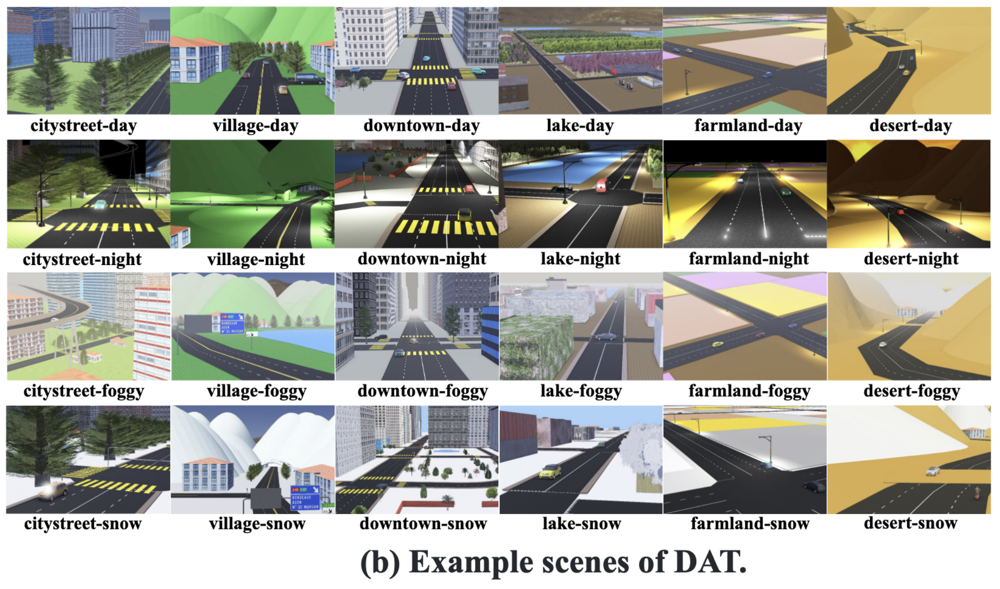{:width 666}
			- 具体而言，DAT 提供了 24 个城市规模场景、无人机动力学的全保真仿真，以及一个可集成到任意 3D 场景以启用类人目标行为的轻量级工具。
			- 它还提供了一个数字孪生工具，能够从现实环境生成无限 3D 场景，实现场景的无限扩展。
		- 其次，我们提出了一种新颖的基于强化学习的无人机 VAT 方法（称为 GC-VAT），旨在提升在复杂多样场景中的适应性。
			- 具体而言，我们设计了“以目标为中心的奖励（Goal-Centered Reward）”，为不同视角提供精确反馈，使智能体能够通过不受限的视角扩展其感知范围。
			- 除此之外，我们提出了定性与理论方法来分析该奖励的有效性。
			- 此外，受课程学习 [65, 41, 83] 启发，我们提出了一种基于课程的训练策略，逐步提升智能体在复杂环境中的性能。
		- 我们的贡献总结如下：
			- 一个全面的无人机主动跟踪基准。
				- 我们提出了 DAT 基准，具有高保真动力学、24 个城市级场景以及用于模拟类人目标行为与无限场景生成的工具，从而支持严格的算法验证。
			- 一种新颖的无人机主动跟踪方法。
				- 我们提出了 GC-VAT，利用以目标为中心的奖励函数和基于课程的训练策略以增强无人机在复杂动态环境中的跟踪性能。
				- 此外，我们提出了定性与理论方法来分析该奖励的有效性。
			- 广泛的实验验证。
				- 在模拟器与真实图片上的实验验证了 DAT 的可用性与 GC-VAT 的有效性；
				- 在模拟器上，GC-VAT 达到约 72% 的跟踪成功率。
## 2 Task Definition of Drone Active Tracking (无人机主动跟踪任务定义)
	- DAT 任务旨在训练一个模型以在动态环境中控制无人机进行主动目标跟踪（见图 1）。
		- 图1
		  id:: c8c0c653-8b6f-44c6-b9bf-0a90b222b260
			- 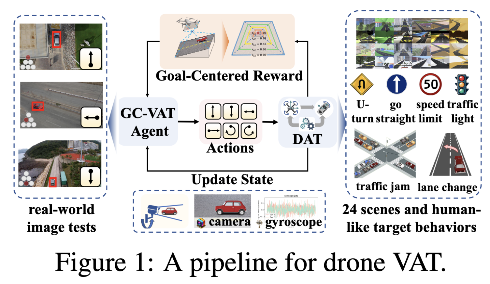{:width 600}
				- [[#blue]]==该图里是作者用来总结他们工作（DAT 基准 + GC-VAT 算法）的**整体“流水线（pipeline）/架构图**。==
				- [[#blue]]==gyroscope: 陀螺仪==
	- 模型使用视觉与运动传感器数据来学习动作，使目标保持在视野中心，从而在多样场景中保证鲁棒性能。
	- **观察空间（Observation spaces）**
		- 目标最初被放置在视野中心，观测空间由传感器获取的数据组成（例如分辨率为 84 × 84 的 RGB 图像）。
	- **动作空间（Action spaces）**
		- 动作空间可以是离散的也可以是连续的。离散空间定义了一组预设的无人机机动动作，而连续空间则允许对速度进行直接控制。
	- **DAT 任务的成功判定（Success criterion）**
		- 我们将成功判定定义为：模型能够将最初位于视野中心的目标物体在图像中间长时间保持在中心位置。
	- **挑战（Challenges）**
		- 开放世界无人机主动跟踪具有挑战性，原因在于数据有限且现实世界中试错代价高，因此需要复杂的仿真环境。此外，开放世界场景的复杂性与动态性进一步要求智能体具备鲁棒的性能。
## 3 DAT Benchmark with Diverse Settings (DAT 基准与多样化设置)
collapsed:: true
	- 我们开发了 DAT，包括由无限场景生成工具构建的 24 个城市级场景、高保真的无人机动力学仿真，以及用于生成类人目标行为的通用流水线。
	- ### 3.1 多样化场景构建
		- 数字孪生工具。
			- 用户可以从 OpenStreetMap [1] 中选择任意区域，使用我们的工具获得无数场景。
			- 具体而言，该工具生成带有交通信号灯与交通规则的高精度道路网络，并将高程 (elevation) 与植被数据转换为放置在场景中的 3D 资源。
			- 此外，生成场景中的所有资源均可编辑，便于进行数据增强。详见附录 B。
		- 场景构建。
			- 基于上述工具，我们在 4 种天气条件下构建了 6 个室外场景，并对 7 项现实世界复杂性进行了建模。
			- 具体而言，场景面积、建筑密度与颜色丰富度刻画了视觉背景的复杂性；
			- 道路密度与地形密度影响目标的行为；
			- 树木密度和隧道密度衡量视觉遮挡程度。
			- 如图 2 (a) 所示，这六种情形在上述七个方面展现出各自独特且逼真的复杂性：
				- 图2 (a)
					- 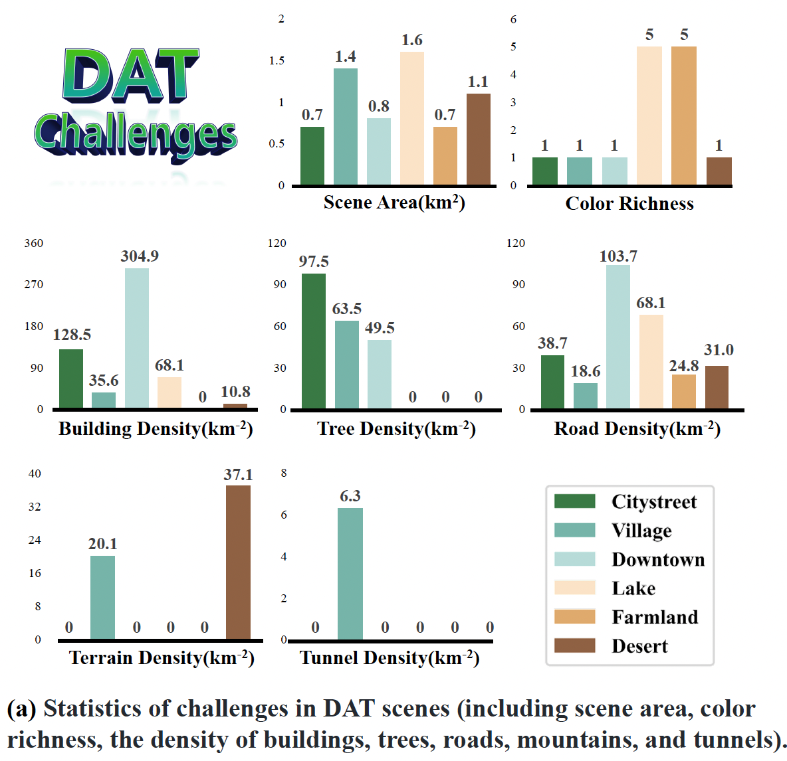{:width 600}
				- • Citystreet（城市街道）场景覆盖 0.7 平方公里。其道路密度为 38.7，树木密度为 97.5，主要用于测试智能体在树木遮挡下的效率。
				- • Village（村庄）场景占地 1.4 平方公里。该场景山地密度为 20.1，隧道密度为 6.3，要求智能体在目标被完全遮蔽时预测其运动。
				- • Downtown（市中心）场景覆盖 0.8 平方公里。包含复杂的道路要素与 304.9 的高建筑密度，对智能体的跟踪精度与避障能力提出挑战。
				- • Lake（湖泊）场景占地 1.6 平方公里。道路要素密度为 68.1，背景颜色丰富度为 5，考验在不同特征与颜色变换下的鲁棒性。
				- • Farmland（农田）场景覆盖 0.7 平方公里。颜色丰富度为 5、存在多个颜色块，挑战智能体对多色环境的适应性。
				- • Desert（沙漠）场景覆盖 1.1 平方公里。其山地密度为 37.1，道路密度为 31.0，部分道路被沙覆盖，用以测试智能体对该类条件的适应性。
			- 我们设计了四种天气条件以测试智能体的跨域适应能力：雾（foggy）降低能见度、夜间（night）降低亮度、雪（snow）改变颜色。上述 24 个场景（见图 2(b)）可充分评估智能体的跟踪性能。场景构建细节见附录 B。
	- ### 3.2 多样跟踪器与目标构建
		- 现实世界中的无人机主动跟踪依据任务会涉及多样的目标。DAT 提供了具类人行为的多样目标并支持高保真的跟踪器动力学仿真。
		- 跟踪器。
			- DAT 基准支持两类跟踪器：无人机与地面机器人。
			- 所用无人机为 DJI Matrice 100 [14]，配备 3 轴云台，允许精确的相机调节。
			- 不同于 [19] 中的简化运动学模型以及忽略动力学的方法 [39]，DAT 利用 webots [37] 来仿真无人机的完整动力学，包括质量、惯性、空气动力学，以及云台的响应与抖动，尽可能贴合真实无人机。详见附录 B。
		- 目标。
			- DAT 包含五类目标：汽车、摩托车、行人、轮式机器人与腿式机器人，总计 24 个跟踪目标（见图 2(d)）。详见附录 B。
		- 目标管理。
			- 我们提出了一条用于模拟逼真目标行为的新流水线。
			- 具体而言，
				- DAT首先利用第 3.1 节所述工具生成的道路网络，并将其直接与 SUMO 交通模拟器 [36] 集成。
				- 随后，为每辆车分配随机轨迹，由 SUMO 管理其运动。
				- 为弥合仿真与可视化之间的差距，我们实现了一个控制器，将运动数据转换为用于 3D 车辆的类人驾驶行为（见图 2(c)）。
					- 图 2(c)
						- 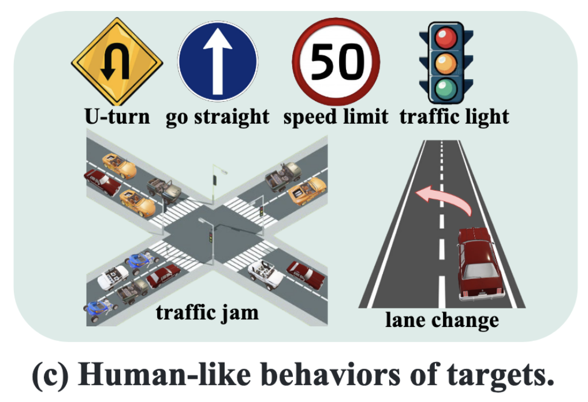{:width 400,:height 800}
				- 我们的控制器同时符合交通规则，并能模拟交通灯等待、交通拥堵等现象。更重要的是，该控制器可应用到任何 3D 场景中。
## 4 基于强化学习的 VAT
	- 在本文中，我们主要聚焦 DAT 基准中的核心任务——视觉主动跟踪（VAT）。
	- 我们提出了一种基于强化学习的无人机视觉主动跟踪方法，称为 Goal-CenteredVAT（GC-VAT），旨在提升复杂场景中跟踪目标的性能。
	- 如图 1 所示，我们将无人机主动跟踪建模为马尔可夫决策过程（MDP），并训练一个能够适应不受限视点条件以在开放场景中跟踪目标的无人机智能体（Drone Agent）。
		- {{embed ((c8c0c653-8b6f-44c6-b9bf-0a90b222b260))}}
	- ### 4.1 无人机主动跟踪的马尔可夫决策过程（MDP）
		- 我们旨在通过将任务建模为一个**马尔可夫决策过程（MDP）**来学习无人机在动态环境中的端到端跟踪策略，该过程定义为：$\langle \mathcal{S}, \mathcal{A}, \mathcal{R}, \gamma, \mathcal{T} \rangle$
		- 其中，$(\mathcal{S})$ 表示**状态空间（state space）**，$(\mathcal{A})$ 表示**动作空间（action space）**，$(\gamma)$ 为**折扣因子（discount factor）**。
		- 在每个时间步 ($t$)，智能体接收状态 ($s_t \in \mathcal{S}$) 作为输入，并执行动作 ($a_t \in \mathcal{A}$)。随后，仿真器根据 $s_{t+1} = \mathcal{T}(s_t, a_t)$ 转移到下一个状态，并计算当前步的奖励 $r_t = \mathcal{R}(s_t, a_t)$
		- MDP 的具体组成如下：
			- 状态 ($\mathcal{S}$)：状态为场景的视觉信息。在每个时间步 (t)，摄像机捕获一张大小为 (84 \times 84) 的图像作为当前状态。
			- 动作 ($\mathcal{A}$)：动作空间为一组离散动作，包括前进、后退、左移、右移、左转、右转以及停止。在每个时间步，无人机智能体（Drone Agent）根据状态 ($s_t$) 选择一个动作 ($a_t \in \mathcal{A}$)，并主动控制摄像机的运动。
			- 状态转移函数 ($\mathcal{T}(s_t, a_t)$)：该函数 ($\mathcal{T}: \mathcal{S} \times \mathcal{A} \rightarrow \mathcal{S}$) 将 ($s_t$) 映射到 ($s_{t+1}$)。本文使用 Webots 动力学引擎来提供真实的状态转移过程。
			- 奖励函数 ($\mathcal{R}(s_t, a_t)$)：奖励函数用于计算智能体的即时回报。目标导向的奖励设计将在第 4.2 节中详细介绍。
		- ==**无人机智能体的网络结构**==
			- ==与先前的研究 [39, 80] 类似，我们选用一个由卷积神经网络（**CNN**）与门控循环单元（**GRU**）[11] 组成的主干结构（见附录 C.2）。==
		- **无人机主动跟踪的关键挑战**
			- 在开放世界环境中，无人机面临目标行为不可预测与频繁遮挡的问题。设计一个能够同时激励多样化且鲁棒跟踪行为的单一奖励函数极具挑战性。
			- 为解决这一问题，我们在第 4.2 节中提出了**目标中心化奖励（goal-centered reward）**。
			- 此外，由于观测空间极为庞大，寻找成功的策略并非易事。为了促进高效学习，我们在第 4.4 节中引入了一种**基于课程学习的训练策略**。
	- ### 4.2 目标中心化奖励设计（Goal-Centered Reward Design）
		- **偏差度量函数（deviation metric）**
			- 背景
				- 对于无人机跟踪地面目标的任务，我们的奖励函数旨在刻画目标在图像中的位置，并引导无人机保持目标处于图像中心。因此，首先需要选择一种合适的距离度量，用于量化目标与图像中心在图像平面上的接近程度。
			- 挑战
				- 由于无人机通常以俯视视角拍摄图像，图像平面与地面并不平行。受到仿射变换（affine transformation）的影响，图像平面的投影呈梯形（见图 3(b)），此时无人机与目标的物理距离不能直接对应到像素距离。
			- 现有方法
				- 已有方法 [39, 19] 采用无人机与目标之间的欧几里得距离（Euclidean distance），但这并不能准确反映其在图像平面上的空间关系。
			- 为解决这一问题，我们引入一种**偏差度量函数（deviation metric）** ( $\phi(\cdot, \cdot)$ )，用于衡量目标与图像中心投影之间的距离，如图 3(b) 所示。
				- 图3
				  id:: 1a7b4982-1f39-4e9b-ad55-758efd31430d
					- 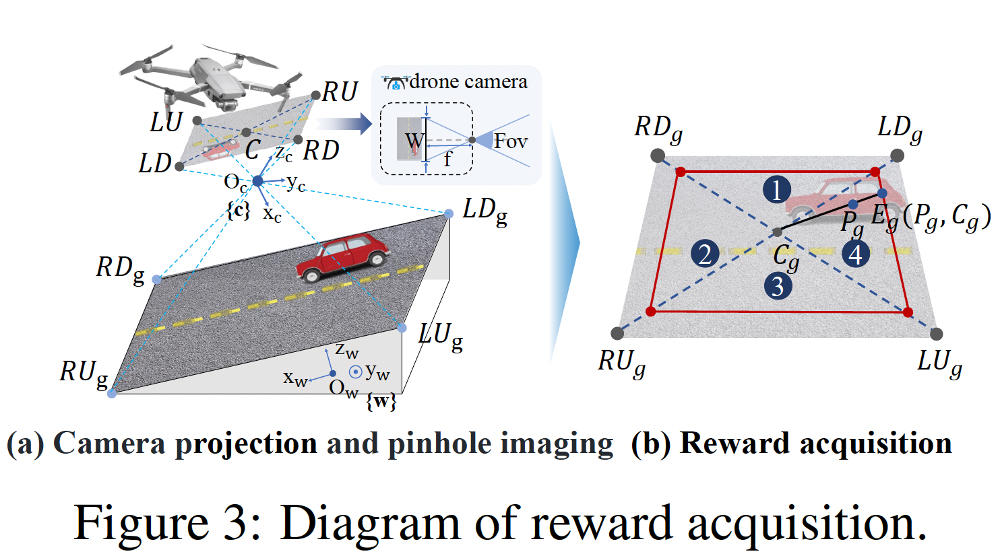{:width 600}
			- 具体而言，给定目标点 ($P_g$) 与图像中心投影 ($C_g$)，偏差度量定义为：
				- $$
				  \phi(P_g, C_g) = \frac{\lvert P_g - C_g \rvert}{\lvert E_g(P_g, C_g) - C_g \rvert}, \tag{1}
				  $$
					- 其中
						- ( $\lvert P_g - C_g \rvert$ ) 表示 ( $P_g$ ) 到 ( $C_g$ ) 的距离，
						- ( $\lvert E_g(P_g, C_g) - C_g \rvert$ ) 表示从点 ( $E_g(P_g, C_g)$ ) 到中心的距离。
						- ( $E_g(P_g, C_g)$ ) 是连接 ( $P_g$ ) 与 ( $C_g$ ) 的直线与投影图像边界的交点，如图 3(b) 所示。
			- 该偏差度量 ( $\phi(\cdot, \cdot)$ ) 被设计为确保图像内的目标比图像外的目标更接近中心，其等值线如图 4(b) 所示。
				- 图4
				  id:: 531c91a5-629f-407a-a5ce-899fd2af5dd8
					- 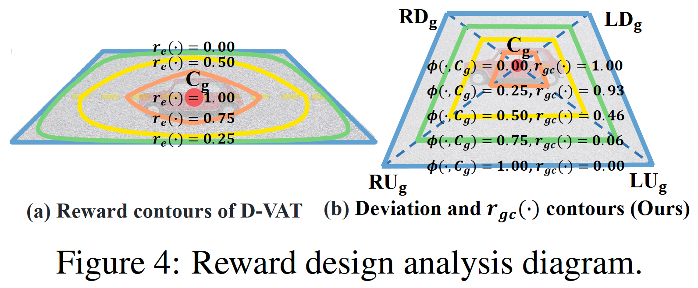{:width 600}
					-
		- **奖励设计原则**
			- 视觉主动跟踪（VAT）任务的目标是使目标保持在图像中心位置。因此，距离图像中心投影越近的目标应获得越高的奖励值。
			- 对于偏差度量 ( $\phi(\cdot, \cdot)$ )，奖励函数 ( $\mathcal{R}_\phi(\cdot)$ ) 的设计原则定义为：
				- $$
				  \forall P_1, P_2 \in W, \text{若} \phi_1 < \phi_2, \text{则} \mathcal{R}_\phi(\phi_1) > \mathcal{R}_\phi(\phi_2), \tag{2}
				  $$
					- 其中，( $W$ ) 表示具有非零奖励的有效区域，( $\phi_1, \phi_2$ ) 分别表示目标点到图像中心投影的偏差。
		- **目标中心化奖励函数**
			- 我们的奖励函数 ( $r_{gc}(\cdot)$ ) 随着目标远离图像中心投影 ( $C_g$ ) 而减小，若目标超出图像范围则奖励为零，定义如下：
				- $$
				  r_{gc}(P_g) = 
				  \left\{
				  \begin{array}{ll}
				  \tanh\big(\alpha (1 - \phi(P_g, C_g))^3\big), & \text{if } P_g \in \mathcal{I}_{\text{clip}} \\
				  0, & \text{otherwise}
				  \end{array}
				  \right.
				  $$
					- 其中，
						- 超参数 ( $\alpha = 4$ ) 用于调节 ( $r_{gc}(\cdot)$ ) 的衰减程度。
						- 由于 ( $\tanh(\cdot)$ ) 函数在图像中心处衰减较快，因此能够提供强烈的任务目标信号。
						- ( $\mathcal{I}_{\text{clip}}$ ) 为图像的裁剪区域，用于防止无人机将目标保持在图像边缘。
						- 图像的裁剪比例可由超参数 ( $\lambda_{\text{clip}}$ ) 控制：$\lambda_{\text{clip}} = H_{\mathcal{I}_{\text{clip}}} / H$, 其中 ( $H$ ) 与 ( $H_{\mathcal{I}_{\text{clip}}}$ ) 分别为原始图像和裁剪后图像的高度。我们设定 ( $\lambda_{\text{clip}} = 0.7$ )。
		- **关于目标中心化奖励的更多细节**
			- 奖励函数（式 (3)）依赖于图像四个角点及图像中心的投影来计算偏差 ( $\phi(\cdot, \cdot)$ )。
			- 如图 3(a) 所示，在摄像机坐标系 {c} 中，图像中心及四个角点的坐标分别为：$C(-f, 0, 0)$, $LU(-f, -\tfrac{1}{2}W, \tfrac{1}{2}H)$, $LD(-f, -\tfrac{1}{2}W, -\tfrac{1}{2}H)$, $RU(-f, \tfrac{1}{2}W, \tfrac{1}{2}H)$, $RD(-f, \tfrac{1}{2}W, -\tfrac{1}{2}H)$,
			- {{embed ((1a7b4982-1f39-4e9b-ad55-758efd31430d))}}
			- 其中 ( $W$ ) 与 ( $H$ ) 分别为图像宽与高，( $f$ ) 为相机焦距，可由小孔成像原理 [8] 计算：
				- $$f = \frac{W}{2 \tan(\tfrac{1}{2}\text{FoV})}$$
					- 其中 ( $\text{FoV}$ ) 为相机视场角。
			- 接下来，在坐标系 {c} 中，图像中心与四个角点到光心 ( $O_c(0, 0, 0)$ ) 的连线方程（图 3(a) 中浅蓝虚线）为：
				- 将给定的公式转化为大括号形式，可以表示为：
					- $$
					  \begin{cases}
					  l_{LUO_c}: & \frac{x}{-f} = \frac{2y}{-W} = \frac{2z}{H} \\
					  l_{LDO_c}: & \frac{x}{-f} = \frac{2y}{-W} = \frac{2z}{-H} \\
					  l_{RUO_c}: & \frac{x}{-f} = \frac{2y}{W} = \frac{2z}{H} \\
					  l_{RDO_c}: & \frac{x}{-f} = \frac{2y}{W} = \frac{2z}{-H} \\
					  l_{CO_c}: & y = 0, \; z = 0
					  \end{cases} \tag{4}
					  $$
						- 其中，( $l_{LUO_c}$ ) 表示连接 ( $LU$ ) 与 ( $O_c$ ) 的直线，其他符号类似。这些直线与地面平面的交点即为其在地面上的投影点。
			- 接下来推导地面平面与目标点的表达式。
				- 为清晰起见，我们统一使用摄像机坐标系 $\{c\}$ 表示。在无人机主动跟踪（DAT）场景中，道路表面可视为平滑平面。因此，在世界坐标系 $\{w\}$ 中（见图 3(a)），地面平面 $G_w$ 定义为：$z = h$,其中 $h$ 表示地面高度。
				- 为了简化，我们在摄像机坐标系 ( $\{c\}$ ) 中将其表示为：$G_c: A_g x + B_g y + C_g z + D_g = 0,$ 其中 $A_g$, $B_g$, $C_g$, $D_g$ 的具体推导见附录 C.2。
			- 此外，目标在世界坐标系中的齐次坐标为：$P_v = (x_v, y_v, z_v, 1)^{T}$, 通过齐次变换矩阵 [7] 
			  ( $T_{cw}$ )，可将其转换到摄像机坐标系下：$P_g = T_{cw}^{-1} P_v$。
			- 随后，通过将式 (4) 中的直线与平面 ( $G_c$ ) 相交，可得到各点在地面的投影：
				- $$
				  \begin{cases}
				  LU_g : & (-f, -\tfrac{1}{2}W, \tfrac{1}{2}H)t_{lu}, \quad t_{lu} = D_g( A_g f + \tfrac{1}{2}B_g W - \tfrac{1}{2}C_g H )^{-1}, \\
				  LD_g : & (-f, -\tfrac{1}{2}W, -\tfrac{1}{2}H)t_{ld}, \quad t_{ld} = D_g( A_g f + \tfrac{1}{2}B_g W + \tfrac{1}{2}C_g H )^{-1}, \\
				  RU_g : & (-f, \tfrac{1}{2}W, \tfrac{1}{2}H)t_{ru}, \quad t_{ru} = D_g( A_g f - \tfrac{1}{2}B_g W - \tfrac{1}{2}C_g H )^{-1}, \\
				  RD_g : & (-f, \tfrac{1}{2}W, -\tfrac{1}{2}H)t_{rd}, \quad t_{rd} = D_g( A_g f - \tfrac{1}{2}B_g W + \tfrac{1}{2}C_g H )^{-1}, \\
				  C_g : & (-\tfrac{D_g}{A_g}, 0, 0)
				  \end{cases} \tag{5}
				  $$
					- 其中 ($LU_g$, $LD_g$, $RU_g$, $RD_g$, $C_g$) 分别为 ($LU$, $LD$, $RU$, $RD$, $C$) 的地面投影点。
			- 利用目标坐标 ($P_g$) 及式 (5)，即可根据式 (3) 计算奖励函数。详细推导见附录 C.2。
	- ### 4.3 奖励设计的理论保证
		- 现有方法 [39, 19] 假设摄像机视角固定为前向水平视图，并使用基于距离的奖励。然而，当视角发生变化时，由于图像投影中的仿射变换效应，这些奖励可能会失效。为此，我们提供**理论分析**，说明当摄像机偏离固定的水平前视角时，常用的基于距离的奖励将失效。
		- 为此，我们将基于欧几里得距离定义的奖励记为 ( $\mathcal{R}_d(\cdot)$ )，该奖励通过目标与图像中心投影之间的欧氏距离来计算。即使基于距离的奖励 ( $\mathcal{R}_d(\cdot)$ ) 满足式 (2)，在偏差度量 ( $\phi(\cdot, \cdot)$ ) 下，它仍可能给距离中心更远的目标分配更高的奖励，从而导致奖励无效。相比之下，任何满足式 (2) 的基于偏差的奖励 ( $\mathcal{R}_\phi(\cdot)$ ) 都可以有效地反映目标的位置关系。
		- **命题 1**
			- 当摄像机不处于固定的水平前向视角时，目标与图像中心投影之间常用的欧几里得距离 ( $d(\cdot, \cdot)$ ) 与目标相对于图像中心投影的偏差 ( $\phi(\cdot, \cdot)$ ) 不一致。即：
				- $$
				  \exists P_1, P_2 \in \mathcal{I}_p, \text{ 使得 } \phi_1 < \phi_2, \ d(P_1, C_g) > d(P_2, C_g), \tag{6}
				  $$
					- 其中，( $\phi_i = \phi(P_i, C_g)$ )，( $P_i$ ) 为投影区域 ( $I_p$ ) 内的点，( $C_g$ ) 为图像中心投影。理论证明见附录 C.1。
		- **注释 1.**
			- 当摄像机不处于固定的水平前向视角时，即使基于距离的奖励 ( \mathcal{R}_d(\cdot) ) 满足式 (2)，其结果也可能使靠近中心的目标获得更低的奖励。即：
				- $$
				  \exists P_1, P_2 \in \mathcal{I}_p, \text{ 使得 } \phi_1 < \phi_2, \ \mathcal{R}_d(d_1) < \mathcal{R}_d(d_2), \tag{7}
				  $$
					- 其中 ( $d_i = d(P_i, C_g)$ )，且 ( $\phi_i = \phi(P_i, C_g)$ )。这说明在此类视角下基于距离的奖励失效。理论证明见附录 C.1。
		- **定性分析.**
			- 根据上述理论分析，当目标向投影边界移动时，奖励应沿图 4(b) 中的偏差等高线单调递减。因此，奖励等高线必须与偏差等高线对齐。图 4(b) 中的 (r_{gc}(\cdot)) 等高线完全对齐，表明其位置反馈准确。相比之下，D-VAT [19]（见图 4(a)）显示了错位的等高线，这解释了其失败的原因（见注释 1）。
			- {{embed ((531c91a5-629f-407a-a5ce-899fd2af5dd8))}}
	- ### 4.4 基于课程学习的训练
		- DAT 场景包含大量动态目标与障碍物，这给收敛与性能带来了挑战。通过让智能体从简单环境逐步训练到复杂环境，可以显著提高性能并加速最终任务的学习 [63]。因此，我们提出一种 **基于课程的训练策略（Curriculum-Based Training, CBT）**，以优化复杂环境下的强化学习训练。
		- 为应对这些挑战，我们采用在控制任务中表现高效的 **近端策略优化算法（Proximal Policy Optimization, PPO）** [55]。为进一步提升智能体的适应性与鲁棒性，我们在训练过程中引入 **领域随机化（domain randomization）**。具体而言，我们随机化无人机相对于目标的初始位置与朝向，以促进多样化行为；此外，还随机化云台俯仰角，以提升智能体的空间感知能力。更多细节见附录 C.2。
		- 考虑到场景的复杂性，我们将模型训练划分为两个阶段：
			- **阶段一（Stage 1）**：在简化环境中训练，目标沿直线轨迹运动且无障碍物。智能体根据式 (3) 中的奖励 ( $r_t$ ) 学习使目标保持在图像中心。
			- **阶段二（Stage 2）**：智能体面对更复杂的目标运动与视觉信息，例如树木遮挡、斑马线等。智能体需在阶段一学习到的任务理解基础上，发展更强的泛化能力。
		- CBT 策略的伪代码见算法 1。
		- 算法1
			- 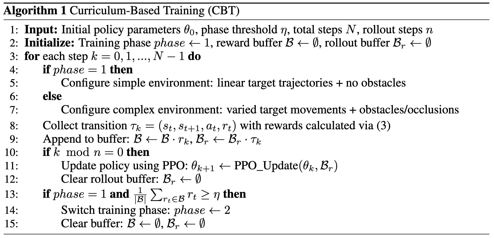{:width 700}
## 5 实验
collapsed:: true
	- ### 5.1 实验设置
		- **实验设置.**
			- 我们进行跨场景（cross-scene）与跨域（cross-domain）测试。前者评估在白天条件下训练的智能体在相同天气但未见过的场景中的表现；后者评估在相同场景下不同天气条件下的表现。细节见附录 E.1。
		- **评估指标.**
			- 我们使用累积奖励（Cumulative Reward, CR）和跟踪成功率（Tracking Success Rate, TSR）来评估智能体性能：
				- $CR = \sum_{t=1}^{E_l} r_{gc}, \quad$
				- $TSR = \frac{1}{E_m^l} \sum_{t=1}^{E_l} r_{dt} \times 100%$,
			- 其中，$CR$ 主要反映智能体在整个回合长度 ( $E_l$ ) 内保持目标居中的能力；$TSR$ 衡量目标保持在视野中的能力（当 ( $r_{dt}=1$ ) 时，表示目标在视野内，详见附录 C）；( $E_m^l$ ) 为最大回合长度。智能体以四个相对角度 ( $[0, \frac{\pi}{2}, \pi, \frac{3\pi}{2}]$ ) 弧度初始化，每个角度进行 10 次实验（共 40 次），并对每个地图计算结果的均值与方差。最终的跨场景与跨域性能取各场景平均值。
		- **基线方法.**
			- 我们复现了两个最新的 SOTA 方法：AOT [39] 和 D-VAT [19]。两者以及其他方法 [81, 18] 均使用基于距离的奖励。正如第 4.3 节所总结的，在倾斜的俯视视图中这些方法可能失效。因此，这些基线足以突出我们提出的 GC-VAT 方法的优势。详见附录 D。
	- ### 5.2 对比实验
		- 我们在 DAT 基准上，将 GC-VAT 与 SOTA 方法在同场景性能及跨场景、跨域泛化性能上进行比较。
		- 如图 5 所示，我们的方法在训练过程中持续获得更高且稳步上升的奖励，展示了其有效性。而 AOT 与 D-VAT 方法由于其基于距离的奖励反馈误导，未能学习到有效的策略。特别是 AOT 会快速驱使目标离开视野，导致奖励曲线迅速下降。结果验证了第 4.3 节中的理论分析。
		- 图5
			- 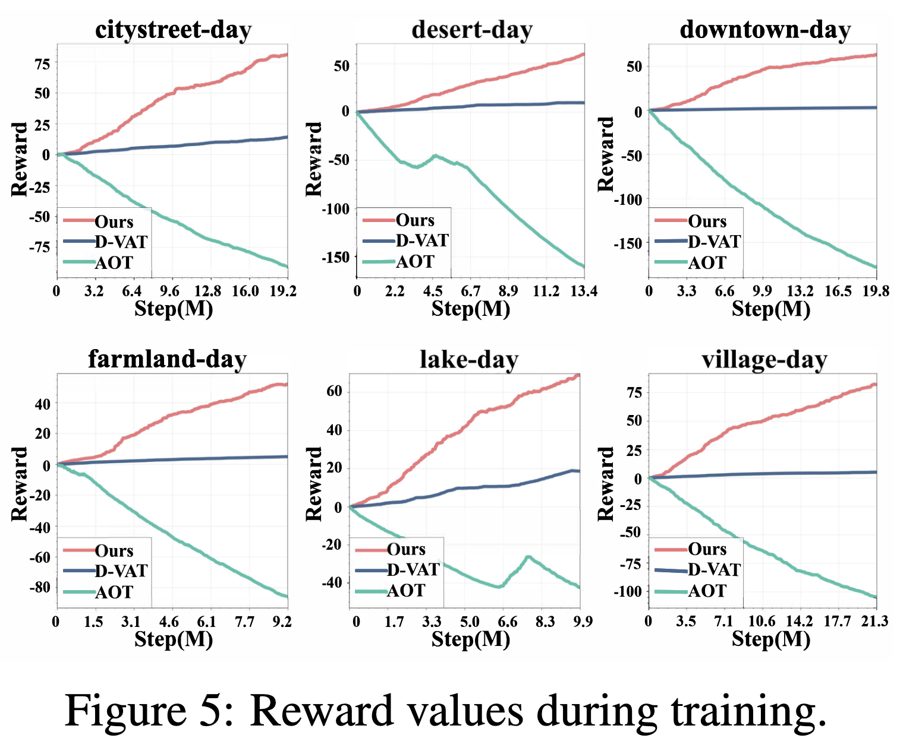{:width 600}
		- 值得注意的是，尽管 AOT 与 D-VAT 的实验结果方差较小，但持续的低奖励通常表明它们未能学得有效的跟踪策略。
		- **同场景性能（Within-scene performance）.**
			- 我们在所有场景上训练模型并在原场景上测试。GC-VAT 的性能显著优于其他方法，如表 2 所示。
			- 表2
				- 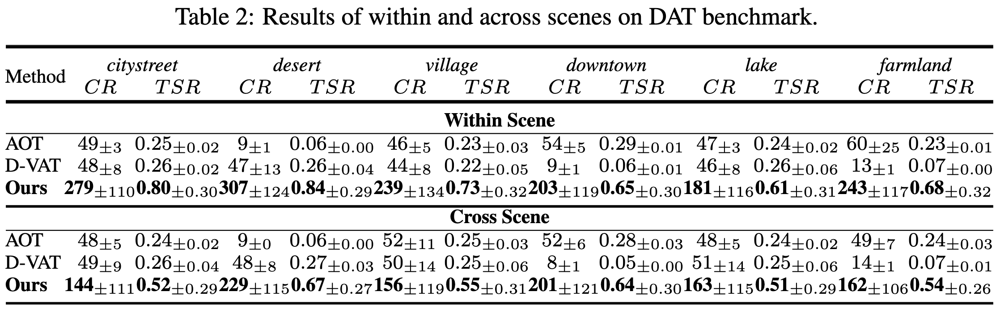{:width 700}
			- 在 $CR$ 指标上，相对于 D-VAT 方法，在六个地图上的平均性能提升达 **591%（35 → 242）**；
			- 在 $TSR$ 指标上，平均提升达 **279%（0.19 → 0.72）**。
		- **跨场景性能（Cross-scene performance）.**
			- 如表 2 所示，我们的方法展现出强大的跨场景泛化能力。与 D-VAT 相比，GC-VAT 在平均 CR 上提升 **376%（37 → 176）**，在平均 TSR 上提升 **200%（0.19 → 0.57）**。
		- **跨域性能（Cross-domain performance）.**
			- 如表 3 所示，我们的方法在跨域泛化上显著优于现有方法。相对于 D-VAT，GC-VAT 在平均 CR 上提升 **509%（35 → 213）**，在 TSR 上提升 **253%（0.19 → 0.67）**。
			- 表3
				- 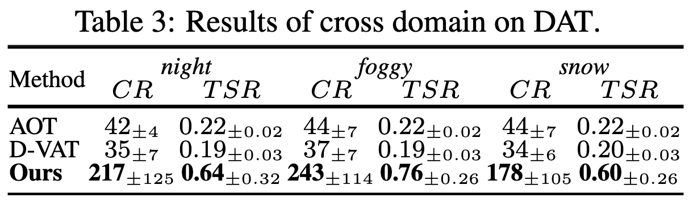{:width 400,:height 800}
		-
	- ### 5.3 消融实验
		- 我们针对**目标中心化奖励（Goal-Centered Reward）**进行了消融实验，以验证第 4.3 节中提出的分析结果。
		- 此外，我们还验证了第 4.4 节中提出的**基于课程学习（Curriculum-Based Training, CBT）**策略与**领域随机化（domain randomization）**是否带来了显著的性能提升。
		- 实验结果如表 4 所示，附录 E.3 中提供了更多结果。
		- 表4
			- {:width 500}
		- **奖励设计的有效性.**
			- 我们比较了使用式 (3) 定义的奖励与 [19] 中奖励函数的 GC-VAT 方法性能。如表 4 所示，采用式 (3) 的奖励后，在跨场景与跨域测试中的 **TSR 提升约 800%**，性能提升极为显著。这一结果强有力地印证了第 4.3 节中的理论分析，并突出了所提出奖励设计的有效性。更多实验结果见附录 E.3。
		- **CBT 策略与领域随机化的有效性.**
			- 如表 4 所示，当不使用 CBT 策略时，模型无法学习到有效的跟踪策略，在不同测试中均表现出持续的低奖励。此外，我们的领域随机化方法带来了显著的性能提升。具体而言，
				- **AR** 表示无人机初始角度的随机化（Angle Randomization），
				- **HR** 表示无人机与目标之间的水平距离随机化（Horizontal Distance Randomization），
				- **VR** 表示垂直距离随机化（Vertical Distance Randomization），
				- **PR** 表示云台俯仰角随机化（Pitch Randomization）。
			- 在这些因素中，**AR 贡献最大**，表明通过角度随机化鼓励多样化动作有助于智能体探索最优策略。
		- **风扰与降水下的鲁棒性.**
			- 为进一步研究真实环境干扰对 GC-VAT 方法的影响，我们在存在风扰与降水引起的传感器退化条件下进行了严格测试。
			- 表5
				- 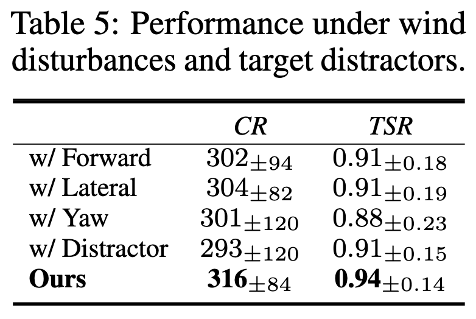{:width 300}
			- 具体而言，我们通过在前进、横向及偏航方向上施加随机扰动来模拟风的影响。结果如表 5 所示，模型在 *citystreet-day* 上训练，并在加入风扰的 *citystreet-foggy* 上测试。结果显示 **跟踪成功率（TSR）下降小于 0.06**，表明 GC-VAT 在显著风扰下仍保持强鲁棒性。更多细节见附录 E.3。
			- 为了模拟雨滴导致的模糊，我们参考测试时自适应文献 [34] 中的标准做法。具体而言，我们在 *citystreet-day* 场景上训练策略，并在合成的雨天条件下进行同场景、跨场景和跨域测试。
			- 为确保真实性，我们在跨域测试中排除了雪天条件，因为现实环境中雨雪很少同时出现。表 6 的结果表明，在雨天模拟下 **TSR 仅下降不足 0.07**，验证了 GC-VAT 对雨滴模糊的鲁棒性。
			- 表6
				- 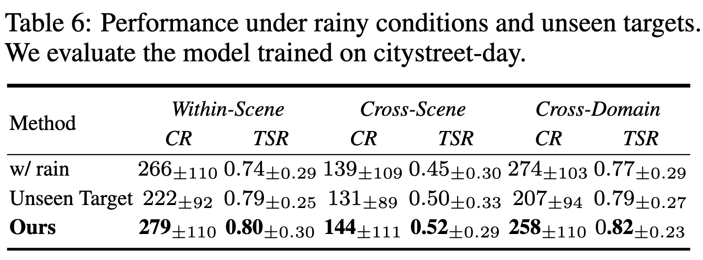{:width 500}
		- **对干扰目标与新目标的鲁棒性.**
			- 如表 5 所示，即使在目标附近引入外观相似的车辆，我们的模型仍保持高跟踪性能，显示出其有效区分真实目标与干扰项的能力。此外，我们还在未见过的目标类别（公交车）上评估了 GC-VAT。表 6 的结果显示，当遇到该新目标时，**TSR 下降不足 0.03**，表明模型在新类别目标上仍具有强泛化能力。
	- ### 5.4 真实场景实验
		- **在真实图像上的有效性.**
			- 由于真实机器人评估较为困难，我们遵循 [39] 的做法，在真实图像上验证 GC-VAT 的效果。
			- 我们在 VOT [30]、DTB70 [35] 和 UAVDT [20] 三个数据集中各选取 8 个视频（共 24 个）进行**零样本迁移测试（zero-shot transfer test）**。尽管录制视频中无法进行摄像机控制，我们仍可将帧输入模型，并验证其预测动作的合理性。
			- 图 6 显示了 VOT 视频 *car16* 的输出动作。每个点表示图像中目标的位置，不同颜色对应不同的动作。如图 6 所示，当目标位于图像左（右）侧时，跟踪器倾向于左（右）移，以将目标带回中心。
			- 图6
				- {:width 500}
			- 我们以**正确动作率（Correct Action Rate, CAR）**——即预测动作的准确率——作为定量评估指标。如表 7 所示，GC-VAT 在 24 个视频上的平均 CAR 达到 **81.0%**，表明其预测合理性与有效性。更重要的是，经 *t 检验* 验证，其性能显著优于随机策略（p < 0.001）。更多结果见附录 E.4。
		- **在真实无人机上的有效性.**
			- 进一步地，作为超越图像评估的关键一步，我们在真实无人机上进行了实验。实验使用 **DJI Mini 3 Pro** [13] 无人机，如图 7 所示。我们在搭载 **RTX 3050 GPU** 与 **Intel i5 CPU** 的笔记本电脑上部署 GC-VAT，使用 **DJI Mobile SDK** [12] 获取图像输入，并根据模型预测动作控制无人机。整个系统运行帧率超过 **30 FPS**。
			- 图7
				- 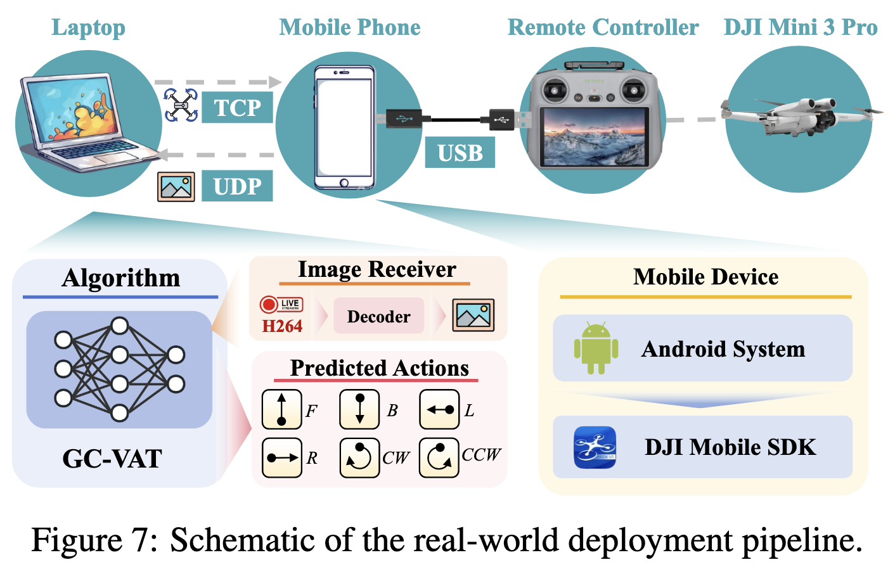{:width 500}
			- 如图 8 所示，模型输出的动作可使目标保持在图像中心位置。定量结果显示，GC-VAT 在零样本设置下达到了 **平均 TSR 88.4%** 与 **CAR 81.3%**。
			- 图8
				- 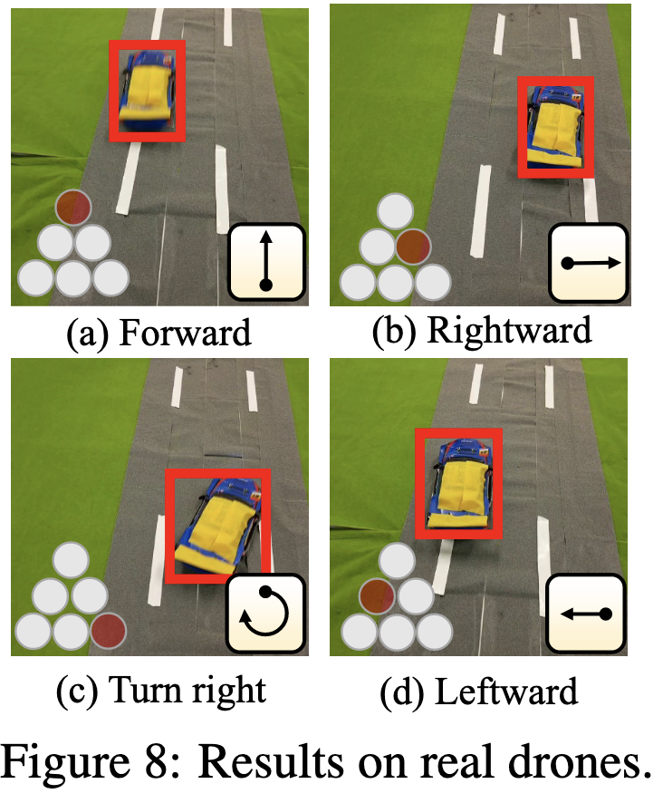{:width 300}
			- 这一成功的 **零样本仿真到现实迁移（Sim-to-Real Transfer）** 充分验证了我们方法的实际可行性。
- ## 6 结论与潜在影响
	- 本文提出了首个**开放世界无人机主动空地跟踪基准（Drone Active air-to-ground Tracking benchmark, DAT）**。
		- DAT 基准涵盖 24 个城市级场景，包含具有人类行为特征的目标与高保真动力学仿真，并提供支持无限场景生成的数字孪生工具。
		- DAT 基准有望推动以下关键研究领域的发展：
			- 强化学习中的遗忘问题（Forgetting in Reinforcement Learning）；
			- 强化学习的鲁棒性（Robustness in Reinforcement Learning）；
			- 多智能体强化学习（Multi-Agent Reinforcement Learning）；
			- 仿真到现实部署（Sim-to-Real Deployment）。
	- 此外，我们提出了一种基于强化学习的无人机跟踪方法 **GC-VAT**，旨在提升无人机在复杂场景下的目标跟踪性能。
		- 我们设计了**目标中心化奖励（Goal-Centered Reward）**，为智能体提供跨视角的精确反馈，使其能够通过非限制性视角扩展感知范围。随后，我们从理论与定性角度分析了奖励设计的有效性。
		- 同时，受课程学习启发，我们提出了**基于课程的训练策略（Curriculum-Based Training）**，以在逐步复杂化的场景中持续提升智能体性能。
	- 在仿真环境与真实图像上的实验验证了理论分析，并表明我们的方法在性能上显著优于当前最先进（SOTA）方法。