title:: @VGGT: Visual Geometry Grounded Transformer

- [[#blue]]==网页==
	- https://vgg-t.github.io/
- 原作者讲解视频
	- [【CVPR 2025最佳论文分享】VGGT：Visual Geometry Grounded Transformer】](https://www.bilibili.com/video/BV17g34zDEXJ/?share_source=copy_web&vd_source=bcc2af992ac8197c0b288e593cbfd0c3)
	- [【CVPR'25 最佳论文一作亲解 | VGGT：纯前馈Transformer架构，快速3D重建新范式！】 ](https://www.bilibili.com/video/BV1UyunzLE4J/?share_source=copy_web&vd_source=bcc2af992ac8197c0b288e593cbfd0c3)
- [[Abstract]]
	- en
	  collapsed:: true
		- We present VGGT, a feed-forward neural network that directly infers ==all key 3D attributes of a scene==, including camera parameters, point maps, depth maps, and 3D point tracks, from one, a few, or hundreds of its views.
		- This approach is a step forward in ==3D computer vision==, where models have typically been constrained to and specialized for single tasks. It is also simple and efficient, reconstructing images in under one second, and still outperforming alternatives that require post-processing with visual geometry optimization techniques.
		- The network achieves state-of-the-art results in multiple 3D tasks, including camera parameter estimation, multi-view depth estimation, dense point cloud reconstruction, and 3D point tracking.
		- We also show that using pre-trained VGGT as a feature backbone significantly enhances downstream tasks, such as non-rigid point tracking and feed-forward novel view synthesis.
		- Code and models are publicly available at https://github.com/facebookresearch/vggt.
	- 我们提出 **VGGT** (Visual Geometry Grounded Transformer; 视觉几何驱动的 Transformer)，一种==前馈神经网络==，可以==直接从一张、几张，甚至数百张场景图像中推理出其所有关键 3D 属性，包括相机参数、点图、深度图和 3D 点轨迹==。
	- 这一方法代表了 3D 计算机视觉的重要进展——传统模型往往局限于单一任务，而 VGGT 则能够==统一==解决多种任务。
	- 该方法
		- 不仅==简洁高效==，能够在一秒内完成重建，
		- 还在==无需使用几何优化后处理==的情况下，超越了许多依赖优化的替代方案。
	- VGGT 在多个 3D 任务上达到了最新的最佳性能，包括相机参数估计、多视角深度估计、稠密点云重建和 3D 点跟踪。
	- 我们还展示了，将预训练的 VGGT 作为特征骨干可以显著提升下游任务的性能，例如非刚性点跟踪和前馈式新视角合成。
	- 代码和模型已在 [https://github.com/facebookresearch/vggt](https://github.com/facebookresearch/vggt) 公开。
-
- 一些值得进一步讨论的问题
  collapsed:: true
	- [[#green]]==NeRF==
	  collapsed:: true
		- NeRF 做的事情是根据多张视角图片和它们的==相机位姿==, 生成新视角
		- 基于优化：NeRF训练是一个优化过程。它需要一组从不同视角拍摄的场景图像，以及它们相应的相机姿势。
		- 局限性：
			- 标准的NeRF训练可能==很慢，计算量很大==。
			- 此外，最终的渲染质量高度依赖于从一开始就拥有==准确的相机姿态==数据。
		- VGGT和NeRF不是替代方法，而是互补方法。VGGT可用于提高NeRF管道的效率和效果，特别是在初始数据处理步骤。
		  快速相机姿态估计：在训练NeRF之前，必须确定每个输入图像的相机姿态。传统的方法可能很慢。VGGT直接和快速推断相机参数的能力可以用来更快地生成必要的姿态，加快整个NeRF工作流程。
		- details
			- ### What is NeRF?
				- NeRF (Neural Radiance Fields) is a technique that uses a deep neural network to represent a 3D scene.
				- **Purpose**: A trained NeRF model can render highly realistic novel views of a scene from any camera angle, as long as it is within the bounds of the original training images.
				- **Mechanism**: The neural network is trained to predict the volume density and color (radiance) of a scene at a continuous 5D coordinate (3D location + 2D viewing direction).
				- **Optimization-based**: NeRF training is an optimization process. It requires a set of images of a scene from different viewpoints, along with their corresponding camera poses.
				- **Limitations**: Standard NeRF training can be slow and computationally intensive. Furthermore, the final rendering quality is highly dependent on having accurate camera pose data from the start.
			- ### How VGGT benefits NeRF
				- VGGT and NeRF are not alternative methods but complementary ones. VGGT can be used to improve the efficiency and effectiveness of NeRF pipelines, particularly in the initial data processing steps.
				- **Fast camera pose estimation**: Before a NeRF can be trained, the camera poses for each input image must be determined. Traditional methods for this can be slow. VGGT's ability to directly and rapidly infer camera parameters can be used to generate the necessary poses much faster, speeding up the entire NeRF workflow.
				- **Initializing the NeRF model**: VGGT can provide a strong geometric prior for the scene, such as an initial point cloud. This can help guide the NeRF model's optimization, making it more robust and potentially faster to converge to a high-quality result.
				- **Improved geometric consistency**: The 3D attributes from VGGT can help regularize the NeRF's training, leading to a more geometrically accurate scene representation and reducing common artifacts like "floaters" (unwanted floating particles).
				- **Creating a more robust pipeline**: By providing a formal, feed-forward method for extracting geometry from raw images, VGGT helps bridge the gap between unprocessed data and the requirements of optimization-based models like NeRF.
	- ((57c73123-e763-473d-9a30-d379dd238ff3))
	- 显式的3D重建对于模型理解3D场景是否是有必要的? 还是直接2D->2D端到端 (比如 NeRF) 即可?
	- Data
	  collapsed:: true
		- ((2a6d8ee4-2b6d-436f-aa51-225365c1e02c))
	- Unsupervised learning
	  collapsed:: true
		- ((19ccf91a-0d08-41a1-a60d-fbf03910ca51))
	- 架构优化
-
- 图1
	- 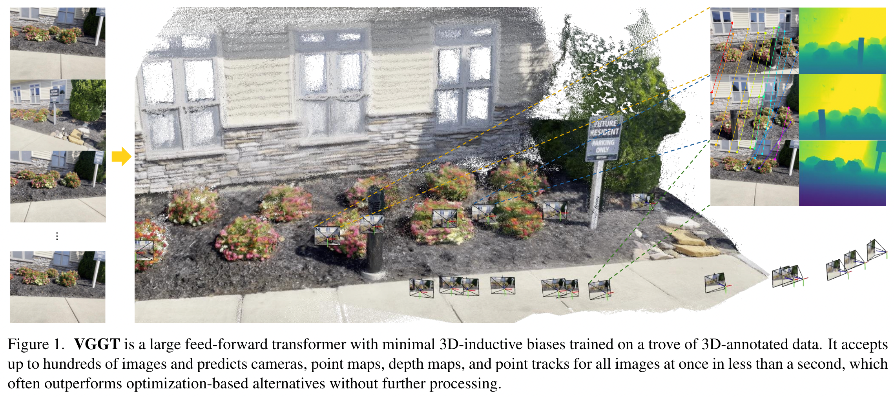{:width 777}
	- VGGT 是一个大规模前馈 Transformer，几乎没有 [[#blue]]==3D 归纳偏置==，
	  collapsed:: true
		- ### 什么是  **3D 归纳偏置** ？
			- **归纳偏置**是指在设计神经网络时，**人为加入的一些假设或先验知识**，帮助模型更快、更有效地学习。
			- 所谓 **3D 归纳偏置**，就是把「三维世界的先验知识」强行嵌入到模型里。比如：
				- 假设物体在不同视角下保持形状不变；
				- 假设光照和阴影符合一定的物理规律；
				- 假设相机成像符合几何投影模型。
			- 这样做的好处是可以减少训练数据需求，提高学习效率。但缺点是，偏置会限制模型的灵活性。
			- 📌 **类比**：就像老师教你「所有四条边相等的四边形都是正方形」，这是一个“偏置”。它能让你快速判断正方形，但当遇到「菱形」时，就可能出错。
			- VGGT 的特别之处在于：它几乎不依赖这种 3D 偏置，而是让网络自己去学习空间规律。
	- 基于大量带有 3D 注释的数据进行训练。
	- 它可以一次性接收数百张图像，并在不到一秒的时间内预测
		- 相机参数、
		- 点图（point maps）、
		- 深度图
		- 点轨迹（point tracks），
	- 其效果往往优于基于优化的方法，且无需进一步处理。
-
## 1. Introduction
collapsed:: true
	- 研究问题
		- 我们研究利用前馈神经网络，从一组图像中估计场景的 3D 属性这一问题。
	- 背景
		- 传统上，3D 重建主要依赖[[#blue]]==视觉几何方法==，通常采用诸如 **束调整（Bundle Adjustment, BA）** [33] 这样的迭代优化技术。机器学习在其中常常扮演补充角色，用来解决几何方法无法独立完成的任务，例如特征匹配和单目深度预测。
		  collapsed:: true
			- ### 什么是  **视觉几何方法** ？
				- **视觉几何方法**是传统计算机视觉里的一类方法，核心思想是：
					- 把相机看作几何投影仪器；
					- 用数学和优化算法（而不是深度学习）去推算出 3D 场景的结构。
				- 最典型的例子是 **结构自运动 (Structure from Motion, SfM)**：
					- 从两张照片里找到相同的点（比如建筑物的角落）。
					- 根据点在不同照片中的相对位置，利用三角测量原理算出相机位置和点的三维坐标。
					- 反复迭代优化（如 **束调整**）来让误差最小。
				- 📌 **类比**：就像你拿两张建筑照片，量角度、画辅助线，然后用几何方法算出建筑的高度。
				- 这种方法优点是结果精确、可解释，但缺点是计算复杂、耗时，且对噪声和遮挡不够鲁棒。
		- 近年来，这种整合越来越紧密，最新的 **结构自运动（Structure-from-Motion, SfM）** 方法（如 VGGSfM [83]）通过可微分 BA 将机器学习与视觉几何端到端结合。即便如此，==视觉几何仍在 3D 重建中占据核心地位==，这无疑增加了复杂性和计算成本。
	- 最初想法
		- 随着神经网络能力的不断增强，我们提出一个问题：是否终于可以仅依靠神经网络直接解决 3D 任务，从而几乎完全避免几何后处理？
	- ---
	- 现有工作
		- 近期的一些工作（如 DUSt3R [87] 及其演进版 MASt3R [43]）在这一方向上展示了前景，
	- 存在问题
		- 但它们一次只能处理两张图像，并依赖后处理来融合成对重建结果以扩展到更多图像。
	- 本文工作
		- 在本文中，我们进一步迈出一步，提出 **Visual Geometry Grounded Transformer (VGGT)**，一种前馈神经网络，可以直接从一张、几张，甚至数百张输入视图中完成 3D 重建。
			- VGGT 一次前向传播即可预测场景的完整 3D 属性集，包括相机参数、深度图、点图和 3D 点轨迹。
			- 令人惊讶的是，即便不进行进一步处理，它往往仍优于基于优化的替代方案。这与 DUSt3R、MASt3R 或 VGGSfM 有显著不同，后者仍需要代价高昂的迭代后优化才能获得可用结果。
		- 此外，我们证明，**无需为 3D 重建专门设计特殊的网络结构**。
			- VGGT 基于一个相对标准的大规模 Transformer [79]，没有特定的 3D 或其他归纳偏置（除了在逐帧注意力与全局注意力之间交替），而是利用大量公开的带 3D 注释的数据集进行训练。
			  collapsed:: true
				- ### 逐帧注意力 和 全局注意力 分别是什么？
					- 在 Transformer 模型里，**注意力机制**决定了“模型在处理某个元素时，要关注哪些其他元素”。
					- **逐帧注意力 (frame-wise attention)**：
						- 每一张输入图像（帧）内部单独做注意力计算。
						- 也就是说，一张图只和自己内部的像素/特征交互，不和其他图像的信息交流。
						- 📌 **类比**：就像每个学生在小组里先自己讨论，不和隔壁组交流。
					- **全局注意力 (global attention)**：
						- 所有输入的图像（帧）一起参与注意力计算。
						- 一张图可以直接和其他图像的特征交流，从而捕捉多视角之间的联系。
						- 📌 **类比**：就像所有学生在大班课堂里一起讨论，可以互相交换信息。
					- VGGT 的做法是：交替使用逐帧注意力和全局注意力，这样既能保证单张图的细节学习，又能保证多视角之间的空间关系被捕捉到。
			- 因此，VGGT 的构建理念与自然语言处理和计算机视觉中的大型模型类似，如 GPT 系列 [1, 18, 101]、CLIP [56]、DINO [6, 53] 和 Stable Diffusion [22]。
			- 这些模型已经成为多任务通用的骨干，可以通过微调解决新的特定任务。类似地，我们展示了 VGGT 计算的特征能够显著增强下游任务，如动态图像中的点跟踪和新视角合成。
	- ---
	- 现有工作
		- 近期已有一些大规模 3D 神经网络出现，例如 DepthAnything [97]、MoGe [86] 和 LRM [34]。
	- 存在问题
		- 然而，这些模型仅专注于单一 3D 任务，如单目深度估计或新视角合成。
	- 本文工作
		- 相比之下，VGGT 通过共享骨干一次性预测所有 3D 相关属性。
		- 我们证明，同时学习这些相互关联的 3D 属性能够提升整体精度，尽管可能存在一定的冗余。
		- 与此同时，我们还展示，在推理过程中，可以通过单独预测的深度和相机参数推导出点图，其精度优于直接使用专门的点图预测头。
	- ---
	- **总结而言，我们的贡献如下：**
		- 我们提出 **VGGT**，一个大规模前馈 Transformer，能够在给定一张、几张甚至数百张场景图像的情况下，在数秒内预测其全部关键 3D 属性，包括相机内参与外参、点图、深度图和 3D 点轨迹。
		- 我们证明了 VGGT 的预测结果可以直接使用，其表现高度竞争，通常优于那些依赖耗时几何后处理优化的最新方法。
		- 我们还展示，当结合 BA (束调整) 后处理时，VGGT 在各项任务上均达到了最新的最佳结果，即使与专注于部分 3D 任务的方法相比，质量仍能显著提升。
## 2. Related Work
collapsed:: true
	- **结构自运动 (Structure from Motion, SfM).**
		- SfM 是计算机视觉中的经典问题 [33, 52, 54]，其目标是从不同视角拍摄的一组静态场景图像中估计相机参数并重建稀疏点云。
		- 传统 SfM 流程 [2, 24, 48, 62, 68, 92] 包含多个阶段，包括图像匹配、三角化和束调整。其中，COLMAP [62] 是最流行的基于传统流程的框架。
		- 近年来，深度学习推动了 SfM 各个组件的发展，尤其是关键点检测 [12, 19, 76, 102] 和图像匹配 [7, 46, 60, 66]。一些最新方法 [3, 67, 71, 74, 75, 78, 81, 83, 89, 108] 探索了端到端可微 SfM，其中 VGGSfM [83] 已在复杂的旅游照片场景中超越了传统算法。
	- **多视图立体 (Multi-view Stereo, MVS).**
		- MVS 旨在利用多张重叠图像稠密重建场景几何，通常假设相机参数已知，而这些参数往往由 SfM 估计得到。
		- MVS 方法大致可分为三类：传统手工方法 [26, 27, 64, 88]、全局优化方法 [25, 50, 91, 100] 和基于学习的方法 [30, 49, 55, 99, 106]。
		- 类似于 SfM，基于学习的 MVS 方法近年来取得了显著进展。在此背景下，DUSt3R [87] 和 MASt3R [43] 能够直接从图像对中估计对齐的稠密点云，类似于 MVS，但无需相机参数。一些同期工作 [73, 85, 96, 105] 尝试用神经网络取代 DUSt3R 的测试时优化，但这些方法的性能往往不及 DUSt3R。而 VGGT 在效果上远超 DUSt3R 和 MASt3R。
	- **任意点跟踪 (Tracking-Any-Point).**
		- 这一任务最早由 Particle Video [59] 提出，并在深度学习时代由 PIPs [32] 重新提出，旨在跨视频序列跟踪兴趣点，包括动态运动。
		- 给定一个视频和一些 2D 查询点，该任务的目标是在所有其他帧中预测这些点的 2D 对应位置。
		- TAPVid [13] 为该任务提出了三个基准，并在 TAPIR [14] 中进一步改进了基线方法。
		- CoTracker [37, 38] 利用点之间的相关性来应对遮挡，而 DOT [41] 实现了稠密跟踪。
		- 最近，TAPTR [44] 提出了用于该任务的端到端 Transformer，LocoTrack [8] 则扩展了常用的逐点特征到邻域区域。
		- 在本文中，我们展示了当与现有点跟踪器结合时，VGGT 的特征可实现最新的最优跟踪性能。
## 3. Method
collapsed:: true
	- 图2: 架构概览。
		- 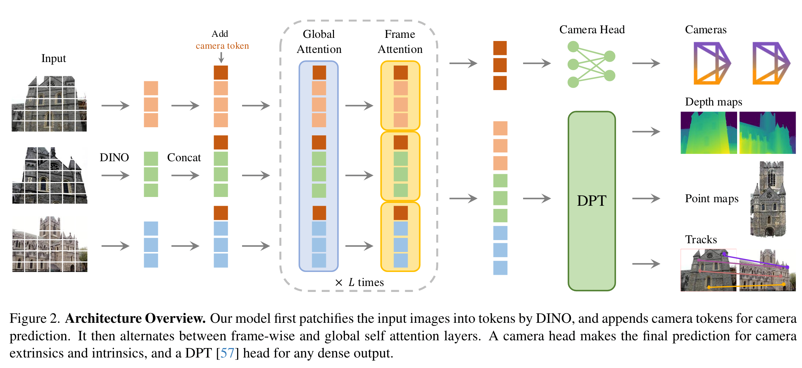{:width 729, :height 343}
		- 我们的模型首先通过 DINO 将输入图像分块（patchify）为 tokens，并添加相机 tokens 以用于相机预测。随后在逐帧注意力与全局自注意力层之间交替。相机预测头输出相机的外参与内参，DPT [57] 预测头负责所有稠密输出。
	- 我们提出了 **VGGT**，一个大规模 Transformer，它将一组图像作为输入，并输出多种三维（3D）量。我们首先在 **3.1 节**定义问题，随后在 **3.2 节**介绍架构，在 **3.3 节**描述预测头。
	- [[#blue]]==Why Alternating-Attention?==
	  id:: 57c73123-e763-473d-9a30-d379dd238ff3
	  collapsed:: true
		- **Global Attention**
			- Ensures scene-level coherence
		- **Frame-wise Attention**
			- Eliminates **frame index embedding** (Replaces frame index embedding by Frame-wise Attention)
				- For permutation equivariance
					- 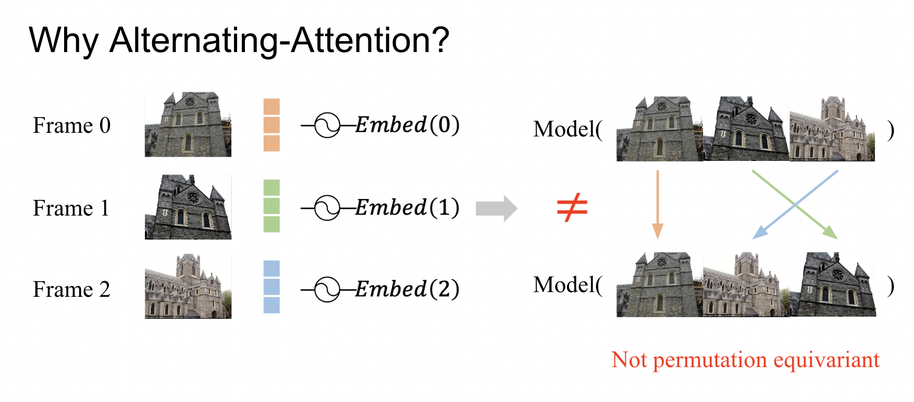{:width 400,:height 800}
				- For flexible input length
					- 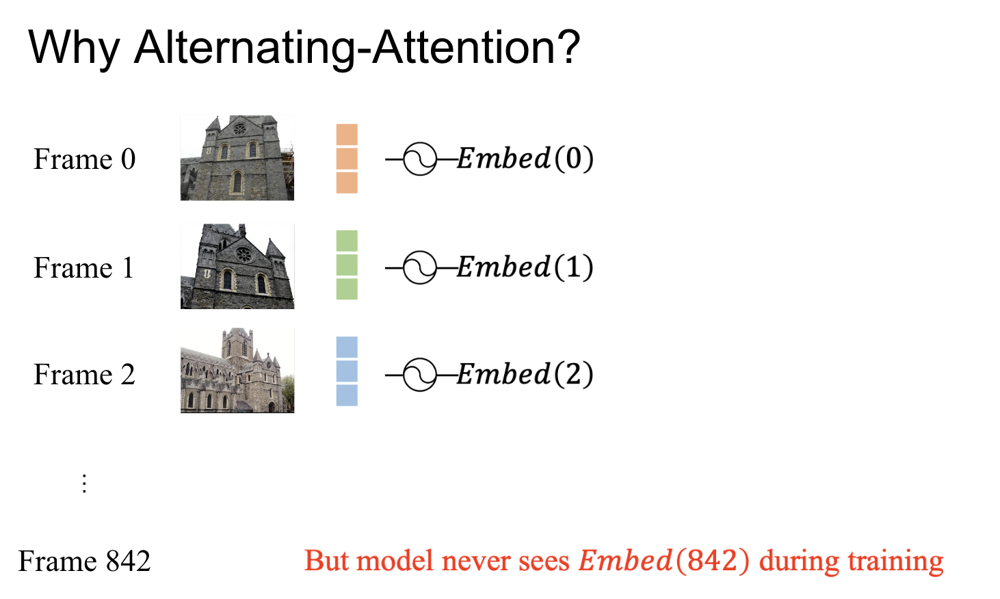{:width 400,:height 800}
	- ### 3.1. Problem definition and notation
		- 输入是一系列 $(I_i)_{i=1}^N$ 的 RGB 图像，数量为 $N$，每张图像 $I_i \in \mathbb{R}^{3 \times H \times W}$，观察同一个三维场景。VGGT 的 Transformer 是一个函数：
			- $f((I_i)_{i=1}^N) = (g_i, D_i, P_i, T_i)_{i=1}^N$
			- 其中：
				- **相机参数** $g_i \in \mathbb{R}^9$：包括内参和外参；
					- 采用 [83] 的参数化方式，设 $g = [q, t, f]$
					- 其中 $q \in \mathbb{R}^4$ 为旋转四元数，$t \in \mathbb{R}^3$ 为平移向量，$f \in \mathbb{R}^2$ 为视场（FoV）。
					- 假设相机的主点位于图像中心，这在 SfM 框架中很常见 [63, 83]。
				- **深度图** $D_i \in \mathbb{R}^{H \times W}$：逐像素的深度值；
					- 每个像素位置 $y \in \mathcal{I}(I_i) = \{1, \dots, H\} \times \{1, \dots, W\}$，对应深度值 $D_i(y) \in \mathbb{R}^+$
				- **点图** $P_i \in \mathbb{R}^{3 \times H \times W}$：每个像素对应的 3D 空间点；
					- 每个像素位置对应三维点 $P_i(y) \in \mathbb{R}^3$。与 DUSt3R [87] 类似，点图是**视角不变**的，即所有 3D 点都定义在第一帧相机 $g_1$ 的坐标系中，作为世界参考系。
				- **特征网格** $T_i \in \mathbb{R}^{C \times H \times W}$：用于点跟踪的 $C$ 维特征。
					- **keypoint tracking**：参考 track-anypoint 方法 [15, 39]。给定查询图像 $I_q$ 上的某个查询点 $y_q$，网络输出该点在所有图像中的 2D 对应轨迹 $T^\star(y_q) = (y_i)_{i=1}^N$，其中 $y_i \in \mathbb{R}^2$。
					- 注意，Transformer $f$ 本身不直接输出轨迹，而是输出稠密特征 $T_i$，轨迹由额外的跟踪模块（Sec. 3.3）利用这些特征计算得到。
		- **预测顺序**：输入图像的顺序任意，但第一张固定为参考帧。网络在除第一帧外，对输入序列具有[[#green]]==置换等变性==。
		- **冗余预测**：VGGT 输出的量并非完全独立。例如：相机参数 $g$ 可由点图 $P$ 反推（PnP 问题 [23, 42]; Perspective-n-Point Problem），深度图也可由点图与相机参数推导。但在 Sec. 4.5 的实验中，我们发现：即使存在这些闭式关系，在训练中要求 VGGT 显式预测所有量，性能也会显著提升。而在推理时，将独立预测的深度与相机参数结合，比直接使用点图预测更准确。
	- ### 3.2. Feature Backbone
		- 借鉴近期 3D 深度学习工作 [36, 87, 90]，我们设计了一个具有**最小 3D 归纳偏置**的简洁架构，让模型通过大量带 3D 标注的数据学习。具体而言，我们将 $f$ 实现为一个大规模 Transformer [79]。
		- **图像编码**：
			- 每个输入图像 $I$ 通过 DINO [53] 被分块为 $K$ 个 tokens（数量取决于分辨率），得到 $t^I \in \mathbb{R}^{K \times C}$。
		- **Token 集合**：
			- 所有图像的 tokens 合并后输入主干网络：
				- $t^I = \bigcup_{i=1}^N \{t^I_i\}$
		- **交替注意力 (Alternating-Attention, AA)**：我们在标准 Transformer 基础上引入 AA 机制：
			- **逐帧自注意力**：仅在每张图像内部计算注意力；
			- **全局自注意力**：在所有图像 tokens 上联合计算注意力。
			- 这种交替设计平衡了**跨图像信息融合**与**单帧特征归一化**。默认使用 $L=24$ 层注意力（逐帧+全局）。注意：架构中没有使用 cross-attention 层。
	- ### 3.3. Prediction heads
		- 下面介绍 Transformer 输出如何用于相机、深度、点图和点跟踪预测。
		- **Token 增强**：
			- 每个输入图像 $I_i$ 的 tokens $t^I_i$，被附加上：
				- 一个相机 token $t^g_i \in \mathbb{R}^{1 \times C'}$；
				- 四个寄存器 tokens $t^R_i \in \mathbb{R}^{4 \times C'}$。
			- 拼接后送入 AA Transformer，得到输出 tokens：$(\hat{t}^I_i, \hat{t}^g_i, \hat{t}^R_i)_{i=1}^N$。
		- **第一帧特殊处理**：
			- 第一帧的相机与寄存器 tokens 与其他帧不同，使用独立可学习参数 $\bar{t}^g, \bar{t}^R$，以标识第一帧，并确保预测结果在第一相机坐标系下。其它非首帧的相机与寄存器 tokens都一样, 也是可学习的.
		- **相机预测**：
			- 输出的相机 tokens $(\hat{t}^g_i)$ 通过额外 4 层自注意力 + 线性层，组成相机预测头，预测内参与外参。
		- **稠密预测**：
			- 输出图像 tokens $\hat{t}^I_i$ 经过 DPT 层 [57] 转换为稠密特征图 $F_i \in \mathbb{R}^{C'' \times H \times W}$，再通过 3×3 卷积得到：
				- 深度图 DiD_i；
				- 点图 PiP_i；
				- 跟踪特征 Ti∈RC×H×WT_i \in \mathbb{R}^{C \times H \times W}。
				- 同时预测 aleatoric 不确定性 [40, 51]，用于训练损失，并反映模型置信度。
		- **点跟踪**：
			- 跟踪模块 $\mathcal{T}$ 采用 CoTracker2 [39]。给定查询图像 $I_q$ 中某点 $y_j$，其特征与其他图像的特征相关匹配，通过自注意力预测对应的 2D 点 $\hat{y}_i$。该过程不依赖时间顺序，因此适用于任意图像集，而不仅仅是视频序列。
		- 📌 **总结**：VGGT 的方法核心是：
			- 使用最少的 3D 归纳偏置，完全依赖 Transformer 从大规模 3D 标注数据中学习；
			- 通过 **交替注意力** 高效整合多视角与单视角信息；
			- 显式预测相机、深度、点图和跟踪特征，并在第一相机坐标系下统一表示。
## 4. Experiments
collapsed:: true
	- 本节我们将方法与当前最先进的方法进行比较，涵盖多个任务，以展示其有效性。关于架构、训练损失和数据集的详细讨论包含在补充材料中。
	- ### Training and Data
		- 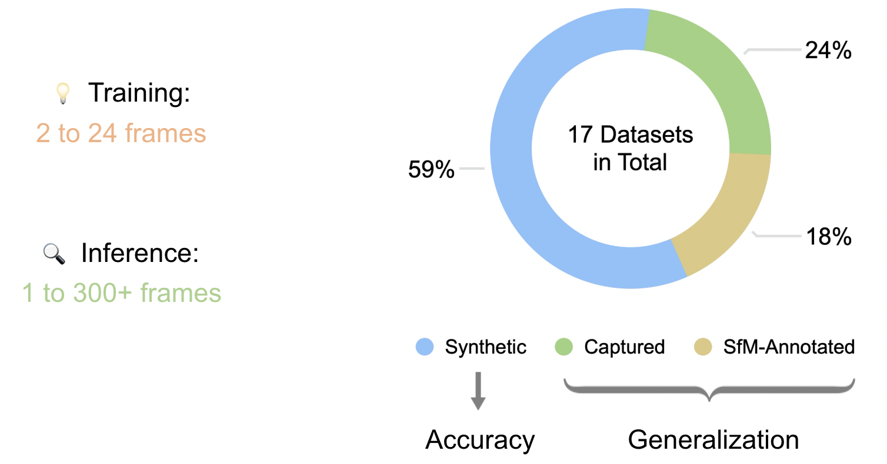{:width 600}
	- 结果
		- **VGGT Is Accurate**
			- {:width 600}
			- 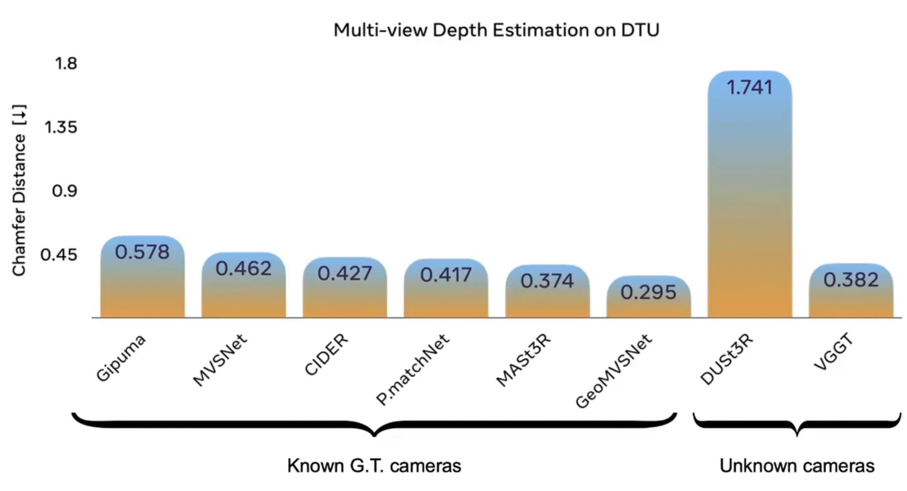{:width 600}
		- **VGGT Is Fast**
			- 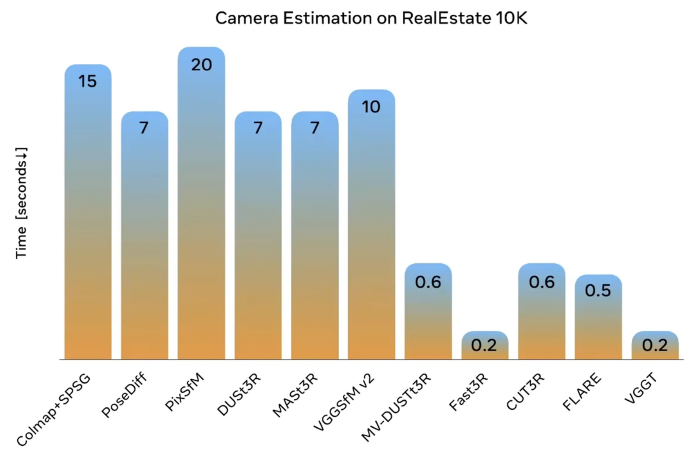{:width 600}
		- **VGGT Is Powerful**
			- 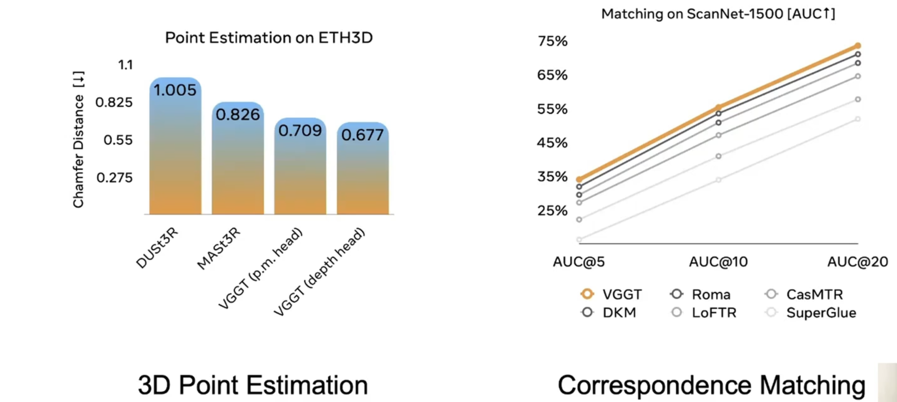{:width 600}
		- **Runtime and Memory**
			- 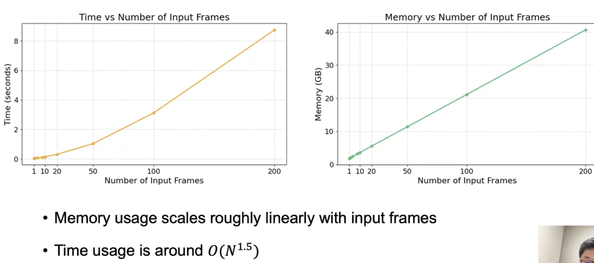{:width 600}
		- **Zero-Shot and Finetuning**
			- Zero-shot Monocular Depth Estimation
				- 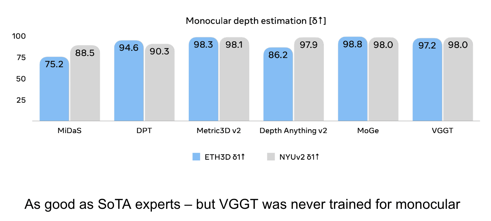{:width 600}
		- **VGGT Helps Downstream Tasks**
			- 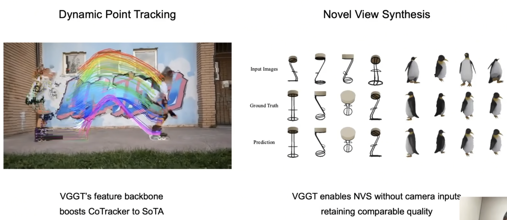{:width 600}
			- [[#green]]==with nerf==
		- 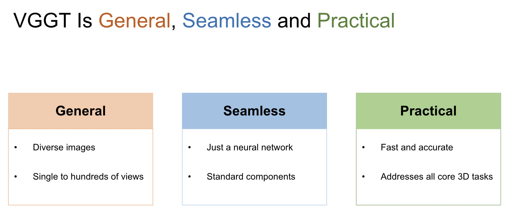{:width 700}
	- ### 4.1 相机位姿估计
		- 我们首先在 **CO3Dv2 [58]** 和 **RealEstate10K [109]** 数据集上评估 VGGT 的相机位姿估计性能（见表 1）。
			- 表1
				- 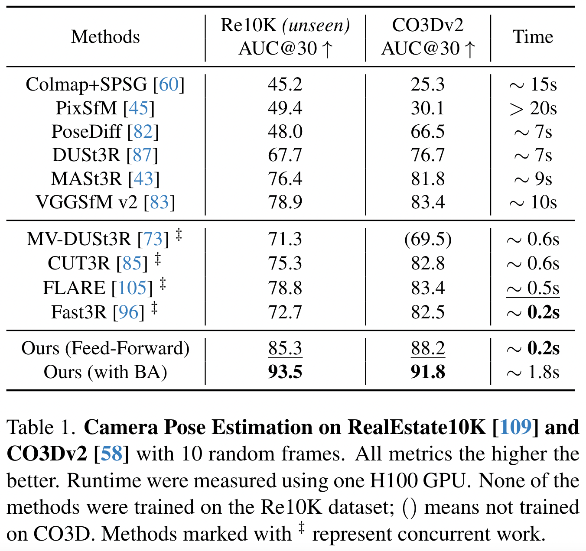{:width 400,:height 800}
				- 在 RealEstate10K [109] 和 CO3Dv2 [58] 上使用 10 张随机帧进行相机位姿估计的结果。所有指标数值越高越好。运行时间在单张 H100 GPU 上测得。所有方法均未在 Re10K 上训练；括号（）表示未在 CO3D 上训练。标记为 ‡ 的方法表示同期工作。
		- 按照 [82] 的设置，我们在每个场景中随机选取 10 张图像，并采用标准指标 **AUC@30** 进行评估，该指标结合了 **RRA** 与 **RTA**。
			- **RRA (Relative Rotation Accuracy)**：每对图像的相对旋转角度误差；
			- **RTA (Relative Translation Accuracy)**：每对图像的相对平移角度误差；
			- AUC：取不同阈值下 $\min(\text{RRA}, \text{RTA})$ 的准确率曲线下的面积。
		- 表 1 中的可学习方法（learnable methods）均在 **Co3Dv2** 上训练，而不是在 RealEstate10K 上训练。
		- 我们的前馈模型在两个数据集的所有指标上均**稳定优于其他方法**，包括一些依赖计算代价极高的后优化步骤的方法：例如 **DUSt3R/MASt3R 的全局对齐**，以及 **VGGSfM 的束调整（Bundle Adjustment, BA）**，这些方法通常需要超过 10 秒。而 VGGT 仅需 **0.2 秒** 即可完成推理，并且完全基于前馈计算。
		- 与同期工作 [73, 85, 96, 105]（表中标记为 ‡）相比，我们的方法在性能上有明显优势，速度也与最快的 **Fast3R [96]** 接近。值得注意的是，在 **RealEstate10K** 数据集（表中方法均未在其上训练）上，VGGT 的优势更为显著，说明其具有更强的泛化能力。
		- 此外，我们还发现将 VGGT 与视觉几何优化方法（如 BA）结合，可进一步提升精度。具体来说，用 BA 对 VGGT 预测的相机位姿和轨迹进行精细化，效果更好。由于 VGGT 已直接预测出接近真实的点图/深度图，这为 BA 提供了良好的初始化，从而省去了三角化与迭代优化（如 [83] 所需），使得带 BA 的推理仅需约 **2 秒**。因此，虽然 VGGT 的前馈模式已经超越了所有之前的方法（无论是否前馈），但后优化依然能带来额外收益。
	- ### 4.2 多视角深度估计
		- 按照 MASt3R [43] 的实验设置，我们在 **DTU [35]** 数据集上评估 VGGT 的多视角深度估计性能，并报告标准指标：
			- **Accuracy**：预测点到真实点的最小欧氏距离；
			- **Completeness**：真实点到预测点的最小欧氏距离；
			- **Overall**：两者的平均，即 Chamfer 距离。
		- 表2
			- 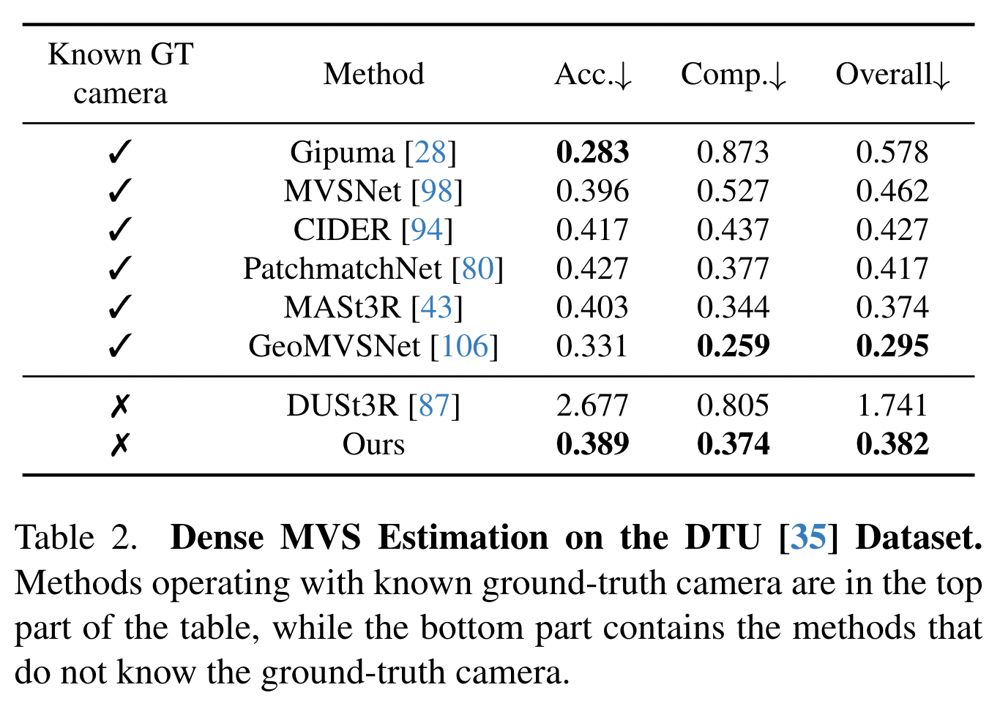{:width 400,:height 800}
			- DTU[35]数据集上的稠密MVS估计。表的顶部是操作已知真实相机参数的方法，而表的底部是不知道真实相机参数的方法。
		- 在表 2 中，只有 **DUSt3R** 与我们的 **VGGT** 无需使用真实相机参数。相反，MASt3R 使用真实相机参数进行三角化来生成深度；而一些深度多视图立体方法（如 GeoMVSNet）则利用真实相机参数构建代价体。
		- 我们的 VGGT 大幅优于 DUSt3R，将 Overall 从 **1.741 降至 0.382**。更重要的是，它的结果接近于那些在测试时**已知真实相机参数**的方法。我们认为这种性能提升主要归因于 VGGT 的多图像训练策略，使模型学会了原生地进行多视角三角推理，而不像 DUSt3R 那样依赖于启发式的配对三角化与平均。
	- ### 4.3 点图估计
		- 我们还在 **ETH3D [65]** 数据集上，将 VGGT 预测的点云与 **DUSt3R** 和 **MASt3R** 进行比较。每个场景随机采样 10 帧，并使用 **Umeyama 算法 [77]** 将预测点云对齐到真实点云。最终指标为 **Accuracy、Completeness 与 Overall (Chamfer 距离)**，并在官方掩码过滤无效点后报告结果。
		- 表 3
			- 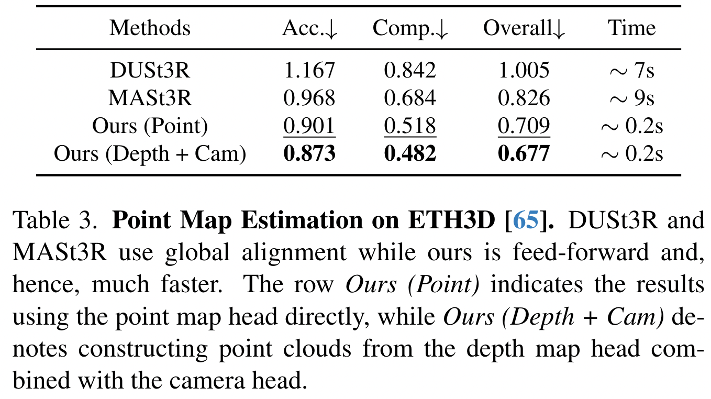{:width 400,:height 800}
			- 在 ETH3D [65] 上的点图估计结果。DUSt3R 和 MASt3R 使用全局对齐，而我们的方法是前馈的，因此速度更快。"Ours (Point)" 表示直接使用点图预测头的结果，"Ours (Depth + Cam)" 表示通过深度预测头与相机预测头联合生成点云的结果。
		- 如表 3 所示，虽然 DUSt3R 和 MASt3R 需要耗时约 10 秒的全局对齐优化，但 VGGT 在简单的前馈模式下（仅需 **0.2 秒**）仍显著超越它们。
		- 此外，我们发现：直接使用点图预测头的结果不如通过 **深度预测 + 相机预测**（将深度图反投影到 3D）得到的结果更准确。我们认为这是因为将复杂任务（点图估计）分解为简单子问题（深度 + 相机预测）更有利于学习，即使训练时已对三者进行了联合监督。
		- 图3
			- 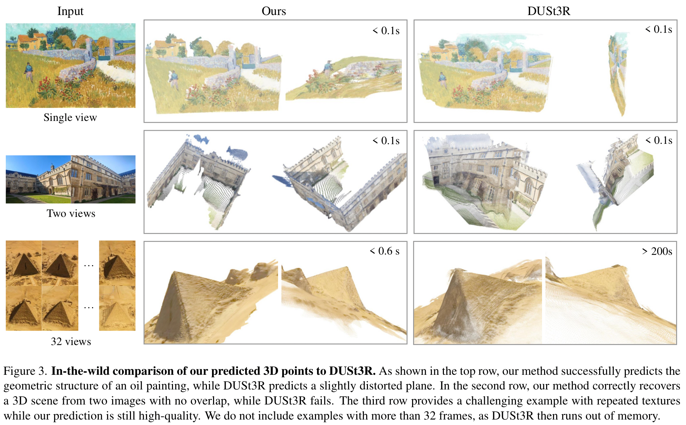{:width 700}
			- 在实际场景中，我们将预测的3D点与DUSt3R进行比较。
			- 如第一行所示，我们的方法成功预测了油画的几何结构，而DUSt3R预测的则是一个略微变形的平面。
			- 在第二行中，我们的方法能够从两张没有重叠的图像中正确恢复3D场景，而DUSt3R则失败了。第三行提供了一个具有重复纹理的挑战性示例，而我们的预测仍然保持高品质。我们未包含超过32帧的示例，因为DUSt3R此时会耗尽内存。
		- 我们还在野外场景中与 DUSt3R 进行了定性对比（见图 3），并在补充材料中提供了更多示例。VGGT 输出的预测质量高，泛化能力强，尤其在挑战性的域外场景（如油画、无重叠帧、重复纹理或均质纹理如沙漠）中表现突出。
		-
	- ### 4.4 图像匹配
		- 双视图图像匹配是计算机视觉领域中研究广泛的主题 [47, 61, 69]。它是刚性点跟踪的一种特例，仅限于两个视角，因此尽管我们的模型并未专门为此任务设计，但它依然是评估我们跟踪精度的一个合适基准。我们遵循 ScanNet 数据集 [9] 上的标准协议 [21, 61]，并在表 4 中报告结果。
		- 表 4
			- 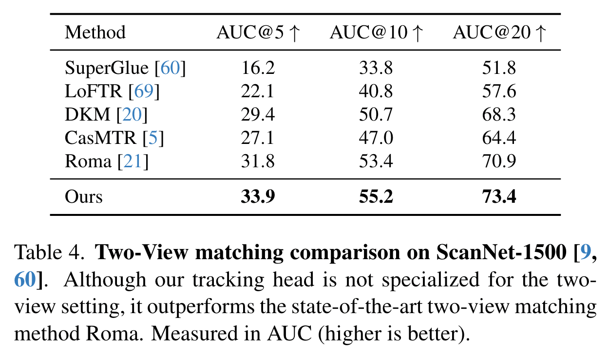{:width 400,:height 800}
			- 在 ScanNet-1500 [9, 60] 上的双视图匹配对比。虽然我们的跟踪头并非专为双视图匹配设计，但其性能优于当前最先进的 Roma 方法。以 AUC 衡量（数值越高越好）。
		- 具体来说，对于每对图像，我们提取匹配点，并据此估计本质矩阵 (essential matrix)，再将其分解为相对相机位姿 (relative camera pose)。最终的评价指标是相对位姿精度（AUC）。在评估中，我们使用 **ALIKED [107]** 来检测关键点，并将其视为查询点 $y_q$​。这些查询点被输入到我们的跟踪分支 $\mathcal{T}$，以在第二帧中找到对应点。其他评估超参数（例如匹配数量、RANSAC 阈值）均采用 Roma [21] 的设置。
		- 结果表明，尽管我们的模型未专门针对双视图匹配进行训练，但表 4 显示 VGGT 在所有基准方法中取得了最高精度。
		-
	- ### 4.5 消融实验
		- **特征骨干网络（Feature Backbone）**
			- 我们首先验证所提出的 **交替注意力（Alternating-Attention, AA）** 设计的有效性。我们将其与两种替代注意力结构进行比较：（a）仅使用全局自注意力；（b）使用交叉注意力。
			- 为了公平比较，所有模型变体均保持相同的参数量，注意力层总数为 2L。
			- 在交叉注意力变体中，每一帧独立地关注来自其他所有帧的 token，从而最大化跨帧信息融合，但这显著增加了运行时间，尤其是在输入帧数增加时。
			- 其余超参数（如隐藏维度和注意力头数）保持一致。
			- 我们选择 **点图估计精度** 作为评估指标，因为它能反映模型对场景几何与相机参数的联合理解。
			- 表 5
				- 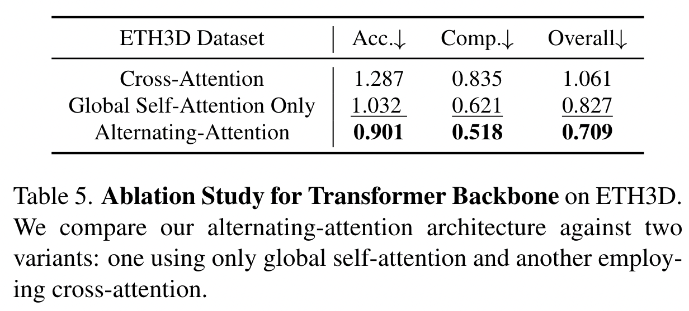{:width 400,:height 800}
				- 在 ETH3D 上的 Transformer 骨干网络消融实验。我们将交替注意力架构与两种变体（仅全局注意力、交叉注意力）进行对比。
			- 表 5 的结果表明，
				- 我们的交替注意力结构在精度上明显优于两种基线。
				- 此外，我们的初步探索实验也一致显示，采用交叉注意力的架构通常不如仅使用自注意力的架构表现好。
		- **多任务学习（Multi-task Learning）**
			- 我们进一步验证了让单一网络同时学习多个 3D 量的好处，即使这些输出可能存在潜在重叠（例如深度图和相机参数结合后可生成点图）。
			- 表 6
				- 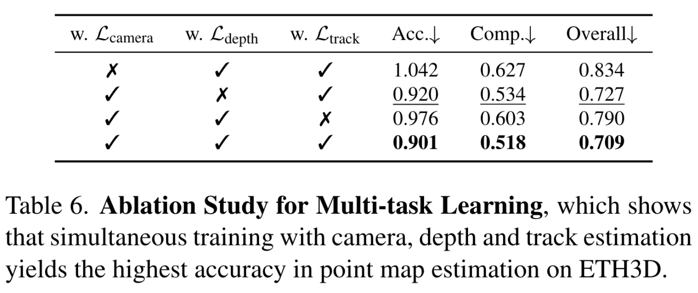{:width 400,:height 800}
				- 多任务学习的消融实验。结果显示，联合训练相机、深度与轨迹预测可在 ETH3D 上获得最高的点图估计精度。
			- 表 6 显示，
				- 当训练中移除相机、深度或轨迹预测时，点图估计的精度明显下降。
				- 值得注意的是，引入相机参数预测能显著提升点图精度，而深度预测仅带来较小的改进。
			-
	- ### 4.6 下游任务微调
		- **前馈新视角合成（Feed-forward Novel View Synthesis）**
			- 前馈式新视角合成正在快速发展 [4, 31, 34, 36, 70, 84, 95, 104]。大多数现有方法以已知相机参数的图像作为输入，并预测对应新视角的目标图像。与依赖显式 3D 表示的方法不同，我们遵循 LVSM [36] 的思路，修改 VGGT 以直接输出目标图像。但我们不假设输入帧具有已知的相机参数。
			- 具体而言，我们严格遵循 LVSM 的训练与评估协议，例如使用 4 个输入视角，并采用 **Plücker 射线** 来表示目标视角。我们对 VGGT 做出简单修改：输入图像首先通过 DINO 转换为 token，而目标视角则通过卷积层将其 Plücker 射线图像编码为 token。这些 token（包括输入图像与目标视角）被拼接后送入交替注意力 Transformer，最后通过 DPT 头回归目标视角的 RGB 颜色。值得注意的是，我们并未输入源图像的 Plücker 射线，因此模型并未获得输入帧的相机参数。
			- LVSM 在 Objaverse 数据集 [11] 上训练，而我们使用一个规模约为 Objaverse 20% 的内部数据集。训练与评估的更多细节见 [36]。
			- 表 7
				- 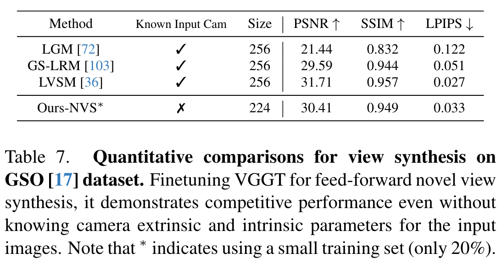{:width 400,:height 800}
				- 在 GSO [17] 数据集上的视角合成定量比较。VGGT 微调用于前馈视角合成，即使未知输入相机的内外参，依然表现出竞争力。∗ 表示仅使用 20% 的小规模训练集。
			- 如表 7 所示，即便未使用输入相机参数，且训练数据少于 LVSM，我们的方法在 GSO 数据集 [17] 上依然取得了具有竞争力的结果。我们预计在更大规模的数据集上训练可获得更佳性能。定性示例如图 4 所示。
			- 图 4
				- 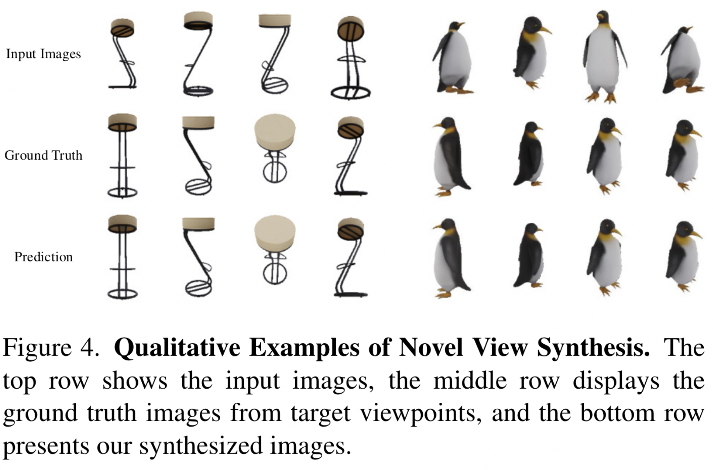{:width 777}
				- 新视角合成的定性示例。第一行：输入图像；第二行：目标视角的真实图像；第三行：我们合成的图像。
		- **动态点跟踪（Dynamic Point Tracking）**
			- 动态点跟踪近年来成为一个竞争激烈的任务 [15, 32, 39, 93]，它是我们所学特征的另一个下游应用。我们遵循标准实践，报告以下指标：
				- **遮挡精度（Occlusion Accuracy, OA）**：遮挡预测的二分类精度；
				- $\delta^{vis}_{avg}$：在一定像素阈值内，准确跟踪的可见点比例均值；
				- **平均 Jaccard（Average Jaccard, AJ）**：综合度量跟踪与遮挡预测的准确性。
			- 我们将最先进的 **CoTracker2 [39]** 进行改造，用 VGGT 的预训练特征骨干替换其原有骨干。这是必要的，因为 VGGT 在训练时接收的是无序的图像集合，而不是顺序的动态视频。VGGT 骨干预测出的跟踪特征 $T_i$​，替代了 CoTracker2 的特征提取器输出，并进入其后续架构，最终输出跟踪结果。我们在 Kubric [29] 上对该改造后的跟踪器进行微调。
			- 表 8
				- 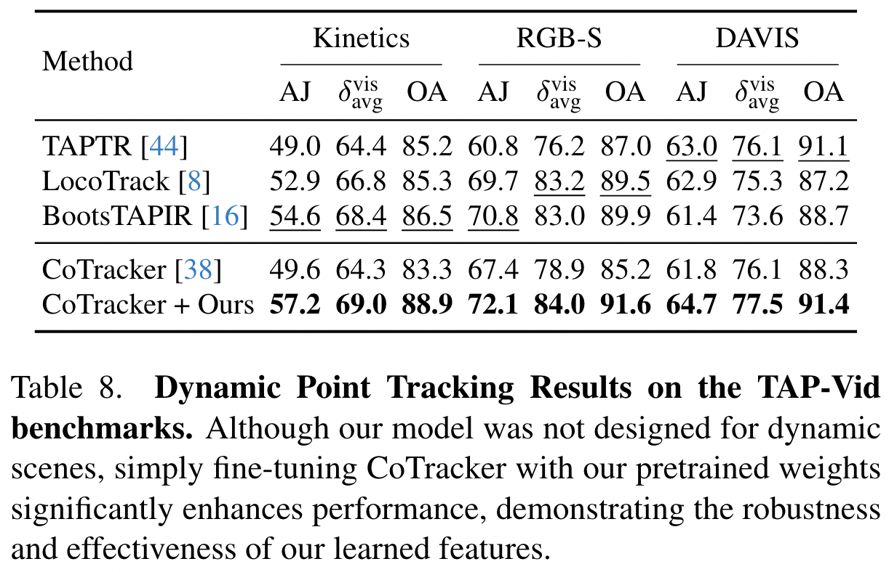{:width 400,:height 800}
				- 在 TAP-Vid 基准上的动态点跟踪结果。虽然 VGGT 并未专为动态场景设计，但仅通过用其预训练权重微调 CoTracker，就能显著提升性能。
			- 如表 8 所示，集成预训练 VGGT 显著提升了 CoTracker 在 TAP-Vid 基准 [13] 上的性能。例如，在 TAP-Vid RGB-S 数据集上，$\delta^{vis}_{avg}$​ 从 **78.9 提升到 84.0**。尽管 TAP-Vid 包含快速动态运动的视频，我们的方法依然表现出色，体现了 VGGT 学习到的特征的强泛化能力。
			- 图 5
				- 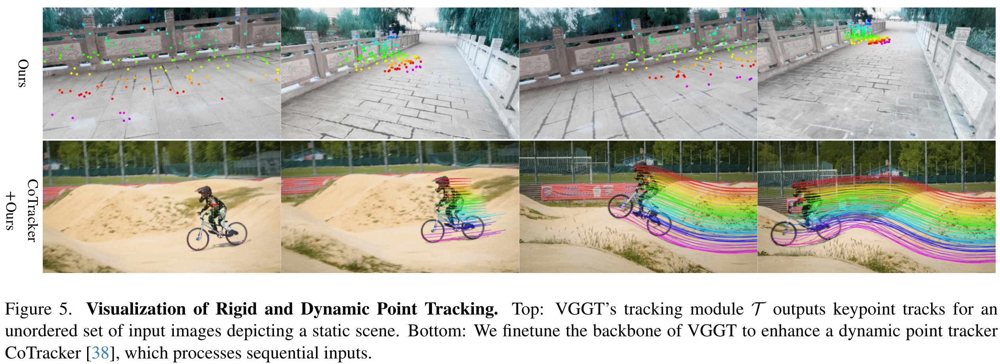{:width 700}
				- 刚性与动态点跟踪可视化。
					- 上：VGGT 的跟踪模块 $\mathcal{T}$ 在静态场景的无序图像集合上输出关键点轨迹；
					- 下：我们微调 VGGT 的骨干以增强动态点跟踪器 CoTracker [38]，用于处理视频序列输入。
## 5. Conclusions
collapsed:: true
	- 我们提出了 **Visual Geometry Grounded Transformer (VGGT)**，一个前馈神经网络，能够直接对数百个输入视角估计所有关键的三维场景属性。它在多个 3D 任务上取得了最先进的结果，包括：相机参数估计、多视角深度估计、稠密点云重建以及 3D 点跟踪。
	- 我们的方法是一种简洁的、以神经网络为核心的方案，有别于传统依赖视觉几何后优化的做法。后者往往需要额外的计算步骤来获得准确且任务特定的结果。而 VGGT 的简洁性与高效性使其特别适合实时应用，这也是其相较于优化类方法的另一项优势。
- ---
## [[#blue]]==Insights==
collapsed:: true
	- 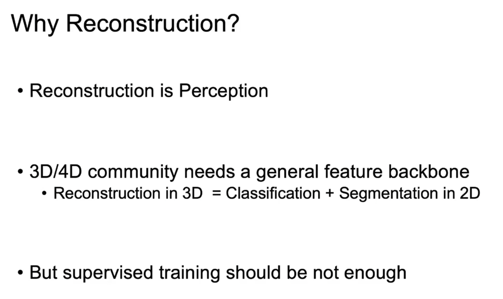{:width 600}
	- [[#green]]==2D->2D端到端==
	- 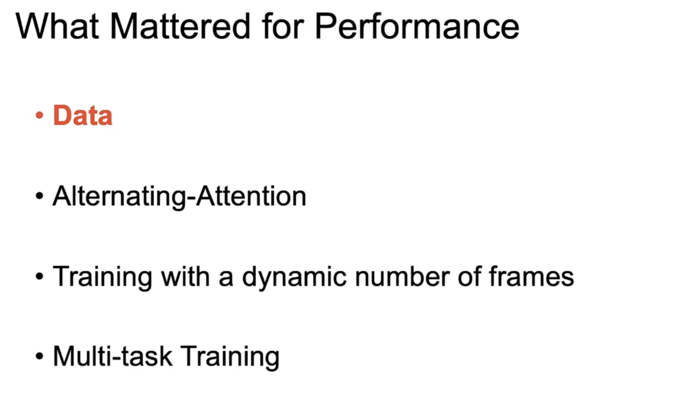{:width 600}
	- 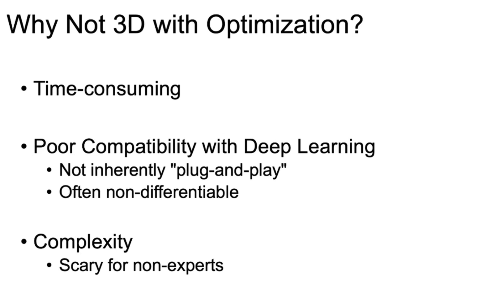{:width 600}
	- {:width 600}
	- 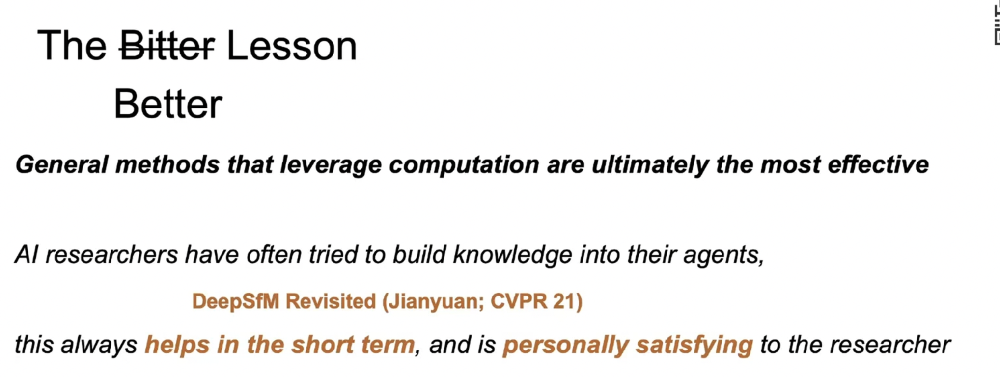{:width 600}
	- {:width 600}
	- 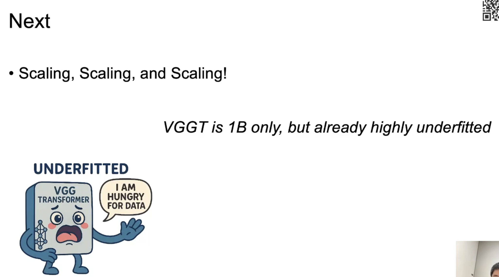{:width 600}
	- 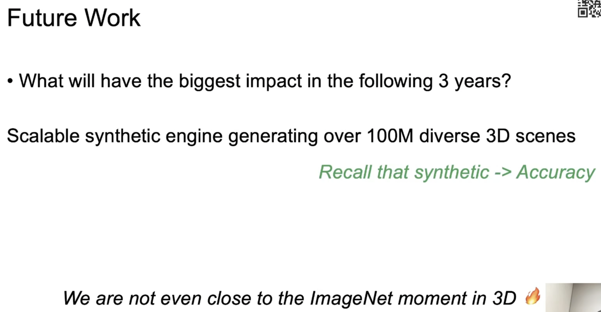{:width 600}
	  id:: 2a6d8ee4-2b6d-436f-aa51-225365c1e02c
	- 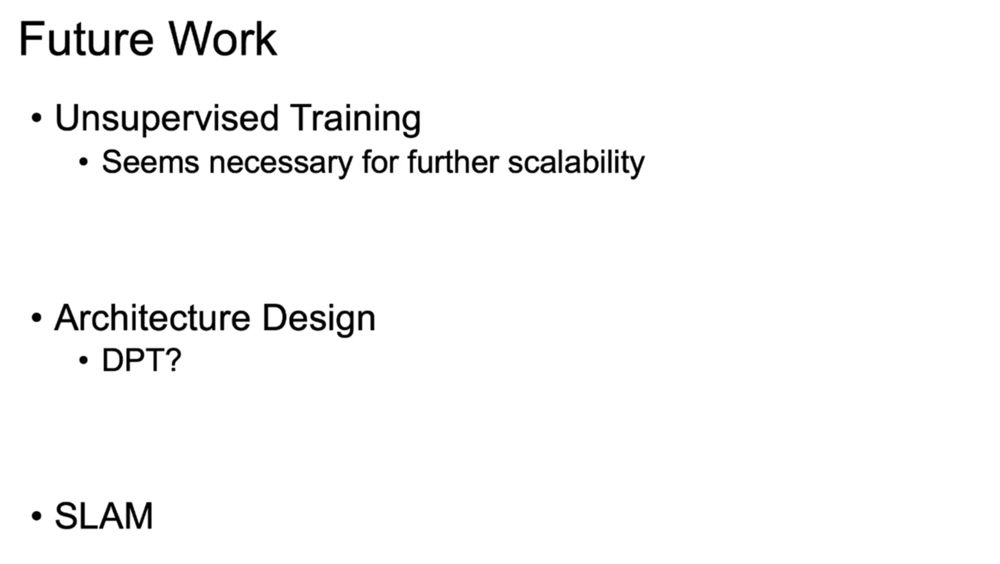{:width 600}
	  id:: 19ccf91a-0d08-41a1-a60d-fbf03910ca51
	- 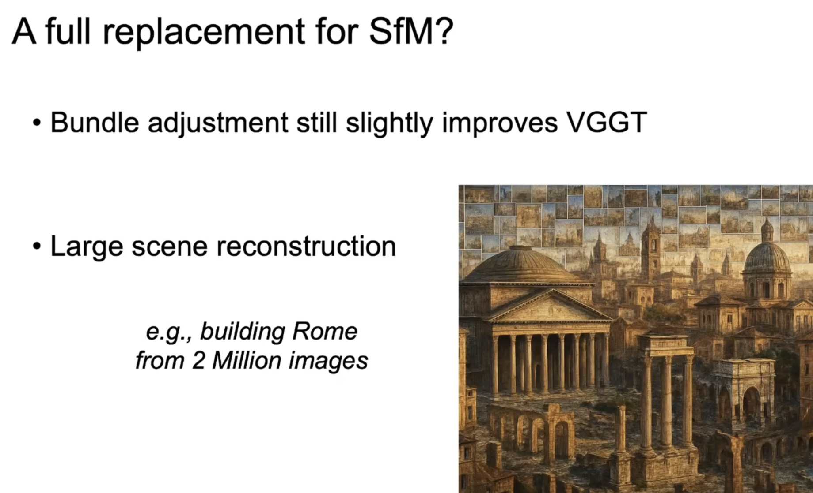{:width 600}
	- 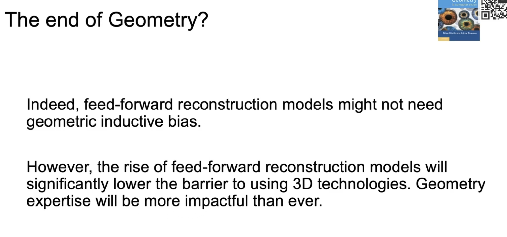{:width 600}
	-
-
- others
  collapsed:: true
	- with 3D difussion model -> 3D生成
	- 实际跑实验
	- 超分